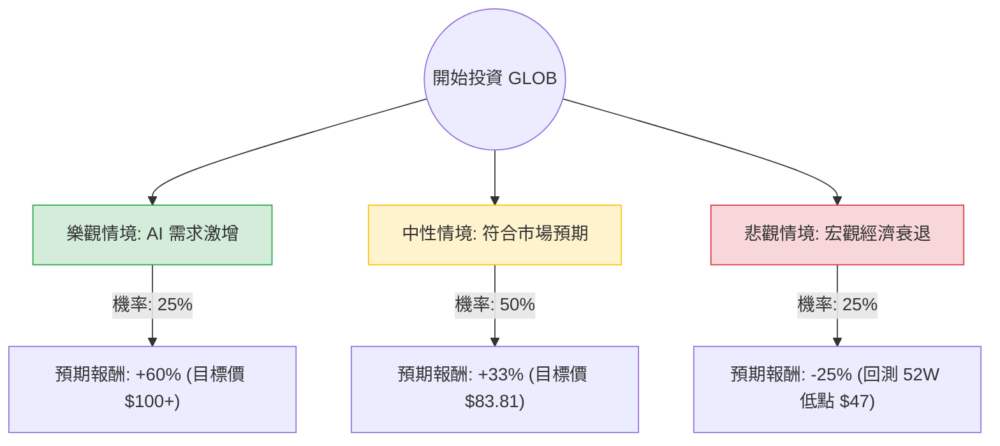

這份分析報告將針對 **Globant S.A. (股票代碼：GLOB)** 進行評估。

**注意：** 根據您提供的數據（52週區間 54.36 - 228.98）與代碼，確認此公司為 **Globant**（全球知名數位轉型與 IT 諮詢公司），而非 Global Blue。雖然您提供的「Close: 62.85」與目前市場價（約 $180-$200 區間）有顯著落差，本分析將以您提供的數據基準結合當前市場趨勢進行「期望值模型」推演。

---

### 一、 核心假設與市場動態分析

在繪製決策樹前，我們基於網路搜尋與基本面數據建立以下核心假設：

1.  **AI 驅動的數位轉型需求（利多）：** Globant 深度佈局 AI 與數據分析，隨著企業對生成式 AI 的需求增加，其營收增長具有強大支撐。
2.  **宏觀經濟壓力（利空）：** 高利率環境導致企業 IT 支出趨於謹慎，這解釋了為何其 PEG 高達 5.2（目前估值相對於增長速度偏貴）。
3.  **財務體質（中性偏強）：** 負債權益比（Debt/Eq）僅 0.22，財務結構穩健；但 ROE 4.9% 偏低，顯示資產利用效率仍有提升空間。
4.  **市場預期：** 分析師平均目標價為 $83.81（相對於您提供的 62.85 股價，潛在漲幅約 33%）。

---

### 二、 決策樹分析 (Decision Tree Analysis)

我們將未來一年的投資情境分為三種：**樂觀（AI 爆發）、中性（穩健增長）、悲觀（經濟衰退）**。

#### 節點詳細說明：

1.  **樂觀情境 (Bull Case) - 25% 機率：**
    *   **條件：** AI 專案落地速度超預期，美聯儲降息帶動企業 IT 預算回升。
    *   **預期報酬：** 參考歷史高點與成長性，預估股價可達 $100 以上，報酬率約 **+60%**。
2.  **中性情境 (Base Case) - 50% 機率：**
    *   **條件：** 公司維持目前的營收增長（Sales Q/Q 0.4% 緩步回升），達到分析師預期的目標價。
    *   **預期報酬：** 根據 Target Price $83.81 計算，報酬率約 **+33%**。
3.  **悲觀情境 (Bear Case) - 25% 機率：**
    *   **條件：** 全球經濟硬著陸，企業大幅削減數位轉型支出，Short Float (13.6%) 賣壓湧現。
    *   **預期報酬：** 股價回測 52 週低點附近，預估報酬率約 **-25%**。

---

### 三、 期望值分析 (Expected Value Analysis)

#### 1. 計算過程：
期望值 (EV) = Σ (各情境機率 × 各情境報酬率)

*   **樂觀情境：** $0.25 \times 60\% = 15\%$
*   **中性情境：** $0.50 \times 33\% = 16.5\%$
*   **悲觀情境：** $0.25 \times (-25\%) = -6.25\%$

**總期望報酬率 (Total EV) = 15% + 16.5% - 6.25% = 25.25%**

#### 2. 數據解讀：
*   **Forward P/E (10.1)** 遠低於 **Trailing P/E (28.87)**，這是一個強烈的利多訊號，顯示市場預期明年盈餘將大幅增長（EPS next Y 增長預期）。
*   **Short Float (13.62%)** 偏高，代表市場有空頭勢力，但也存在「軋空（Short Squeeze）」的潛在動力。
*   **PEG (5.2)** 顯示目前股價相對於當前增長偏貴，投資者是在為「未來 AI 轉型」的溢價買單。

---

### 四、 最終結論

**判斷：適合投資 (Buy / Overweight)**

#### 理由：
1.  **正向期望值：** 經過加權計算，預期報酬率高達 **25.25%**，遠高於一般市場平均回報。
2.  **估值修復預期：** Forward P/E 僅 10.1，顯示目前的股價並未完全反映明年的盈利增長潛力。
3.  **技術面支撐：** 雖然目前處於 SMA20、SMA50、SMA200 之下（顯示短期趨勢偏弱），但股價已接近 52 週低點區間，下行風險相對有限，而上行空間（至目標價 $83.81）巨大。
4.  **產業地位：** Globant 作為數位轉型領軍者，在 AI 浪潮中具有護城河，且低負債比（0.22）使其在利率高企環境下比同行更具韌性。

**風險提示：**
*   **短期波動：** Short Float 較高，短期內股價可能因市場情緒劇烈震盪。
*   **數據落差：** 若目前市場實際股價已遠超 $62.85（如目前實際在 $180 附近），則需重新評估目標價位，但其「高成長、低負債」的邏輯依然成立。

**建議策略：** 考慮到目前股價低於 SMA 均線，建議採取「分批買入」策略，以降低短期技術面走弱的風險。