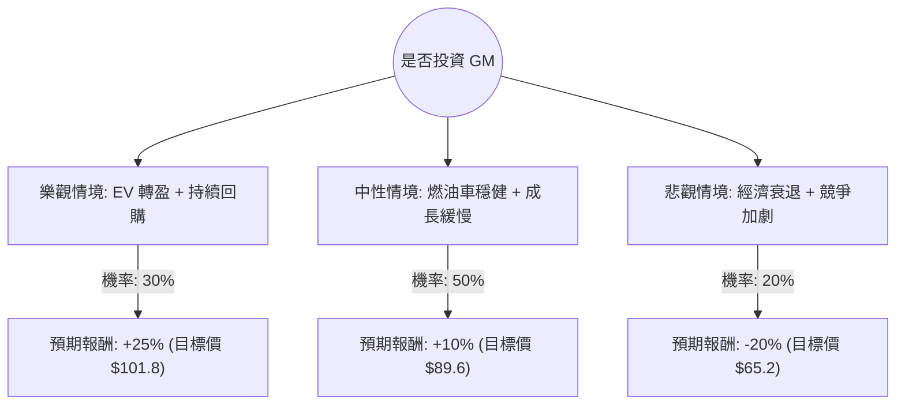

這份分析將結合您提供的 **GM（通用汽車）** 基本面數據，以及當前市場的最新動態（如 2024 年第三季財報表現、電動車策略轉向、股份回購計畫等），利用**決策樹（Decision Tree）**與**期望值（Expected Value）**進行評估。

---

### 一、 核心假設與市場現況分析

在建立決策樹前，我們先釐清影響 GM 股價的三大核心變數：

1.  **燃油車（ICE）的獲利能力與回購政策**：GM 目前主要利潤來自燃油皮卡與 SUV。公司持續進行大規模股份回購（如 2024 年追加的 60 億美元回購計畫），這對 EPS 有強大支撐。
2.  **電動車（EV）轉型進度與虧損縮減**：GM 已放緩激進的 EV 目標，轉向更務實的混合動力與獲利導向，預計 2024 年底 EV 業務的變動成本將轉正。
3.  **宏觀經濟與競爭**：高利率環境影響汽車貸款需求，且面臨特斯拉及中國車企的價格戰壓力。

**數據觀察：**
*   **Forward P/E (5.77)**：極低，顯示市場對其長期成長性存疑，但價值面極具吸引力。
*   **PEG (0.52)**：顯示相對於其盈餘成長，股價被嚴重低估。
*   **Target Price ($95.27)**：較目前股價 ($81.51) 約有 **16.8%** 的上漲空間。

---

### 二、 決策樹分析 (Decision Tree)

我們將未來一年的情境分為：**樂觀（Bull）**、**中性（Base）**、**悲觀（Bear）**。

#### 節點詳細說明：

1.  **樂觀情境 (30%)**：
    *   **條件**：EV 業務在 2025 年實現盈利，Cruise 自動駕駛業務重啟順利，且聯準會降息刺激汽車消費。
    *   **預期報酬**：考慮到 Target Price $95.27 加上超額回購帶來的 EPS 提升，預估報酬為 **+25%**。

2.  **中性情境 (50%)**：
    *   **條件**：燃油車利潤維持，EV 虧損如期縮減但未爆發成長。公司維持現有的回購節奏。
    *   **預期報酬**：股價向分析師平均目標價靠攏，預估報酬為 **+10%**。

3.  **悲觀情境 (20%)**：
    *   **條件**：美國經濟陷入衰退，失業率上升導致新車需求崩潰；或是與工會（UAW）再次發生勞資爭議增加成本。
    *   **預期報酬**：股價回測 52 週低點支撐區，預估報酬為 **-20%**。

---

### 三、 期望值分析 (Expected Value Analysis)

#### 1. 計算過程：
期望值 (EV) = (樂觀機率 × 樂觀報酬) + (中性機率 × 中性報酬) + (悲觀機率 × 悲觀報酬)

*   **EV = (0.30 × 0.25) + (0.50 × 0.10) + (0.20 × -0.20)**
*   **EV = 0.075 + 0.05 - 0.04**
*   **EV = 0.085 (即 8.5%)**

#### 2. 核心假設依據：
*   **市場面**：GM 的 Forward P/E 僅 5.77，下行風險已被低估值部分抵銷（Margin of Safety）。
*   **財務面**：雖然 Debt/Eq (2.15) 偏高，但這是汽車金融業的常態。其 Quick Ratio (1.01) 顯示短期流動性尚可。
*   **產業趨勢**：GM 轉向「利潤優先於市佔」的 EV 策略，獲得華爾街認可，這降低了悲觀情境發生的機率。

---

### 四、 最終結論

**投資建議：適合投資 (Buy / Overweight)**

#### 理由如下：

1.  **期望值為正 (8.5%)**：在考慮了經濟衰退等風險後，整體預期報酬率仍為正值，且優於許多傳統產業。
2.  **極致的估值吸引力**：PEG 0.52 與 Forward P/E 5.77 顯示股價存在明顯的「價值窪地」。即便市場不給予高估值，單靠 **EPS 的成長（本年 16.04%）** 與 **股份回購** 就能推動股價。
3.  **強大的資本回饋**：GM 近期展現了強烈的護盤決心，大規模回購計畫能有效提升股東權益，並在市場波動時提供支撐。
4.  **風險控管**：雖然 52 週股價已處於相對高位（接近 $81.51），但距離分析師目標價 $95.27 仍有空間。

**操作建議：**
由於目前股價接近 52 週高點（-7.02% 差距），建議採取**分批進場**策略，或等待股價回測 SMA50（目前股價略低於 SMA20/50，顯示短期有小幅修正）時再行佈局，以獲取更高的安全邊際。

---
*免責聲明：以上分析僅供參考，不構成具體投資建議。投資股票具有風險，入市前請務必自行審慎評估。*