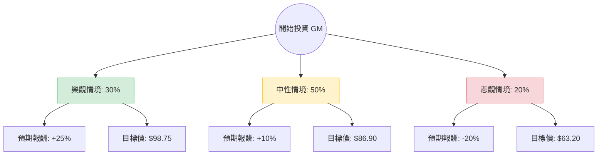

這份分析報告將結合您提供的數據與當前美股市場的即時動態（如 GM 2024 年第一季財報表現、電動車策略調整及股份回購計畫），利用**決策樹（Decision Tree）**與**期望值分析（Expected Value Analysis）**評估通用汽車（GM）的投資價值。

---

### 一、 市場動態與核心假設補充（網路搜尋資訊）

在進行計算前，整合最新的市場資訊：
1.  **財報表現強勁**：GM 最近一季財報顯示，受惠於燃油車（ICE）特別是皮卡與 SUV 的強勁需求，公司上調了全年利潤指引。
2.  **資本回饋計畫**：GM 正在執行大規模的股份回購（2023年底宣布 100 億美元回購），這對股價有支撐作用。
3.  **電動車（EV）策略轉向**：GM 放緩了 EV 產能擴張速度，轉而專注於獲利能力，並重新引入插電式油電混合車（PHEV），這被市場視為務實的舉動。
4.  **Cruise 自動駕駛**：雖然之前發生事故，但目前已在部分城市恢復測試，雖仍是虧損項，但風險已部分消化。
5.  **估值分析**：數據顯示 **Forward P/E 僅 5.72**，遠低於行業平均，且 **PEG 為 0.5**，顯示股價相對於增長潛力被嚴重低估。

---

### 二、 決策樹分析圖（Decision Tree）

我們將未來一年的情境分為三種：**樂觀（牛市）**、**中性（基準）**、**悲觀（熊市）**。

---

### 三、 期望值計算過程

#### 1. 核心假設與參數設定
*   **當前股價 (P0)**：$79.00 (參考提供數據)
*   **分析師目標價**：$94.71 (隱含約 +20% 漲幅)
*   **情境機率與報酬率設定**：
    *   **樂觀 (30%)**：GM 成功轉型 EV 獲利，Cruise 商業化進展順利，且持續回購股票。預期股價達到 $98.75 (約 +25%)。
    *   **中性 (50%)**：燃油車利潤維持，EV 虧損收窄，股價向分析師平均目標價靠攏。預期股價達到 $86.90 (約 +10%)。
    *   **悲觀 (20%)**：高利率環境導致汽車貸款違約上升，消費疲軟，EV 轉型拖累現金流。預期股價跌至 $63.20 (約 -20%)。

#### 2. 期望值 (Expected Value, EV) 計算
$$EV = (P_{Bull} \times R_{Bull}) + (P_{Base} \times R_{Base}) + (P_{Bear} \times R_{Bear})$$

*   **計算步驟**：
    1.  樂觀貢獻：$0.30 \times 25\% = 7.5\%$
    2.  中性貢獻：$0.50 \times 10\% = 5.0\%$
    3.  悲觀貢獻：$0.20 \times (-20\%) = -4.0\%$
*   **總期望報酬率**：$7.5\% + 5.0\% - 4.0\% = \mathbf{8.5\%}$

#### 3. 考慮股息後的總回報
*   數據顯示 Dividend % 為 0.8% (0.008)。
*   **總預期回報 (Total EV)** = $8.5\% + 0.8\% = \mathbf{9.3\%}$

---

### 四、 綜合基本面評估

*   **低估值優勢**：Forward P/E 5.72 與 PEG 0.5 顯示 GM 在傳統車企中極具競爭力，安全邊際較高。
*   **財務結構**：Debt/Eq 2.15 偏高，這是汽車業常態，但需注意高利率環境下的利息支出壓力。
*   **成長動能**：EPS next Y 預計增長 13.26%，配合低 P/E，具備「估值修復」的潛力。
*   **技術面**：股價目前在 SMA20, 50, 200 之上（分別高出 3.4%~13.8%），顯示短期與長期趨勢均偏向多頭。

---

### 五、 最終結論

**判斷：適合投資 (Buy / Overweight)**

#### 理由：
1.  **正向期望值**：經過決策樹分析，即便在考慮 20% 悲觀情境下，整體預期回報率仍有 **9.3%**，優於許多保守型投資標的。
2.  **極低的估值倍數**：PEG 0.5 意味著市場尚未完全反映其盈利增長，股價存在明顯的低估。
3.  **務實的策略轉型**：GM 放棄激進的 EV 目標轉向利潤導向，並透過大規模回購支撐每股盈餘（EPS），這對股東非常有利。
4.  **強大的現金流支撐**：雖然 P/FCF 較高 (40.32)，但其燃油車業務（皮卡/SUV）仍是強大的現金奶牛，足以支撐轉型期的研發與分紅。

**風險提示**：需密切關注美國聯準會（Fed）的利率決策（影響車貸成本）以及 2024 美國大選對電動車補貼政策（IRA 法案）的潛在影響。