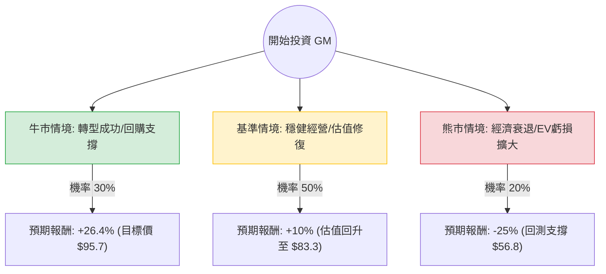

這份分析將結合您提供的 **GM（通用汽車）** 基本面數據，以及最新的市場動態（包含 2024 年第三季財報表現、電動車策略轉向、以及自動駕駛部門 Cruise 的進展），利用**決策樹（Decision Tree）**與**期望值分析（Expected Value Analysis）**進行評估。

---

### 一、 核心假設與市場背景分析

在建立模型前，我們先整合數據與最新資訊：

1.  **估值極低（Value Play）：** 根據數據，**Forward P/E 僅 5.16**，**PEG 為 0.46**。這顯示市場對 GM 的成長預期極低，股價處於低估區間。
2.  **財務韌性：** GM 最近一季財報（2024 Q3）表現優異，上調了全年利潤指引。儘管數據顯示 `Profit Margin` 僅 1.73%，但其燃油車（ICE）業務持續產生強大現金流。
3.  **轉型陣痛：** 電動車（EV）需求放緩，GM 已調整策略，轉向更靈活的燃油/電動混合生產，並延後部分 EV 工廠投資以保護利潤。
4.  **自動駕駛變數：** Cruise 雖然面臨監管挑戰，但已重新開始測試，是長期的「高風險高回報」因子。
5.  **資本回報：** GM 積極進行大規模股票回購（如 2024 年初的 100 億美元回購計畫），這對股價有支撐作用。

---

### 二、 決策樹分析 (Decision Tree)

我們以 **12 個月** 為投資期限，設定三種主要情境：

#### 節點詳細說明：

1.  **牛市情境 (Optimistic Case) - 30%：**
    *   **條件：** EV 業務在 2025 年實現盈利、Cruise 恢復商業化營運、燃油車市佔率維持。
    *   **預期報酬：** 達到分析師目標價 **$95.7**（較現價 $75.72 上漲約 **26.4%**）。

2.  **基準情境 (Base Case) - 50%：**
    *   **條件：** 聯準會降息刺激汽車貸款、公司持續回購股票抵銷 EPS 壓力、EV 虧損縮減。
    *   **預期報酬：** 股價隨大盤與估值修復，預計上漲 **10%**（約 $83.3）。

3.  **熊市情境 (Pessimistic Case) - 20%：**
    *   **條件：** 全球經濟衰退導致汽車需求大跌、工會成本上升、EV 轉型徹底失敗。
    *   **預期報酬：** 股價回落至 52 週中軸以下，預計下跌 **25%**（約 $56.8）。

---

### 三、 期望值計算 (Expected Value Calculation)

我們根據上述情境計算總體期望報酬率（Expected Return）：

| 情境 | 預期報酬 (R) | 機率 (P) | 加權期望值 (R × P) |
| :--- | :--- | :--- | :--- |
| **牛市** | +26.4% | 0.30 | +7.92% |
| **基準** | +10.0% | 0.50 | +5.00% |
| **熊市** | -25.0% | 0.20 | -5.00% |
| **總計** | | **1.00** | **+7.92%** |

**計算過程：**
$EV = (26.4\% \times 0.3) + (10\% \times 0.5) + (-25\% \times 0.2)$
$EV = 7.92\% + 5\% - 5\% = 7.92\%$

**考慮股息收益：**
數據顯示 `Dividend %` 為 **0.87%**。
**總期望回報 = 7.92% + 0.87% = 8.79%**

---

### 四、 核心假設與風險評估

1.  **估值安全邊際：** Forward P/E 5.16 意味著市場已經定價了極其悲觀的預期。只要 GM 不發生破產級別的危機，下行空間受限。
2.  **利率環境：** 假設 2024-2025 年處於降息週期，這對高單價的汽車消費是利多。
3.  **資本配置：** GM 管理層目前的策略是「利潤優先於市佔」，這對股東有利。
4.  **債務風險：** `Debt/Eq` 為 2.15，雖然偏高，但符合汽車製造業特性，且 `Quick Ratio` 1.01 顯示短期流動性尚可。

---

### 五、 最終結論

#### **判斷：適合投資 (Buy / Overweight)**

**理由：**
1.  **正向期望值：** 經過風險加權後的期望報酬率約為 **8.79%**，在傳統產業中表現穩健。
2.  **極高的安全邊際：** PEG 0.46 顯示股價被嚴重低估。即使在熊市情境下，GM 強大的現金流與回購計畫也能提供一定的底部支撐。
3.  **轉型靈活性：** 最新新聞顯示 GM 不再盲目追求 EV 產量，而是根據市場需求調整，這種務實做法有助於維持利潤率（Oper. Margin）。
4.  **技術面支撐：** 目前股價高於 SMA200 (0.0966)，顯示長期趨勢仍偏向多頭。

**建議操作：**
由於汽車業受宏觀經濟影響大，建議**分批入場**。若股價因短期財報波動回落至 $65-$70 區間，投資價值將進一步放大。

***

**風險提示：** 汽車產業具備高度週期性，若美國經濟進入深度衰退，所有汽車股均會面臨劇烈回撤。請投資人務必做好倉位控管。