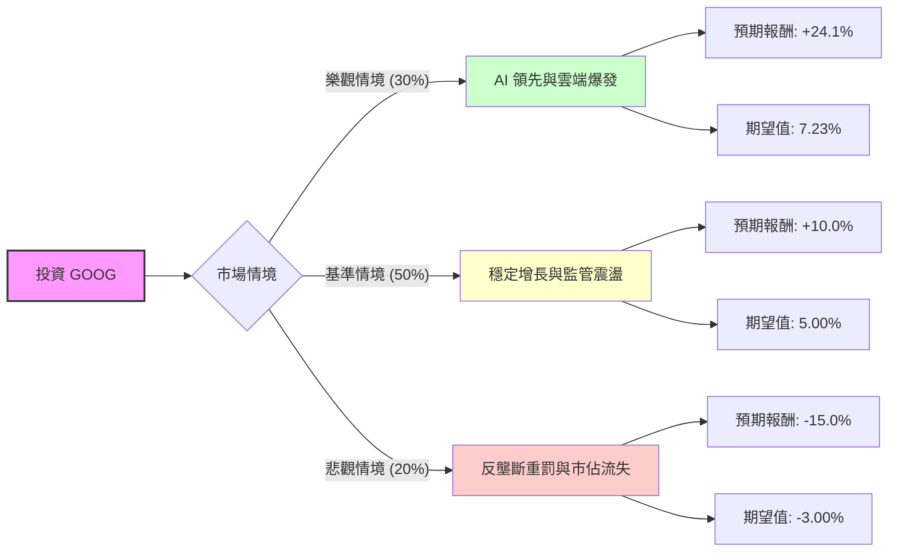

這份分析將結合您提供的基本面數據與最新的市場動態（包含司法部反壟斷判決、AI 發展進度及財報表現），利用**決策樹（Decision Tree）**與**期望值分析（Expected Value Analysis）**評估 Alphabet (GOOG) 的投資價值。

---

### 一、 核心假設與市場背景分析

在建立模型前，我們先整合數據與最新資訊：

1.  **基本面優勢**：ROE (35.7%) 與 ROA (25.28%) 極高，顯示極強的獲利能力。債務比 (Debt/Eq 0.16) 極低，財務結構非常穩健。
2.  **估值狀況**：目前 P/E 28.32，Forward P/E 22.91，相較於其 EPS 增長預期（Next Year 16.95%），估值尚屬合理（PEG 1.85 略高但可接受）。
3.  **最新利空（關鍵變數）**：
    *   **反壟斷法案**：美國法院近期裁定 Google 在搜尋引擎市場存在壟斷行為，這可能導致未來需支付巨額罰款或被迫拆分業務。
    *   **AI 競爭**：OpenAI 與 Microsoft 的威脅依然存在，Google 需投入大量資本支出（CapEx）以維持 Gemini 的競爭力。
4.  **最新利多**：
    *   **雲端業務**：Google Cloud 已實現盈利且增長強勁。
    *   **資本回報**：公司開始發放股利（Dividend 0.27%）並持續回購股票。

---

### 二、 決策樹分析 (Decision Tree)

我們預測未來一年的三種主要情境：

#### 節點詳細說明：

1.  **樂觀情境 (Probability: 30%)**：
    *   **描述**：Gemini AI 成功整合至搜尋與廣告系統，帶動廣告單價上升；Google Cloud 市佔率大幅超越預期；反壟斷判決最終以輕微罰款結案。
    *   **預期報酬**：達到分析師目標價 $376.84（較目前 $303.56 約 **+24.1%**）。
2.  **基準情境 (Probability: 50%)**：
    *   **描述**：搜尋業務維持穩定，AI 投入與產出平衡；監管壓力持續但未傷及核心商業模式。
    *   **預期報酬**：隨盈餘增長（EPS Next Y 16.9%）但估值倍數微調，預估報酬約 **+10%**。
3.  **悲觀情境 (Probability: 20%)**：
    *   **描述**：法院強制要求 Google 停止與 Apple 的預設搜尋協議；AI 搜尋導致傳統廣告點擊率下降；宏觀經濟衰退。
    *   **預期報酬**：回測至 52 週低點附近或 P/E 修正，預估報酬約 **-15%**。

---

### 三、 期望值計算過程 (Expected Value Calculation)

我們將各情境的機率與報酬相乘，得出總體期望報酬率：

| 情境 | 機率 (P) | 預期報酬 (R) | 期望值 (P * R) |
| :--- | :--- | :--- | :--- |
| **樂觀 (Bull)** | 0.30 | +24.1% | +7.23% |
| **基準 (Base)** | 0.50 | +10.0% | +5.00% |
| **悲觀 (Bear)** | 0.20 | -15.0% | -3.00% |
| **總計期望報酬** | **1.00** | | **+9.23%** |

**計算公式：**
$EV = (0.30 \times 24.1\%) + (0.50 \times 10.0\%) + (0.20 \times -15.0\%) = 9.23\%$

---

### 四、 最終結論與建議

#### **評估結果：適合投資 (適合中長期持有)**

**判斷理由：**

1.  **正向期望值**：經過風險加權後的期望報酬率為 **9.23%**。雖然短期受反壟斷判決影響導致股價波動（Perf Month -9.01%），但期望值仍為正數，顯示目前價格具備安全邊際。
2.  **強大的基本面護城河**：ROE 35.7% 與 Oper. Margin 32.9% 顯示公司在面對競爭時仍有極高的獲利空間。即便搜尋業務受挫，其雲端業務與 YouTube 仍是強大的增長引擎。
3.  **估值吸引力**：Forward P/E 22.91 低於歷史平均與許多科技巨頭，且 Target Price ($376.84) 顯示市場分析師普遍看好其長期潛力。
4.  **技術面修正提供買點**：目前股價低於 SMA20 (-6.78%) 與 SMA50 (-4.93%)，顯示短期超賣，對於長期投資者而言是分批進場的時機。

**風險提示：**
投資者應密切關注 **1) 美國司法部對搜尋業務的後續處置方案** 以及 **2) 下一季資本支出對利潤率的影響**。若反壟斷判決導致 Google 必須拆分 Android 或 Chrome，則需重新評估悲觀情境的機率。