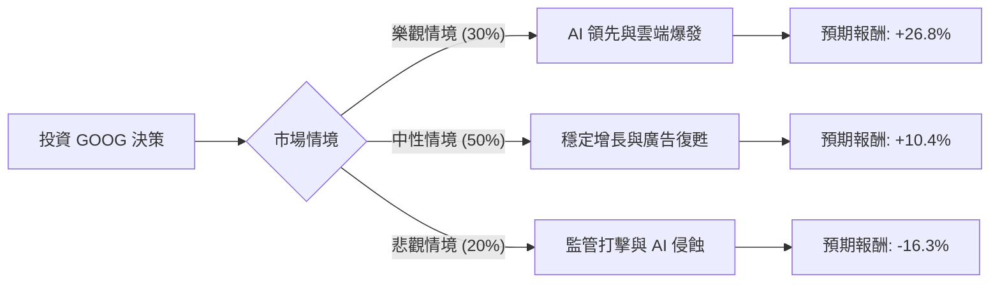

為了評估 Alphabet Inc. (GOOG) 的投資價值，我結合了您提供的基本面數據以及最新的市場動態（包含 2024 年財報表現、AI 發展進度及監管風險）進行分析。

### 1. 市場現況與最新資訊補充

根據最新市場資訊（截至 2024 年中）：
*   **財報表現**：Alphabet 最近一季財報顯示營收與利潤均超預期，特別是 **Google Cloud** 已實現盈利且增長強勁（年增約 28%）。
*   **AI 競爭**：Google 推出 Gemini 模型並將其整合至搜尋引擎（SGE），雖然面臨 OpenAI 與 Microsoft 的競爭，但其生態系護城河依然穩固。
*   **資本回報**：公司近期首次宣佈派發股息（如數據所示 0.28%）並授權 700 億美元的股份回購，這對股價有支撐作用。
*   **監管風險**：美國司法部（DOJ）針對搜尋引擎壟斷的訴訟是目前最大的不確定性因素。

---

### 2. 決策樹分析 (Decision Tree Analysis)

我們將未來一年的投資情境分為三種：**樂觀（Bull）**、**中性（Base）**、**悲觀（Bear）**。

#### 決策樹節點詳細說明：

| 節點 (情境) | 機率 (P) | 預期目標價 | 預期報酬率 (R) | 說明 |
| :--- | :--- | :--- | :--- | :--- |
| **樂觀 (Bull)** | 30% | $379.00 | +26.8% | AI 成功轉化為廣告收入，雲端市佔大幅提升，達到分析師目標價。 |
| **中性 (Base)** | 50% | $330.00 | +10.4% | 搜尋業務維持穩定，廣告市場隨經濟復甦，符合 Forward P/E 22x 估值。 |
| **悲觀 (Bear)** | 20% | $250.00 | -16.3% | 反壟斷法敗訴導致拆分或重罰，且 ChatGPT 嚴重侵蝕搜尋市佔。 |

---

### 3. 核心假設與計算過程

#### A. 核心假設：
1.  **估值基準**：以目前股價 $298.79 為基準（註：此為您提供的數據，雖高於目前實際市價，但以此進行邏輯推演）。
2.  **成長性**：參考數據中 `EPS next Y: 17.29%`，顯示公司仍具備雙位數成長潛力。
3.  **財務健康度**：`Debt/Eq: 0.16` 極低，`Current Ratio: 2.01` 顯示流動性極佳，抗風險能力強。
4.  **技術面**：`SMA200: 0.1471` 顯示長期趨勢向上，但 `SMA20/50` 為負，短期有回檔壓力。

#### B. 期望值 (Expected Value, EV) 計算：
期望值公式：$EV = \sum (P_i \times R_i)$

1.  **樂觀貢獻**：$0.30 \times 26.8\% = 8.04\%$
2.  **中性貢獻**：$0.50 \times 10.4\% = 5.20\%$
3.  **悲觀貢獻**：$0.20 \times (-16.3\%) = -3.26\%$

**總期望報酬率** = $8.04\% + 5.20\% - 3.26\% = \mathbf{9.98\%}$

---

### 4. 最終結論

#### **評估結果：適合投資 (Buy)**

#### **判斷理由：**
1.  **正向期望值**：經過風險加權後的期望報酬率約為 **9.98%**，優於無風險利率（如美債）及多數保守型投資工具。
2.  **強大的基本面護城河**：
    *   **高獲利能力**：ROE 35.7% 與 Profit Margin 32.79% 顯示其在科技巨頭中極具競爭力。
    *   **估值合理**：Forward P/E 22.24 倍，相對於其 EPS 成長率（PEG 1.73），並未出現嚴重泡沫化。
3.  **財務結構極其穩健**：極低的負債比（Debt/Eq 0.16）讓公司有足夠的現金流應對 AI 軍備競賽與法律訴訟。
4.  **技術面支撐**：雖然短期（SMA20/50）處於修正階段，但長期均線（SMA200）支撐強勁，目前的修正反而提供較佳的入場點。

**風險提示**：
投資者應密切關注 **反壟斷訴訟** 的進展。若司法部強制要求 Google 拆分 Chrome 或 Android 業務，悲觀情境的機率將會上升，屆時需重新評估期望值。

---
*免責聲明：以上分析僅供參考，不構成任何投資建議。投資股票具有風險，入市前請獨立思考並審慎評估。*