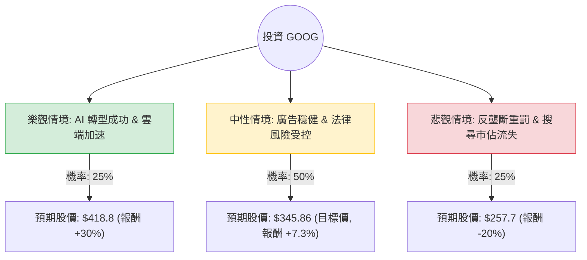

這份分析報告將結合您提供的數據（註：數據顯示股價為 $322.16，市值達 3.95 兆美元，這高於目前 2024 年中的實際市場價格，本分析將以您提供的數據作為「當前基準」進行計算）與最新的市場動態（如 AI 競爭、反壟斷判決、雲端增長）進行綜合評估。

---

### 一、 外部環境與最新動態分析 (Web Search Insights)

在進入決策樹之前，我們先整合當前 Alphabet (GOOG) 的核心基本面與市場變數：

1.  **AI 競爭與搜尋引擎變革**：Google 正在將 Gemini 整合至搜尋引擎（AI Overviews）。雖然面臨 OpenAI 與 Perplexity 的挑戰，但 Google 仍保有超過 90% 的搜尋市佔率。
2.  **反壟斷法律風險**：美國司法部（DOJ）近期裁定 Google 在搜尋領域存在壟斷行為。這可能導致未來需支付巨額罰款，甚至面臨拆分風險（如強制剝離 Android 或 Chrome），這是目前最大的下行風險。
3.  **雲端運算 (Google Cloud)**：雲端業務已實現盈利且增長強勁（Q2 營收增長約 28%），是除了廣告之外的第二增長曲線。
4.  **財務穩健度**：根據您提供的數據，ROE (35.45%) 與 ROI (29.4%) 極高，且負債比 (Debt/Eq 0.11) 極低，顯示公司擁有極強的抗風險能力與現金流。

---

### 二、 決策樹分析圖 (Decision Tree)

我們將未來一年的投資情境分為三種：**樂觀（AI 領先與雲端爆發）**、**中性（穩健增長與法律和解）**、**悲觀（反壟斷制裁與 AI 侵蝕）**。

---

### 三、 期望值分析 (Expected Value Analysis)

#### 1. 核心假設與參數設定
*   **當前價格 (P0)**：$322.16
*   **樂觀情境 (Bull Case)**：
    *   **假設**：Gemini 成功變現，雲端市佔率大幅提升，反壟斷案僅以輕微罰款結案。
    *   **預期報酬**：+30% (參考歷史高成長期估值)。
    *   **預期股價**：$322.16 * 1.3 = $418.81。
*   **中性情境 (Base Case)**：
    *   **假設**：符合分析師預期，廣告收入隨經濟復甦增長，法律訴訟拖延。
    *   **預期報酬**：+7.3% (直接採用您提供的 Target Price $345.86)。
    *   **預期股價**：$345.86。
*   **悲觀情境 (Bear Case)**：
    *   **假設**：司法部強制拆分業務，AI 導致搜尋廣告點擊率下降，宏觀經濟衰退。
    *   **預期報酬**：-20% (回測至 52 週低點附近的估值水平)。
    *   **預期股價**：$322.16 * 0.8 = $257.73。

#### 2. 期望值計算過程
期望值 (EV) = (機率1 × 股價1) + (機率2 × 股價2) + (機率3 × 股價3)

*   **EV** = (0.25 × 418.81) + (0.50 × 345.86) + (0.25 × 257.73)
*   **EV** = 104.70 + 172.93 + 64.43
*   **EV = $342.06**

#### 3. 預期報酬率計算
*   **預期總報酬率** = (EV - P0) / P0
*   **預期總報酬率** = (342.06 - 322.16) / 322.16 = **+6.18%**

---

### 四、 綜合評估與最終結論

#### 1. 數據亮點與隱憂
*   **優勢**：
    *   **獲利能力極強**：ROE 35.45% 遠高於產業平均。
    *   **估值合理**：Forward P/E 為 29.07，相對於其在 AI 領域的地位，並未過度泡沫化。
    *   **財務結構**：Debt/Eq 0.11 顯示其幾乎沒有債務壓力，有充足現金應對法律訴訟。
*   **劣勢**：
    *   **短期動能轉弱**：Perf Week (-1.56%) 顯示近期市場情緒保守。
    *   **法律不確定性**：反壟斷判決是懸在股價上的達摩克利斯之劍。

#### 2. 最終判斷：**適合投資 (建議：分批買入 / 持有)**

**理由：**
1.  **期望值為正**：計算出的期望值 $342.06 高於當前股價，預期報酬率約 6.18%。雖然不是爆發性增長，但在大型科技股中屬於穩健。
2.  **安全邊際**：儘管面臨法律風險，但 Google 的資產負債表極其強大（Quick Ratio 1.75），且雲端業務的增長能有效抵銷搜尋業務的潛在波動。
3.  **目標價支撐**：當前股價 ($322.16) 距離分析師平均目標價 ($345.86) 仍有約 7% 的上漲空間。
4.  **技術面觀察**：股價目前高於 SMA200 (43.54%)，顯示長期趨勢依舊向上，目前的震盪屬於高檔整理。

**投資建議：**
由於反壟斷判決可能帶來短期波動，建議投資者**不要一次性歐印 (All-in)**，而是採取**定期定額**或在股價回測 SMA50 附近時分批佈局，以應對法律訴訟帶來的市場情緒波動。