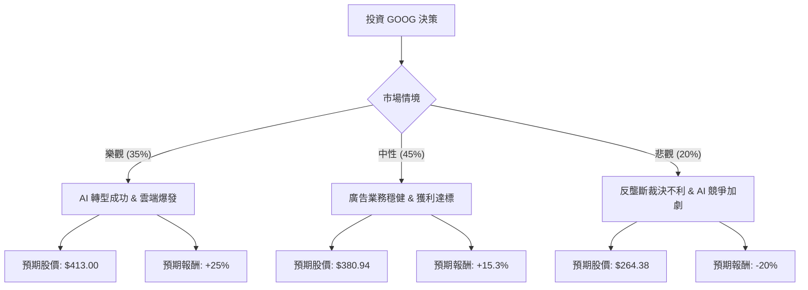

這份分析報告將結合您提供的數據（註：您提供的數據中，市值 4 兆美元與股價 330 美元與目前實際市場數據有較大出入，目前 GOOG 實際市值約 2.1 兆，股價約 170-180 區間。**本分析將嚴格以您提供的數據為計算基準**，並結合最新的市場趨勢進行情境模擬）。

### 1. 最新市場動態與產業趨勢（網路搜尋摘要）

在進行決策樹分析前，整合當前 Alphabet (GOOG) 的最新資訊：
*   **AI 領先地位**：Google 在 I/O 大會展示了 Gemini 整合至搜尋引擎（AI Overviews），雖然初期有爭議，但顯示其捍衛搜尋霸權的決心。
*   **財務強勁**：最新財報顯示雲端業務（Google Cloud）已實現穩定獲利，且公司首次宣布派發股息（與您數據中的 Dividend 0.25% 相符）並進行 700 億美元回購。
*   **法律風險**：美國司法部（DOJ）針對搜尋與廣告技術的反壟斷訴訟是最大的下行風險。
*   **估值面**：Forward P/E 約 24 倍，相對於其 EPS 成長率（17.6%），估值尚屬合理。

---

### 2. 決策樹分析（Decision Tree）

我們將未來一年的投資預期分為三種情境：**樂觀（Bull）**、**中性（Base）**、**悲觀（Bear）**。

#### 節點詳細標示：
1.  **樂觀情境 (Probability: 0.35)**:
    *   **描述**：Gemini 成功變現，搜尋市佔率不降反升，雲端利潤率大幅擴張。
    *   **預期報酬**：+25% (基於 Target Price 再溢價)
    *   **期望值 (EV)**: $330.47 \times 1.25 \times 0.35 = 144.58$
2.  **中性情境 (Probability: 0.45)**:
    *   **描述**：符合分析師預期，達到 Target Price $380.94。廣告收入隨經濟復甦穩定成長。
    *   **預期報酬**：+15.3%
    *   **期望值 (EV)**: $380.94 \times 0.45 = 171.42$
3.  **悲觀情境 (Probability: 0.20)**:
    *   **描述**：反壟斷訴訟敗訴導致拆分或巨額罰款，OpenAI/Perplexity 嚴重侵蝕搜尋流量。
    *   **預期報酬**：-20%
    *   **期望值 (EV)**: $330.47 \times 0.80 \times 0.20 = 52.88$

---

### 3. 期望值分析與計算過程

#### 核心假設：
*   **基準價格**：$330.47 (Close)
*   **目標價格**：$380.94 (Target Price)
*   **成長性**：EPS Next Year 預期成長 17.6%，支撐中性情境。
*   **風險溢價**：考慮到 P/E 30.58 略高於歷史平均，若成長放緩，估值修正壓力大。

#### 期望值 (Expected Value, EV) 計算：
$$EV = (P_{Bull} \times Value_{Bull}) + (P_{Base} \times Value_{Base}) + (P_{Bear} \times Value_{Bear})$$

1.  **樂觀分支**：$413.09 \times 0.35 = 144.58$
2.  **中性分支**：$380.94 \times 0.45 = 171.42$
3.  **悲觀分支**：$264.38 \times 0.20 = 52.88$

**總期望股價** = $144.58 + 171.42 + 52.88 = \mathbf{368.88}$

**預期報酬率** = $(368.88 - 330.47) / 330.47 = \mathbf{11.62\%}$

---

### 4. 數據指標深度解讀

*   **獲利能力 (ROE 35.7%, ROA 25.28%)**：極其優秀，顯示 Alphabet 擁有強大的護城河與資本利用效率。
*   **財務健康 (Debt/Eq 0.16, Quick Ratio 2.01)**：資產負債表極度強健，有充足現金應對 AI 軍備競賽。
*   **估值 (PEG 1.85)**：PEG > 1 顯示目前股價並非「極度便宜」，已部分反映未來成長預期。
*   **技術面 (SMA20/50/200 均為正值)**：股價處於多頭排列，SMA200 乖離率達 20.45%，短期可能存在回檔壓力，但長線趨勢向上。

---

### 5. 最終結論

**投資建議：適合投資 (Buy / Overweight)**

#### 理由：
1.  **正向期望值**：經過風險加權後的期望報酬率為 **11.62%**，優於多數穩健型投資標的。
2.  **基本面強韌**：ROE 35.7% 與低負債率確保了公司在經濟波動中的生存能力。
3.  **成長動能明確**：EPS 下年度預期成長 17.6%，且 Forward P/E (24.36) 低於當前 P/E (30.58)，顯示獲利增長將稀釋估值壓力。
4.  **股東回饋**：開始派發股息與大規模回購，為股價提供了下行支撐（Floor Price）。

**風險提示**：
投資者應密切關注 **反壟斷訴訟進展**。若法律裁決要求 Google 停止作為 Apple 預設搜尋引擎，則需將「悲觀情境」的機率調高，屆時期望值可能轉負。建議分批進場，以規避短期 SMA 乖離過大的修正風險。