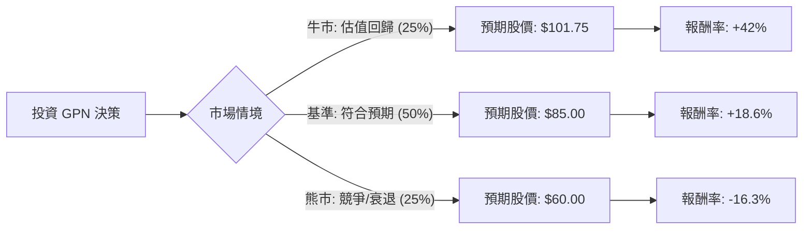

這份分析報告將結合您提供的財務數據與最新的市場動態（截至 2024 年 5 月），利用**決策樹（Decision Tree）**與**期望值分析（Expected Value Analysis）**來評估 Global Payments Inc. (GPN) 的投資價值。

---

### 一、 核心假設與市場背景分析

在建立模型前，我們先整合基本面與最新市場資訊：

1.  **估值極低（核心假設）**：GPN 目前的 Forward P/E 僅 5.4，PEG 為 0.46。這顯示市場對其成長性極度悲觀，或該股被嚴重低估。
2.  **財務表現**：Q1 2024 財報顯示，調整後 EPS 超出預期，且公司維持全年指引（預計營收增長 6-7%，EPS 增長 11-12%）。
3.  **產業趨勢**：金融科技（Fintech）板塊整體受高利率壓制，且面臨 Adyen、Stripe 等對手的激烈競爭。
4.  **技術面**：股價處於 52 週低點附近，SMA20/50/200 均呈負值，顯示短期動能極弱，存在「價值陷阱（Value Trap）」風險。

---

### 二、 決策樹分析 (Decision Tree)

我們將未來一年的情境分為三種：**牛市（估值修復）**、**基準（穩定增長）**、**熊市（衰退/競爭加劇）**。

#### 節點詳細說明：

1.  **牛市情境 (Probability: 25%)**：
    *   **描述**：市場重新意識到 GPN 的低估值，Forward P/E 從 5.4 倍修復至歷史均值約 10-12 倍。
    *   **預期報酬**：達到分析師目標價 **$101.75**。
    *   **計算**：($101.75 - $71.67) / $71.67 = **+42%**。

2.  **基準情境 (Probability: 50%)**：
    *   **描述**：公司達成 2024 年指引，EPS 增長 11%，但市場情緒謹慎，估值僅小幅回升。
    *   **預期報酬**：股價回升至 **$85.00**（約為 200 日均線附近）。
    *   **計算**：($85.00 - $71.67) / $71.67 = **+18.6%**。

3.  **熊市情境 (Probability: 25%)**：
    *   **描述**：美國消費支出大幅放緩，或競爭對手侵蝕利潤率，導致 Sales Q/Q 持續下滑。
    *   **預期報酬**：跌破 52 週低點，下探 **$60.00**。
    *   **計算**：($60.00 - $71.67) / $71.67 = **-16.3%**。

---

### 三、 期望值計算 (Expected Value Analysis)

我們根據上述機率與報酬率計算總體期望報酬率（Expected Return, ER）：

$$ER = (P_{bull} \times R_{bull}) + (P_{base} \times R_{base}) + (P_{bear} \times R_{bear})$$

**計算過程：**
1.  牛市貢獻：$0.25 \times 42\% = 10.5\%$
2.  基準貢獻：$0.50 \times 18.6\% = 9.3\%$
3.  熊市貢獻：$0.25 \times (-16.3\%) = -4.075\%$

**總期望報酬率：**
$$10.5\% + 9.3\% - 4.075\% = \mathbf{15.725\%}$$

---

### 四、 最終結論與建議

#### **判斷：適合投資 (Suitable for Investment)**
*但需注意這屬於「逆勢價值投資（Contrarian Value Play）」，建議分批建倉。*

#### **理由：**
1.  **極高的安全邊際**：Forward P/E 5.4 倍對於一家仍有雙位數 EPS 增長預期的標普 500 公司來說極其罕見。PEG 0.46 顯示股價並未反映其增長潛力。
2.  **正向期望值**：15.7% 的預期報酬率優於標普 500 的長期平均表現，且下行風險（熊市情境）在目前股價已大幅修正 32% 的情況下相對可控。
3.  **現金流與獲利能力**：Gross Margin 高達 67%，Oper. Margin 25.8%，顯示公司在核心業務上仍具備強大的獲利能力與護城河。
4.  **催化劑（Catalysts）**：公司正在進行非核心資產剝離（如 Netspend），專注於高毛利的 B2B 與軟體整合支付，這有助於未來利潤率進一步提升。

#### **風險提示：**
*   **技術面壓力**：目前股價低於所有主要均線（SMA20/50/200），短期內可能持續震盪，需耐心持有。
*   **宏觀風險**：若美國經濟進入深度衰退，消費支付總額（Volume）下降將直接衝擊營收。

**建議操作：**
考慮到目前技術面偏弱，建議在 **$68 - $72** 區間分批買入，首波目標價設為 **$85**，長期持有至 **$100** 以上。若股價跌破 **$65**（52W Low）且基本面惡化，則需重新評估。