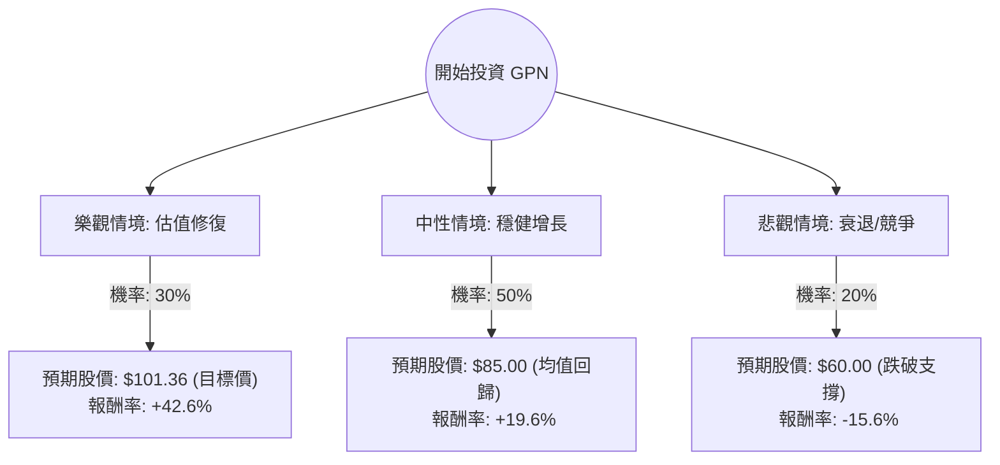

這份分析報告將針對 **Global Payments Inc. (GPN)** 進行深入評估。我們將結合您提供的基本面數據，以及最新的市場動態（包含 2024 年第一季財報與產業趨勢），透過**決策樹（Decision Tree）**與**期望值分析（Expected Value Analysis）**來判斷其投資價值。

---

### 1. 最新市場動態與背景分析 (Market Context)

在進入計算前，我們先整合最新的外部資訊：
*   **最新財報 (2024 Q1)：** GPN 第一季表現優於預期，調整後 EPS 為 $2.59（高於預期的 $2.57），營收達 21.8 億美元。公司重申了 2024 全年展望，預計營收增長 6-7%，EPS 增長 11-12%。
*   **估值極端低廉：** 目前 Forward P/E 僅約 4.41，PEG 為 0.27。這在金融科技（Fintech）產業中屬於極度低估，反映了市場對其轉型壓力與競爭（如 Adyen, Stripe）的過度擔憂。
*   **策略轉型：** 公司正積極剝離非核心資產（如 Netspend），專注於高利潤的 B2B 與軟體整合支付業務。
*   **技術面：** 股價處於 52 週低點附近，SMA20/50/200 均呈現負值，顯示短期動能極弱，但具備均值回歸的潛力。

---

### 2. 決策樹分析 (Decision Tree)

我們將未來一年的投資情境分為三種：**樂觀（估值修復）**、**中性（穩健增長）**、**悲觀（經濟衰退/競爭加劇）**。

---

### 3. 核心假設與期望值計算

#### A. 核心假設
1.  **樂觀情境 (30%)**：市場重新認識其 PEG 0.27 的價值，且聯準會降息預期升溫帶動成長股估值回升。股價達到分析師平均目標價 **$101.36**。
2.  **中性情境 (50%)**：公司維持 11-12% 的 EPS 增長，股價隨業績緩步回升至 SMA200 附近或 P/E 回升至 8-9 倍。預期股價 **$85.00**。
3.  **悲觀情境 (20%)**：美國經濟陷入硬著陸，消費者支出大幅萎縮，或競爭對手大幅侵蝕市佔率。股價跌破 52 週低點，下探 **$60.00**。

#### B. 期望值 (Expected Value, EV) 計算過程
*   **現價 ($P_0$):** $71.06

| 情境 | 預期股價 ($P_i$) | 報酬率 ($R_i$) | 機率 ($P_i$) | 加權期望報酬 ($R_i \times P_i$) |
| :--- | :--- | :--- | :--- | :--- |
| 樂觀 | $101.36 | +42.6% | 0.30 | +12.78% |
| 中性 | $85.00 | +19.6% | 0.50 | +9.80% |
| 悲觀 | $60.00 | -15.6% | 0.20 | -3.12% |
| **總計** | | | **1.00** | **+19.46%** |

**計算公式：**
$EV = (101.36 \times 0.3) + (85.00 \times 0.5) + (60.00 \times 0.2) = 30.41 + 42.50 + 12.00 = \$84.91$

**預期報酬率：**
$(84.91 - 71.06) / 71.06 = \mathbf{19.49\%}$

---

### 4. 綜合評估與最終結論

#### 基本面優勢：
*   **極高的安全邊際：** P/B 0.73 意味著股價低於淨資產價值，Forward P/E 4.41 顯示下行空間受限。
*   **獲利能力穩健：** 營業利益率 (Oper. Margin) 達 27.16%，且現金流充沛 (P/FCF 9.76)。
*   **成長性：** PEG 0.27 顯示相對於其 EPS 增長預期，股價被嚴重低估。

#### 潛在風險：
*   **技術面弱勢：** 股價處於所有均線下方，短期內可能持續受壓。
*   **宏觀壓力：** 支付產業對消費支出高度敏感，若通膨持續或失業率上升將受打擊。

#### **最終結論：適合投資 (Suitable for Investment)**

**理由：**
1.  **期望值極佳：** 經過機率加權後的預期報酬率約為 **19.5%**，遠高於市場平均預期。
2.  **估值錯置：** GPN 目前的估值更像是一間瀕臨破產的公司，但其財報顯示仍有雙位數的 EPS 增長與強勁的利潤率。這種「基本面與估值」的嚴重脫節提供了良好的價值投資機會。
3.  **下行保護：** P/B 低於 1 且 P/E 處於歷史極低位，提供了強大的安全邊際 (Margin of Safety)。

**建議策略：**
由於技術面仍呈空頭排列，建議採取**分批買進（Dollar Cost Averaging）**策略，以應對短期內可能出現的非理性下跌，目標價設定在 $95 - $100 區間。