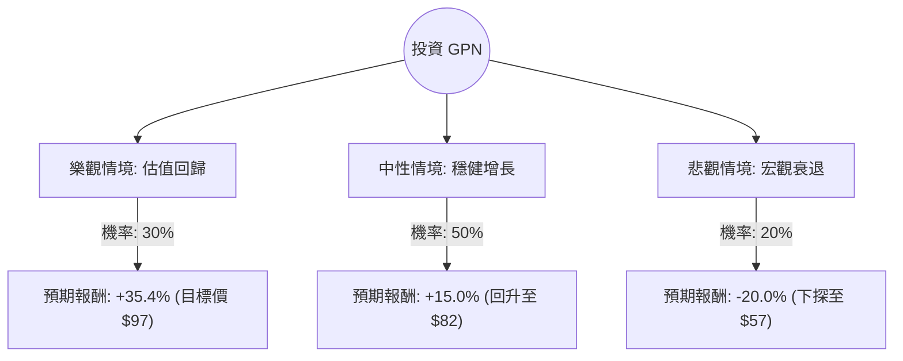

這份分析報告將結合您提供的基本面數據與最新的市場動態（截至 2024 年 8 月），利用**決策樹（Decision Tree）**與**期望值分析（Expected Value Analysis）**評估 Global Payments Inc. (GPN) 的投資價值。

---

### 一、 核心假設與市場背景分析

在建立模型前，我們先整合基本面與最新資訊：

1.  **極度低估的估值**：GPN 目前的 **P/B 為 0.74**（低於帳面價值），**Forward P/E 僅 4.45**，**PEG 為 0.27**。這在標普 500 成分股中屬於極端低估，顯示市場對其增長前景極度悲觀或存在誤解。
2.  **最新財報表現 (2024 Q2)**：GPN 於 8 月初公布財報，營收與獲利均優於預期。公司重申了全年調整後 EPS 增長 11-12% 的指引，並宣布將進行策略轉型，專注於核心支付業務，並考慮出售非核心資產（如 AdvancedMD）。
3.  **產業趨勢**：金融科技（Fintech）板塊近期受宏觀經濟（消費支出放緩預期）影響承壓，但 GPN 透過軟體整合支付（Software-led payments）維持了較高的營業利潤率 (27.16%)。
4.  **技術面**：股價目前在 52 週低點附近震盪，SMA200 仍為負值 (-8.95%)，顯示中長期趨勢尚未反轉，但短期有築底跡象。

---

### 二、 決策樹分析 (Decision Tree)

我們將未來一年的投資情境分為三種：**樂觀（估值修復）**、**中性（穩健增長）**、**悲觀（宏觀衰退/競爭加劇）**。

#### 節點詳細說明：

| 情境 | 機率 (P) | 預期股價 | 預期報酬率 (R) | 說明 |
| :--- | :--- | :--- | :--- | :--- |
| **樂觀 (Bull)** | 30% | $97.00 | +35.4% | 市場認可其轉型計畫，估值修復至分析師平均目標價。 |
| **中性 (Base)** | 50% | $82.36 | +15.0% | 業績符合預期，隨大盤穩健回升，P/E 稍微修復至 6-7 倍。 |
| **悲觀 (Bear)** | 20% | $57.30 | -20.0% | 美國消費支出大幅萎縮，競爭對手奪取市佔，股價跌破 52W 低點。 |

---

### 三、 期望值計算過程 (Expected Value Calculation)

期望值 (EV) 的計算公式為：
$$EV = \sum (機率 \times 預期報酬率)$$

**1. 計算各情境貢獻值：**
*   樂觀情境：$0.30 \times 35.4\% = 10.62\%$
*   中性情境：$0.50 \times 15.0\% = 7.50\%$
*   悲觀情境：$0.20 \times (-20.0\%) = -4.00\%$

**2. 總期望報酬率：**
$$EV = 10.62\% + 7.50\% - 4.00\% = 14.12\%$$

**3. 考慮股息收益：**
*   目前股息率約為 1.4%。
*   **總預期年化報酬率 = 14.12% + 1.4% = 15.52%**

---

### 四、 核心假設與風險評估

1.  **估值安全邊際**：P/B < 1 且 Forward P/E < 5 提供極強的安全邊際。即便在悲觀情境下，進一步大幅下殺的空間受限於其強大的現金流（P/FCF 僅 9.67）。
2.  **轉型催化劑**：公司正在剝離非核心業務並加大股份回購，這通常是股價回升的催化劑。
3.  **風險點**：
    *   **債務壓力**：Debt/Eq 為 0.97，在降息循環開啟前，利息支出仍是負擔。
    *   **增長放緩**：Sales Q/Q 下降 24.59% 是一個警訊，需觀察是否為季節性或資產剝離影響。

---

### 五、 最終結論

**判斷：適合投資 (Buy / Overweight)**

#### 理由：
1.  **期望值極具吸引力**：經風險加權後的預期報酬率高達 **15.52%**，遠高於市場平均預期。
2.  **估值極端低廉**：PEG 0.27 顯示股價嚴重低估了其 EPS 增長潛力（明年預期增長 17.27%）。目前股價接近 52 週低點，提供了良好的進場點。
3.  **財務韌性**：儘管營收有所波動，但營業利潤率 (27.16%) 與毛利率 (69.37%) 依然強勁，顯示其在支付產業中具有競爭力。
4.  **策略清晰**：管理層主動進行業務瘦身並回饋股東（回購與股息），有助於提升 ROE。

**建議操作策略：**
*   **進場點**：目前價格 $71.62 附近即可分批佈局。
*   **停損點**：若股價跌破 $60（約 52 週低點下方 4%），需重新評估基本面是否惡化。
*   **持有期限**：建議中長期持有（6-12 個月），等待市場對其 Forward P/E 的重新定價。