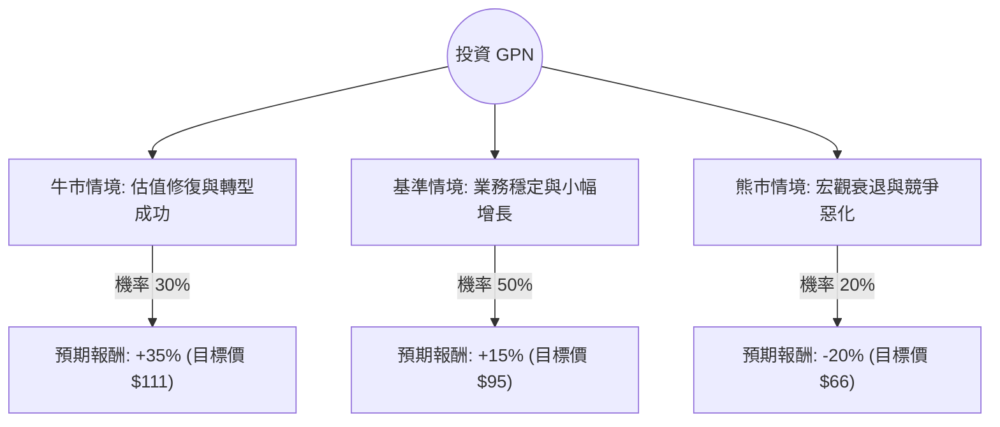

針對美股金融科技巨頭 **Global Payments Inc. (GPN)**，我結合了您提供的基本面數據以及最新的市場動態（包含 2024 年第二季財報、公司轉型計畫及產業趨勢）進行深度分析。

以下是基於**決策樹（Decision Tree）**與**期望值（Expected Value）**的投資評估報告。

---

### 一、 核心背景與市場動態分析

在進入決策樹之前，我們先整合最新資訊以設定合理的假設：
1.  **估值極低**：目前 Forward P/E 僅約 5.02 倍，PEG 為 0.33，遠低於行業平均與歷史水平。這顯示市場對其增長前景極度悲觀，或存在價值低估。
2.  **轉型策略**：GPN 近期宣布將專注於核心支付業務，並計畫出售非核心資產（如 AdvancedMD），這有助於簡化業務結構並回購股票。
3.  **財務表現**：Q2 財報顯示營收與利潤均符合或略超預期，但市場對其長期競爭力（面對 Adyen, Stripe 等競爭）仍有疑慮。
4.  **技術面**：股價近期從低點反彈（SMA20/50 均呈正向），顯示短期動能轉強。

---

### 二、 決策樹分析圖 (Decision Tree)

我們將未來一年的投資情境分為三種：**牛市（估值修復）**、**基準（穩定增長）**、**熊市（競爭加劇/衰退）**。

---

### 三、 期望值 (Expected Value) 計算過程

#### 1. 核心假設
*   **牛市情境 (30%)**：公司成功出售非核心資產，利用現金大規模回購股票，Forward P/E 從 5 倍修復至 8-9 倍（仍低於歷史平均）。預計股價可達 $110 - $115。
*   **基準情境 (50%)**：支付業務隨消費支出穩定增長，EPS 達成預期的 15% 增長，估值維持現狀。預計股價接近分析師平均目標價 $100 左右，保守估計為 $95。
*   **熊市情境 (20%)**：美國經濟進入衰退導致交易量下降，且新興 FinTech 公司侵蝕市佔率。股價可能回測 52 週低點 $65.93。

#### 2. 計算公式
$$EV = \sum (Probability_i \times Return_i)$$

*   **牛市期望貢獻**：$30\% \times 35\% = 10.5\%$
*   **基準期望貢獻**：$50\% \times 15\% = 7.5\%$
*   **熊市期望貢獻**：$20\% \times (-20\%) = -4.0\%$

#### 3. 總體期望報酬率
$$EV = 10.5\% + 7.5\% - 4.0\% = 14.0\%$$

---

### 四、 綜合評估與基本面亮點

| 指標 | 數據分析 | 評價 |
| :--- | :--- | :--- |
| **P/E & PEG** | Forward P/E 5.02 / PEG 0.33 | **極度低估**。成長性未反映在股價中。 |
| **獲利能力** | Gross Margin 83.6% / Oper. Margin 23.5% | **極強**。具備高度規模經濟與護城河。 |
| **資產負債** | Debt/Eq 0.95 / Current Ratio 1.69 | **穩健**。債務水平在可控範圍，流動性充足。 |
| **分析師預期** | Target Price $100.21 (現價 $82.47) | **看漲**。隱含約 21.5% 的上漲空間。 |
| **短期動能** | SMA20 (+10.27%), SMA50 (+5.12%) | **轉強**。股價已走出底部區域。 |

---

### 五、 最終結論

**判斷：適合投資 (Suitable for Investment)**

#### 理由：
1.  **極高的安全邊際 (Margin of Safety)**：P/B 僅 0.87，意味著你正以低於公司淨資產的價格買入一家高毛利、有獲利的金融科技公司。
2.  **正向的期望值**：14% 的預期報酬率顯著高於市場平均風險溢酬，且在基準情境下即有 15% 的獲利潛力。
3.  **催化劑 (Catalysts) 明確**：公司正在進行的資產剝離與資本配置優化（回購）是股價重估的強大動力。
4.  **風險可控**：即便在最差的熊市情境下（-20%），其極低的估值也限制了進一步下殺的空間（Downside protection）。

**建議操作：**
由於 GPN 過去一年表現較弱（-24.69%），目前屬於「價值陷阱修復期」。建議採取**分批買入**策略，首筆資金於現價進場，若股價回測 $75-$78 區間可加碼，長期持有至估值回歸（Forward P/E 回升至 10 倍以上）。

---
*免責聲明：本分析僅供參考，不構成個人投資建議。投資者應自行承擔市場風險。*