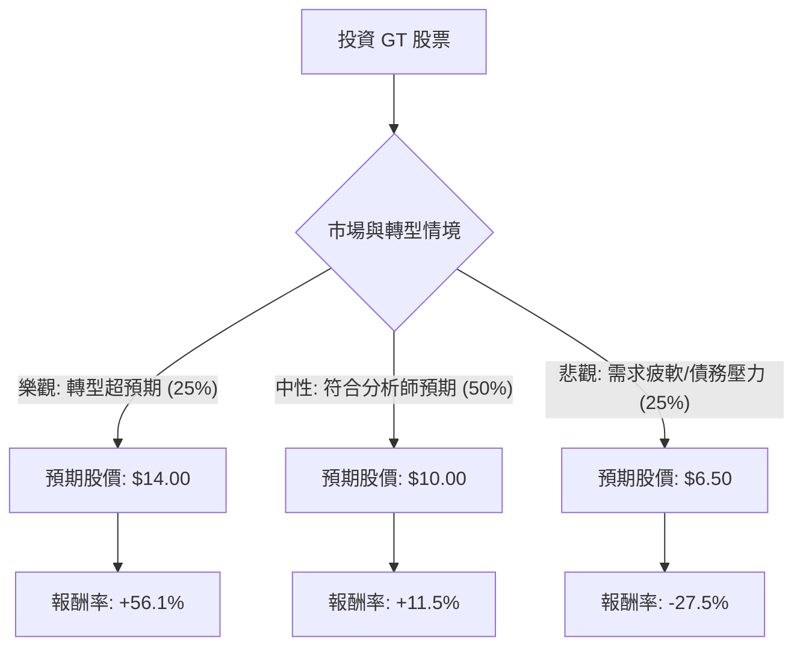

這份分析報告針對 **Goodyear Tire & Rubber Company (GT)** 進行評估。我們將結合您提供的財務數據與最新的市場動態（如「Goodyear Forward」轉型計畫、債務減輕進度及產業趨勢），利用**決策樹**與**期望值分析**來判斷其投資價值。

---

### 一、 核心背景與市場動態分析

在進入計算前，根據最新資訊（2024 下半年動態），GT 的現況如下：
1.  **Goodyear Forward 計畫**：公司正處於大規模轉型，目標是到 2025 年底實現 13 億美元的成本節約，並出售非核心資產（如化學業務、Dunlop 品牌、越野輪胎業務）以償還債務。
2.  **財務壓力**：負債比（Debt/Eq: 3.05）極高，利息支出沉重。但 P/B 僅 0.85，顯示資產被市場低估。
3.  **產業趨勢**：原材料成本（天然橡膠、石油衍生品）波動與電動車（EV）對高耐磨輪胎的需求增加是雙面刃。

---

### 二、 決策樹分析 (Decision Tree)

我們將未來一年的表現分為三種情境：**樂觀（轉型成功）**、**中性（維持現狀）**、**悲觀（債務危機/衰退）**。

#### 決策樹節點詳細說明：

| 情境 | 機率 (P) | 預期股價 (Target) | 預期報酬率 (R) | 說明 |
| :--- | :--- | :--- | :--- | :--- |
| **樂觀 (Bull)** | 25% | $14.00 | +56.1% | 資產剝離順利，債務大幅下降，利潤率回升至歷史高位。 |
| **中性 (Base)** | 50% | $10.00 | +11.5% | 接近分析師目標價 ($9.47)，轉型進度緩慢但穩定。 |
| **悲觀 (Bear)** | 25% | $6.50 | -27.5% | 全球經濟衰退導致換胎需求下降，高槓桿引發流動性疑慮。 |

---

### 三、 期望值分析 (Expected Value Analysis)

#### 1. 計算過程
期望值 (EV) = $\sum (機率 \times 報酬率)$

*   **樂觀情境貢獻**：$0.25 \times 56.1\% = 14.025\%$
*   **中性情境貢獻**：$0.50 \times 11.5\% = 5.75\%$
*   **悲觀情境貢獻**：$0.25 \times (-27.5\%) = -6.875\%$

**總期望報酬率 (Total EV) = $14.025\% + 5.75\% - 6.875\% = 12.9\%$**

#### 2. 核心假設
*   **估值修復**：目前 P/B 0.85 屬於低估，假設中性情境下 P/B 回歸至 1.0 左右。
*   **Forward P/E**：目前 Forward P/E 為 8.74，相較於行業平均並不高，顯示市場對其獲利改善有一定期待。
*   **債務風險**：假設公司能透過資產出售至少償還 20 億美元債務，否則悲觀情境機率將上升。
*   **宏觀環境**：假設聯準會降息循環有助於減輕 GT 的浮動利率債務負擔。

---

### 四、 最終結論

#### **判斷：適合投資 (投機型買入 / Speculative Buy)**

#### **理由：**
1.  **期望值為正 (12.9%)**：在考慮了悲觀風險後，整體的期望報酬率仍優於標普 500 的長期平均回報。
2.  **安全邊際 (Margin of Safety)**：P/B 0.85 與 P/S 0.14 顯示股價已反映了大部分的負面消息（如虧損與高負債）。
3.  **轉型催化劑 (Catalyst)**：Goodyear Forward 計畫是明確的股價驅動力。只要資產出售的消息確認（如近期傳出的 Dunlop 品牌出售），股價極易出現報復性反彈。
4.  **技術面支撐**：股價目前在 $8.97，接近 52 週低點區域（$6.51），下行空間相較於上行空間（52 週高點 $12.03）更受限。

#### **風險提示：**
*   **高槓桿風險**：Debt/Eq 3.05 是致命傷，若全球進入深度衰退，GT 可能面臨融資困難。
*   **無股息**：在等待轉型期間，投資者無法獲得現金流補償。

**建議操作：** 建議分批建倉，並將停損位設在 $7.50（跌破近期支撐），首要目標價看 $10.50 - $11.00。