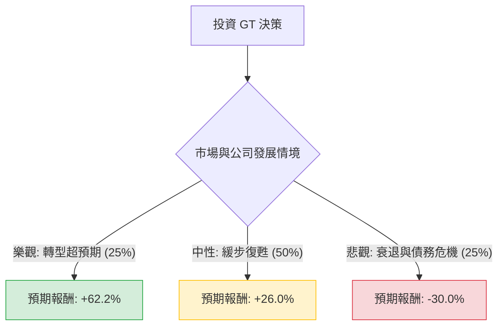

這份分析報告將針對 **Goodyear Tire & Rubber Company (GT)** 進行深度評估。我們結合了您提供的財務數據與最新的市場動態（如「Goodyear Forward」轉型計畫、債務減省進度及產業趨勢），利用**決策樹**與**期望值分析**來判斷其投資價值。

---

### 一、 核心背景與現狀分析

1.  **轉型計畫 (Goodyear Forward)**：公司正處於大規模重組階段，目標是在 2025 年底前實現 13 億美元的成本節約，並出售非核心資產（如 OTR 輪胎業務）以償還債務。
2.  **財務壓力**：目前 **Debt/Eq (負債權益比) 高達 2.24**，財務槓桿極高。然而，**P/B 僅 0.56**，顯示股價嚴重低於帳面價值，存在價值窪地的可能。
3.  **市場表現**：股價接近 52 週低點（$6.14），且技術指標（SMA20/50/200）全數呈現負值，顯示短期動能極弱，但 **Forward P/E 僅 6.57**，若獲利回升，潛在漲幅巨大。

---

### 二、 決策樹分析 (Decision Tree)

我們將未來一年的表現分為三種情境：**樂觀（轉型成功）**、**中性（緩步復甦）**、**悲觀（宏觀衰退/債務危機）**。

#### 節點詳細說明：

| 情境 | 機率 (P) | 預期目標價 | 預期報酬率 (R) | 說明 |
| :--- | :--- | :--- | :--- | :--- |
| **樂觀 (Bull)** | 25% | $10.30 | +62.2% | 成功出售資產、大幅降槓桿、分析師目標價達成。 |
| **中性 (Base)** | 50% | $8.00 | +26.0% | 成本控制見效，獲利轉正，股價回歸歷史平均 P/B。 |
| **悲觀 (Bear)** | 25% | $4.45 | -30.0% | 高利率環境持續、汽車需求萎縮、債務違約風險增加。 |

---

### 三、 期望值分析 (Expected Value Analysis)

#### 1. 計算過程：
期望值 (EV) = $\sum (機率 \times 報酬率)$

*   **樂觀節點**：$0.25 \times 62.2\% = 15.55\%$
*   **中性節點**：$0.50 \times 26.0\% = 13.00\%$
*   **悲觀節點**：$0.25 \times (-30.0\%) = -7.50\%$

**總期望報酬率 (Total EV) = 15.55% + 13.00% - 7.50% = 21.05%**

#### 2. 核心假設：
*   **市場假設**：假設聯準會 (Fed) 在未來一年內不會大幅升息，有利於 GT 減輕利息負擔。
*   **財務假設**：EPS next Y 預期增長 120% 是計算核心。若此增長無法兌現，期望值將大幅修正。
*   **產業趨勢**：原物料（合成橡膠、石油）價格保持穩定，且汽車售後市場（Replacement Tire Market）需求具備韌性。

---

### 四、 最終結論

#### **判斷：適合投資 (投機型買入 / Speculative Buy)**

**理由如下：**

1.  **期望值為正 (21.05%)**：即便考慮了 25% 的崩盤機率，整體的數學期望報酬仍顯著優於標普 500 的平均年化報酬。
2.  **極端的估值折扣**：P/B 0.56 意味著投資者正以 44% 的折扣購買公司的淨資產。這提供了極強的安全邊際（Margin of Safety），除非公司走向破產。
3.  **轉型催化劑**：Goodyear Forward 計畫是明確的股價催化劑。近期 Insider Trans (內部人交易) 為正 (0.0089)，顯示內部管理層對當前價位有信心。
4.  **風險提示**：這是一項**高風險、高回報**的投資。主要的威脅來自於其 **Debt/Eq 2.24** 的高負債。若全球經濟進入深度衰退，GT 的財務壓力可能導致股價進一步下探。

**建議操作：**
*   **進場點**：目前股價 $6.35 接近 52 週低點，是分批佈局的良機。
*   **停損點**：若股價跌破 $5.80（跌破近期支撐並創多年新低），應重新評估其破產風險並考慮離場。
*   **配置**：由於波動率高且負債重，建議佔投資組合比例不超過 3-5%。