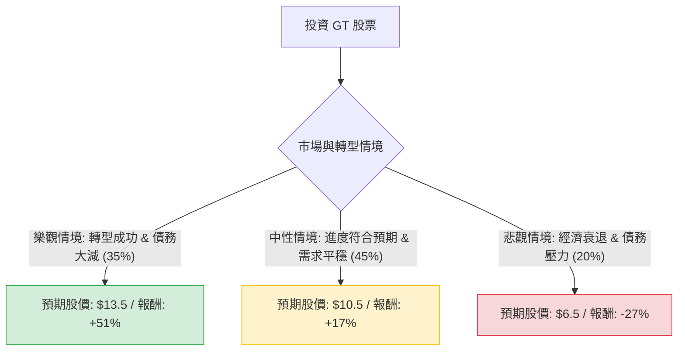

針對美股固特異輪胎 **Goodyear Tire & Rubber Company (GT)** 的投資評估，我結合了您提供的基本面數據與最新的市場動態（包含 2024 年 Q3 財報與「Goodyear Forward」轉型計畫進度）進行分析。

---

### 一、 核心背景與現況分析

1.  **轉型計畫 (Goodyear Forward)：** 公司正處於大規模縮減成本與去槓桿階段。近期已完成將 OTR（非公路用輪胎）業務以 9.05 億美元出售給橫濱橡膠，這對緩解其高額債務（Debt/Eq 2.24）至關重要。
2.  **財務表現：** 雖然目前 ROE 為負，但 **Forward P/E 僅 8.23** 且 **PEG 為 0.2**，顯示市場對其明年盈餘成長（EPS next Y +72.67%）有極高期待。
3.  **市場環境：** 原物料成本（合成橡膠、炭黑）波動與汽車銷量放緩是主要風險，但公司毛利率（18.44%）已有改善跡象。

---

### 二、 決策樹分析 (Decision Tree)

以下使用 Markdown 繪製決策樹，評估未來一年的投資情境：

#### 節點詳細說明：

1.  **樂觀情境 (Bull Case) - 35% 機率：**
    *   **條件：** 「Goodyear Forward」計畫超額達成 13 億美元的成本節約目標，資產剝離進度快，淨債務/EBITDA 比率降至 2.0x 以下。
    *   **預期報酬：** 股價回升至 52 週高點以上，約 $13.5。
    *   **期望值貢獻：** $0.35 \times 51\% = 17.85\%$

2.  **中性情境 (Base Case) - 45% 機率：**
    *   **條件：** 轉型計畫穩步推進，EPS 達到分析師預期的 $1.0 - $1.2 區間。市場維持對輪胎的更換需求。
    *   **預期報酬：** 股價回升至分析師平均目標價約 $10.5。
    *   **期望值貢獻：** $0.45 \times 17\% = 7.65\%$

3.  **悲觀情境 (Bear Case) - 20% 機率：**
    *   **條件：** 全球汽車銷量大幅下滑，高利率導致債務利息支出侵蝕利潤，轉型計畫因執行力不足受阻。
    *   **預期報酬：** 股價下探至 52 週低點附近，約 $6.5。
    *   **期望值貢獻：** $0.20 \times (-27\%) = -5.4\%$

---

### 三、 期望值分析 (Expected Value Analysis)

#### 1. 計算過程
根據上述決策樹節點，計算總體預期報酬率（Expected Return）：
$$EV = (0.35 \times 51\%) + (0.45 \times 17\%) + (0.20 \times -27\%)$$
$$EV = 17.85\% + 7.65\% - 5.4\% = 20.1\%$$

#### 2. 核心假設
*   **估值修復：** 目前 P/B 僅 0.78，遠低於歷史平均，假設只要不發生破產危機，估值應回歸至 P/B 1.0 左右。
*   **債務風險：** 假設公司能透過資產出售（如 OTR 業務）償還至少 10 億美元債務，降低財務槓桿。
*   **成長性：** 認可 Forward P/E 8.23 所代表的低估值狀態，前提是明年 EPS 成長 72% 的預測能實現一半以上。

---

### 四、 最終結論

**判斷：適合投資 (Speculative Buy / 投機性買入)**

#### 理由：
1.  **期望值為正 (20.1%)：** 儘管存在下行風險，但目前的股價（$8.94）已反映了大部分的負面消息（如虧損、高債務），上行空間明顯大於下行空間。
2.  **極具吸引力的估值：** P/S 0.14 與 P/B 0.78 顯示該公司被嚴重低估。這通常是典型的「價值反轉型」投資標的。
3.  **催化劑明確：** 透過出售非核心資產（OTR 業務）來去槓桿的策略正在兌現，這將直接改善資產負債表，降低破產風險。
4.  **技術面支撐：** 股價目前接近 52 週區間的中下部，且 PEG 0.2 顯示若成長兌現，股價具備翻倍潛力。

**風險提示：**
GT 屬於**高槓桿、高風險**標的。若您是保守型投資者，建議避開；若您追求高彈性的轉機股，目前是一個具備風險報酬比（Risk-Reward Ratio）優勢的切入點。建議配置比例不宜過高，並密切關注其債務減免進度。