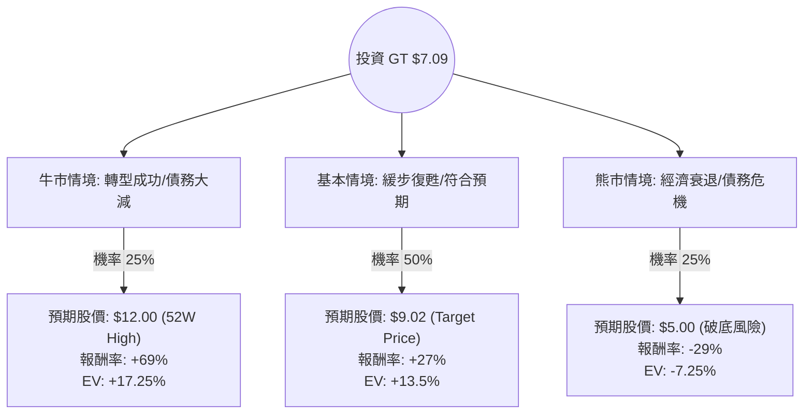

這份分析報告將結合您提供的財務數據與最新的市場動態（如「Goodyear Forward」轉型計畫、債務減輕進度及產業趨勢），利用**決策樹（Decision Tree）**與**期望值分析（Expected Value Analysis）**評估固特異輪胎（Goodyear Tire & Rubber Co., 代碼：GT）的投資價值。

---

### 一、 最新市場動態與背景分析

在進入計算前，根據最新資訊補充以下關鍵點：
1.  **Goodyear Forward 轉型計畫**：公司正處於大規模重組階段，目標是在 2025 年底前實現 13 億美元的成本節約，並出售非核心資產（如 OTR 輪胎業務已以 9.05 億美元出售給橫濱橡膠）以償還債務。
2.  **財務壓力**：數據顯示 **Debt/Eq 為 2.24**，負債比極高。然而，**P/B 僅 0.63** 且 **P/S 僅 0.11**，顯示資產被嚴重低估，市場已反映了破產或長期衰退的風險。
3.  **產業趨勢**：原材料成本（天然橡膠、石油衍生品）波動與全球汽車銷量放緩是主要威脅；但替換輪胎市場的需求相對穩定。
4.  **分析師預期**：平均目標價約為 **$9.02**，較目前股價（$7.09）有約 27% 的上漲空間。

---

### 二、 決策樹分析 (Decision Tree)

以下決策樹模擬未來 12 個月內 GT 可能面臨的三種主要情境：

---

### 三、 期望值計算過程與核心假設

#### 1. 核心假設
*   **牛市情境 (25%)**：資產剝離進度超前，債務大幅下降，且原材料價格下跌。股價回歸 52 週高點附近（約 $12.00）。
*   **基本情境 (50%)**：公司按計畫實現成本節約，EPS 轉正（符合 Forward P/E 7.52 的預期）。股價達到分析師平均目標價 $9.02。
*   **熊市情境 (25%)**：全球經濟衰退導致汽車需求崩潰，高槓桿（Debt/Eq 2.24）引發流動性危機。股價跌破 52 週低點，下探 $5.00。

#### 2. 期望報酬率計算
期望值 (EV) = $\sum (\text{機率} \times \text{報酬率})$

*   **牛市貢獻**：$0.25 \times 69\% = 17.25\%$
*   **基本貢獻**：$0.50 \times 27\% = 13.50\%$
*   **熊市貢獻**：$0.25 \times (-29\%) = -7.25\%$

**總體期望報酬率 (Total EV) = $17.25\% + 13.50\% - 7.25\% = 23.5\%$**

#### 3. 財務數據解讀
*   **估值優勢**：PEG 僅 0.17，顯示相對於未來的盈餘成長（EPS next Y 預期增長 178%），目前股價極其廉價。
*   **風險指標**：Quick Ratio 0.54 偏低，顯示短期流動性緊張，這解釋了為何市場給予極低的 P/B 比。

---

### 四、 最終結論

#### **判斷：適合投資 (Speculative Buy / 投機性買入)**

**理由如下：**
1.  **期望值為正 (23.5%)**：即便考慮了 25% 的極端負面情境，整體的數學期望報酬率依然顯著高於市場平均水準。
2.  **極高的安全邊際 (Valuation)**：P/B 0.63 與 P/S 0.11 意味著投資者是以「清算價值」左右的價格買入這家全球輪胎巨頭。只要公司不破產，估值修復的潛力巨大。
3.  **轉型催化劑**：Goodyear Forward 計畫與資產出售（如 OTR 業務）提供了明確的去槓桿路徑。
4.  **技術面支撐**：目前股價 $7.09 接近 52 週低點（$6.14），下行空間相對有限，而上行空間（至 $9.02 或 $12.00）較大。

**風險提示：**
GT 屬於**高風險、高回報**的標的。其高負債比（Debt/Eq 2.24）意味著它對利率環境極其敏感。建議投資者將其定位為波段操作或轉型題材配置，並嚴格執行止損（建議設於 $6.00 附近），不宜作為核心穩健持倉。