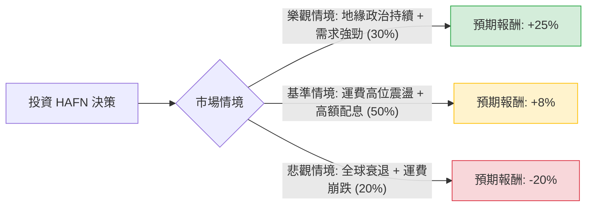

這份分析報告將針對 **Hafnia Limited (HAFN)** 進行深入評估。Hafnia 是全球最大的成品油輪（Product Tanker）船隊營運商之一。我們將結合你提供的財務數據與當前航運市場的即時動態（如紅海危機、燃油需求、新船訂單量）進行決策樹與期望值分析。

---

### 一、 核心假設與市場背景分析

在建立模型前，我們必須確立以下關鍵假設：

1.  **地緣政治影響（紅海危機）**：目前成品油輪受益於繞道好望角，導致「噸海里（Ton-mile）」需求增加，支撐了高運費（Spot Rates）。
2.  **股利政策**：HAFN 擁有極高的派息率（通常為淨利的 70%-80%），目前殖利率約 7.5%，這是股價的重要支撐。
3.  **循環週期風險**：數據顯示明年 EPS 預期衰退 -18.44%，反映市場預期運費可能從高點回落。
4.  **資產價值**：P/B 1.55 顯示股價高於帳面價值，反映了市場對其高效能船隊的溢價。

---

### 二、 決策樹分析 (Decision Tree)

以下為未來 12 個月的投資情境預測：

#### 節點詳細說明：

1.  **樂觀情境 (Bull Case) - 30% 機率**：
    *   **條件**：紅海危機持續整年，且全球成品油需求超預期（特別是亞太與歐洲貿易）。
    *   **預期報酬**：股價達到 Target Price $8.13 以上，加上 7.5% 股息，總報酬約 **25%**。
2.  **基準情境 (Base Case) - 50% 機率**：
    *   **條件**：運費雖有回落但仍高於歷史平均。公司維持高配息。
    *   **預期報酬**：股價在 $7.0 - $7.5 區間橫盤，主要收益來自股息與小幅資本利得，總報酬約 **8%**。
3.  **悲觀情境 (Bear Case) - 20% 機率**：
    *   **條件**：地緣政治和解導致航線恢復正常，加上全球經濟衰退導致石油需求萎縮。
    *   **預期報酬**：股價回測 200 日均線或更低，EPS 衰退兌現，總報酬（含股息抵銷後）約 **-20%**。

---

### 三、 期望值計算 (Expected Value Analysis)

我們將各情境的機率與預期報酬相乘，得出整體期望值：

**計算公式：**
$EV = (P_{Bull} \times R_{Bull}) + (P_{Base} \times R_{Base}) + (P_{Bear} \times R_{Bear})$

**代入數值：**
*   $EV = (0.30 \times 0.25) + (0.50 \times 0.08) + (0.20 \times -0.20)$
*   $EV = 0.075 + 0.04 - 0.04$
*   **$EV = 0.075$ (即 7.5%)**

#### 財務數據補充分析：
*   **P/E 10.7 / Forward P/E 10.3**：估值處於合理區間，並未過度泡沫。
*   **Debt/Eq 0.48**：負債比在資本密集型的航運業中屬於非常健康的水平，抗風險能力強。
*   **SMA200 (0.2092)**：目前股價高於 200 日均線約 20%，顯示短期內有技術面修正的壓力，但長期趨勢向上。

---

### 四、 最終結論

#### **判斷：適合投資 (Suitable for Investment)**
*(註：建議定位為「價值型/收益型」配置，而非短線衝刺型)*

#### **理由：**
1.  **正向期望值**：經過風險加權後的預期報酬率為 **7.5%**，這在當前高利率環境下仍具備吸引力，且尚未計入複利效應。
2.  **強大的現金流與股息支撐**：7.5% 的股利率為股價提供了強大的下行保護（Floor Price）。即便股價不漲，投資者仍有穩定的現金流。
3.  **產業結構優勢**：成品油輪的新船訂單量（Orderbook）相對於原油輪仍處於歷史低位，這意味著未來 1-2 年供給增加有限，運費易漲難跌。
4.  **財務穩健**：低負債比（0.48）與高 ROE（14.79%）顯示管理層在循環週期中運作效率極高。

#### **風險提示（需監控指標）：**
*   **EPS 下修風險**：需密切關注下一季財報是否達到 EPS next Y 的衰退預期。
*   **地緣政治轉折**：若蘇伊士運河突然恢復全面通航，短期運費將面臨劇烈修正。
*   **技術面回檔**：目前股價接近 52 週高點（距離僅 -8.9%），建議採取**分批買進**策略，而非一次性歐印。

**總結：HAFN 是一家具備高防禦性（低債、高息）且受惠於當前地緣政治紅利的優質標的，適合尋求穩定現金流與中度資本利得的投資者。**