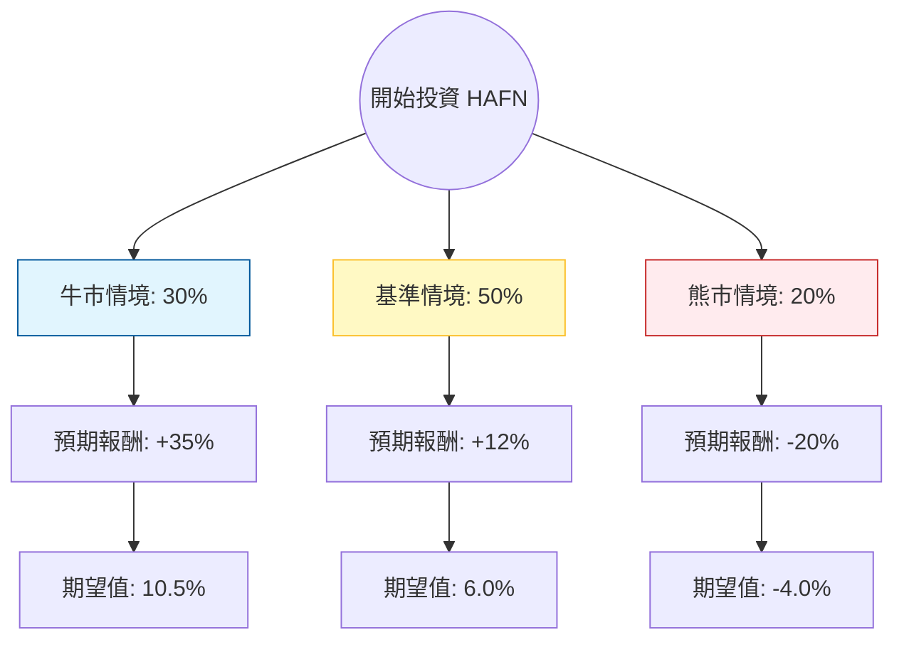

這份分析報告將結合您提供的基本面數據，以及針對 **Hafnia Limited (HAFN)** 的最新市場動態、航運產業趨勢（成品油輪市場）進行綜合評估。

---

### 一、 核心背景與市場動態分析

在進入決策樹之前，我們先釐清影響 HAFN 的關鍵變數：

1.  **產業地位**：Hafnia 是全球最大的成品油輪（Product Tanker）營運商之一。主要運輸汽油、柴油、航空燃油及化學品。
2.  **地緣政治（紅海危機）**：由於紅海局勢不穩，大量油輪繞道好望角，導致航程增加（Ton-mile demand 增加），支撐了運費（Spot Rates）。
3.  **供需結構**：目前成品油輪的新船訂單量處於歷史低點，且全球煉油重心東移（從歐美轉向中東/亞洲），增加了長途運輸需求。
4.  **財務狀況**：HAFN 擁有極強的現金流與低負債比（Debt/Eq 0.38），其股息政策（Dividend % 6.88%）對價值型投資者極具吸引力。
5.  **近期風險**：Q/Q 營收與 EPS 下滑（-18.46% / -56.62%），反映出運費從 2023 年的高點回落，市場正在進入「常態化的高獲利期」而非「爆發期」。

---

### 二、 決策樹分析 (Decision Tree)

我們將未來一年的投資情境分為三種：**牛市（地緣政治持續+供應吃緊）**、**基準（現狀維持+高股息）**、**熊市（全球衰退+運費崩跌）**。

#### 節點詳細說明：

| 情境 | 機率 | 預期報酬 (資本利得 + 股息) | 說明 |
| :--- | :--- | :--- | :--- |
| **牛市 (Bull)** | 30% | **+35%** | 紅海危機長期化，且環保法規迫使舊船拆解，運費飆升。股價達到 Target Price $7.22 以上。 |
| **基準 (Base)** | 50% | **+12%** | 運費維持在歷史均值上方。公司維持高配息（約 7-8%），股價小幅增長至 $6.0-$6.3。 |
| **熊市 (Bear)** | 20% | **-20%** | 全球經濟衰退導致能源需求大減，地緣政治和解，運費回歸低點。股價回測 52W 低點。 |

---

### 三、 期望值分析 (Expected Value Analysis)

#### 1. 計算過程
總期望值 (EV) = Σ (各情境機率 × 各情境報酬)

*   **牛市貢獻**：$0.30 \times 35\% = 10.5\%$
*   **基準貢獻**：$0.50 \times 12\% = 6.0\%$
*   **熊市貢獻**：$0.20 \times (-20\%) = -4.0\%$

**總體預期報酬率 (Total EV) = 10.5% + 6.0% - 4.0% = 12.5%**

#### 2. 核心假設
*   **市場假設**：假設未來 12 個月內不會發生全球性深度經濟衰退。
*   **財務假設**：HAFN 將維持其 60%-80% 的盈餘配發率（Payout Ratio）。
*   **估值假設**：目前 P/E 9.49 處於合理區間，Forward P/E 8.24 顯示市場預期獲利將改善。
*   **產業趨勢**：成品油輪的供給增速（<2%）低於需求增速，結構性利好支撐底部。

---

### 四、 最終結論

#### **評估結果：適合投資 (Buy / Overweight)**

#### **理由：**
1.  **正向期望值**：12.5% 的預期報酬率優於多數傳統產業，且考慮到其 6.88% 的高股息，提供了極佳的下行保護（Downside Protection）。
2.  **估值低廉**：P/B 僅 1.24，P/E 低於 10 倍，且 Forward P/E 顯示獲利能力具備韌性。
3.  **強勁現金流**：P/FCF 為 6.28，顯示公司賺取現金的能力極強，足以支撐高額派息與債務償還。
4.  **產業護城河**：在能源轉型期間，煉油廠地理位置的錯配（東產西用）是長期趨勢，HAFN 作為龍頭將持續受益於航程增加。

#### **投資建議與風險提示：**
*   **進場點**：目前股價 $5.75 接近 SMA20 與 SMA200，技術面處於盤整向上階段，建議分批進場。
*   **風險監控**：需密切關注「紅海局勢是否突然和平解決」以及「OPEC+ 的減產政策」，這兩者會直接影響短期運費波動。
*   **適合對象**：追求穩定現金流（股息）並看好能源運輸結構性機會的價值投資者。

---
*免責聲明：本分析僅供參考，不構成任何投資建議。投資者應自行承擔市場風險。*