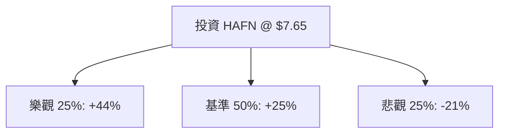

# HAFN (Hafnia Limited) 量化投資分析報告

作為量化投資分析師，針對 Hafnia Limited (HAFN) 的當前數據與市場動態，我將透過機率思考框架，將其複雜的航運週期變數轉化為可量化的期望值模型。

---

### 1. 核心驅動因素與風險 (Drivers & Risks)

#### **關鍵催化劑 (Catalysts)**
1.  **地緣政治導致的噸海里 (Ton-mile) 需求增加**：紅海危機持續迫使成品油輪繞道好望角，顯著拉長航程，變相減少全球有效運力供給，支撐運價（Spot Rates）維持在高位。
2.  **極低的成品油輪訂單量 (Orderbook)**：目前成品油輪的新船訂單佔現有船隊比例仍處於歷史低點，且新船交付需 2-3 年，這意味著未來 12-18 個月內供給端將持續偏緊。
3.  **高額股息發放政策**：HAFN 擁有強勁的現金流與約 70%-80% 的派息率。目前殖利率約 7.14%，在低估值（P/E 8.46）環境下，高股息將成為股價下行的強力支撐。

#### **主要風險點 (Risks)**
1.  **全球經濟衰退導致需求萎縮**：若主要經濟體（如中國、美國）需求大幅下滑，將直接衝擊成品油（汽油、柴油、航空煤油）的貿易量。
2.  **地緣政治緩解與運河復航**：若紅海局勢意外迅速平息，繞道溢價將消失，運價可能面臨短期劇烈回調。
3.  **OPEC+ 減產政策延長**：原油產量減少會間接影響下游成品油的運輸需求與套利空間。

---

### 2. 情境設定與機率賦予 (Scenario Modeling)

基於當前 P/E 8.46 倍與 52 週高點回落約 20% 的現況，設定未來 12 個月的三種情境：

#### **樂觀情境 (Bull Case)**
*   **發生條件**：紅海局勢持續全年，全球成品油庫存處於低位引發補庫存需求，運價維持在 $40,000/day 以上。
*   **預估機率**：25%
*   **目標價格與預期回報**：目標價 **$10.50**（基於 P/E 回升至 10x + 股息）。預期總回報：**+44%** (含息)。

#### **基準情境 (Base Case)**
*   **發生條件**：運價從高峰溫和回落但仍高於歷史均值，公司維持穩定的季度派息，市場情緒中性。
*   **預估機率**：50%
*   **目標價格與預期回報**：目標價 **$9.00**（接近分析師平均目標價 $9.33）。預期總回報：**+25%** (含息)。

#### **悲觀情境 (Bear Case)**
*   **發生條件**：全球經濟衰退，紅海復航，運價跌破盈虧平衡點。
*   **預估機率**：25%
*   **目標價格與預期回報**：目標價 **$5.50**（回測 52 週低點與 P/B 1.0 附近）。預期總回報：**-21%** (含息)。

---

### 3. 期望值計算與決策樹 (EV Calculation & Decision Tree)

#### **決策樹結構**

#### **總期望值計算**
*   `EV = (0.25 * 0.44) + (0.50 * 0.25) + (0.25 * -0.21)`
*   `EV = 0.11 + 0.125 - 0.0525 = 0.1825`
*   **總期望報酬率：18.25%**

#### **風險回報比分析**
*   **上行潛力**：$10.50 - $7.65 = $2.85
*   **下行空間**：$7.65 - $5.50 = $2.15
*   **風險回報比 (R/R Ratio)**：1 : 1.33。雖然比例不算極端不對稱，但正向期望值（18.25%）顯著高於無風險利率，具備投資價值。

---

### 4. 決策總結 (Decision Summary)

| 情境 | 發生機率 (%) | 預期報酬率 (%) | 關鍵驅動/觸發因素 |
| :--- | :--- | :--- | :--- |
| **樂觀 (Bull)** | 25% | +44% | 地緣政治長期化、運力供給極度短缺 |
| **基準 (Base)** | 50% | +25% | 運價維持高位震盪、穩定高額派息 |
| **悲觀 (Bear)** | 25% | -21% | 全球經濟衰退、紅海危機解除 |
| **整體期望值** | **100%** | **+18.25%** | **加權平均預期回報** |

**最終結論：**
1.  **投資建議**：**買入 (Buy)**
2.  **核心逻辑**：HAFN 目前處於「低估值、高現金流、供給受限」的甜蜜點。儘管近期股價隨油價波動回調，但 18.25% 的期望報酬率顯示市場已過度定價了下行風險。在成品油輪供給週期尚未結束前，高額股息提供了極佳的安全邊際。
3.  **風控建議**：若股價跌破 **$6.80**（SMA200 支撐位附近）或紅海局勢出現實質性停火協議，應重新評估基準情境機率，並考慮減碼以規避週期性下行風險。【結束指令】