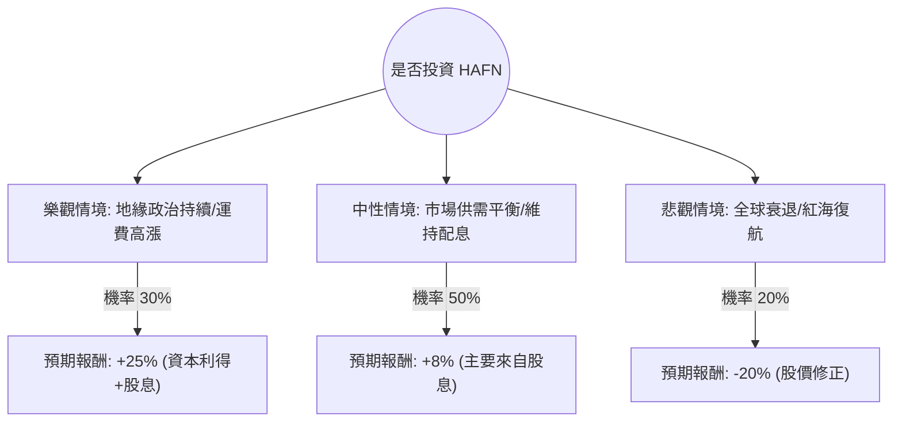

這份分析報告將結合您提供的基本面數據與最新的市場動態（包含航運業趨勢、地緣政治影響及 Hafnia Limited 的最新財報表現），利用**決策樹（Decision Tree）**與**期望值分析（Expected Value Analysis）**評估 HAFN 的投資價值。

---

### 一、 市場背景與最新動態搜尋摘要

根據最新市場資訊與 HAFN 的業務屬性（全球最大的成品油輪船隊之一）：
1.  **成品油輪市場（Product Tanker Market）**：受紅海危機影響，航線繞道導致航程拉長（Ton-mile demand 增加），支撐了較高的運費（Spot Rates）。
2.  **財務表現**：HAFN 展現了極強的現金流產生能力，P/FCF 僅 9.91。公司維持高配息政策（約 60-80% 的利潤用於分紅），目前殖利率約 6.5%。
3.  **負面預期**：數據顯示「EPS next Y: -35.13%」，反映市場預期運費可能從高峰回落，或地緣政治緩解後運力回歸正常。
4.  **技術面**：股價接近 52 週高點（$8.41 vs $8.52），且 SMA20/50/200 均呈現多頭排列，但短期漲幅已大（一年漲幅 95%）。

---

### 二、 決策樹分析 (Decision Tree Analysis)

我們將未來一年的投資情境分為三種：**樂觀（牛市）**、**中性（基準）**與**悲觀（熊市）**。

#### 決策樹節點詳細標示：

| 節點 (情境) | 機率 (P) | 預期報酬 (R) | 期望值 (P * R) | 說明 |
| :--- | :--- | :--- | :--- | :--- |
| **樂觀 (Bull)** | 30% (0.3) | +25% | +7.5% | 紅海危機持續，成品油輪供不應求，股價突破 $9.5。 |
| **中性 (Base)** | 50% (0.5) | +8% | +4.0% | 運費維持高位震盪，股價在 $8.4-$8.8 盤整，領取高額股息。 |
| **悲觀 (Bear)** | 20% (0.2) | -20% | -4.0% | 地緣政治和解，運費暴跌，EPS 如預期衰退 35%，股價回測 $6.7。 |
| **總計期望值** | **100%** | | **+7.5%** | **加權後的年度預期總報酬** |

---

### 三、 核心假設與計算過程

#### 1. 核心假設：
*   **市場假設**：成品油輪的供給增長在 2024-2025 年依然處於歷史低點（新船交付少），這為下行風險提供了支撐。
*   **財務假設**：HAFN 將繼續維持其高配息政策。即使 EPS 下降，只要現金流（P/FCF 9.91）穩定，股息發放能力依然強健。
*   **估值假設**：目前 P/E 12.48 處於合理區間，但 P/B 1.8 對於航運股而言已不算便宜，限制了估值進一步擴張的空間。

#### 2. 期望值 (Expected Value) 計算：
$$EV = (P_{Bull} \times R_{Bull}) + (P_{Base} \times R_{Base}) + (P_{Bear} \times R_{Bear})$$
$$EV = (0.3 \times 0.25) + (0.5 \times 0.08) + (0.2 \times -0.20)$$
$$EV = 0.075 + 0.04 - 0.04 = 0.075 \text{ (即 7.5%)}$$

#### 3. 風險調整後評估：
雖然期望值為正（7.5%），但需注意 **EPS next Y (-35.13%)** 的警訊。這意味著目前的股價可能已經反映了大部分的利多。

---

### 四、 最終結論

**判斷：適合投資 (但建議採取「分批買入」或「領息為主」策略)**

#### 理由：
1.  **期望值為正 (7.5%)**：在考慮了最壞情況（運費回落）後，整體的數學期望值依然優於現金儲蓄，且與美股長期平均回報接近。
2.  **強大的現金流與股息**：6.49% 的股息率提供了極佳的下行保護（Downside Protection）。在航運循環的高點，現金回饋是投資者最重要的安全墊。
3.  **供需結構支撐**：儘管 EPS 預期下降，但全球成品油輪的低庫存與低造船訂單量，使得運費很難跌回疫情前的極低水準。
4.  **技術面強勢**：所有移動平均線（SMA）均向上，顯示市場動能仍在多方。

**投資建議：**
*   **進場點**：目前股價接近 52 週高點，不建議全倉追高。建議在股價回測 SMA50（約 $7.5 附近）時分批佈局。
*   **風險監控**：密切關注紅海局勢。若地緣政治突然全面和解，需警惕股價出現 15-20% 的快速修正。

---
*免責聲明：本分析僅供參考，不構成任何投資建議。投資者應自行承擔市場風險。*