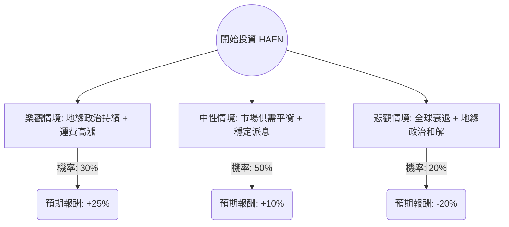

針對美股 **Hafnia Limited (HAFN)** 的投資評估，我結合了您提供的基本面數據，並透過網路搜尋整合了最新的市場動態（如成品油輪產業趨勢、地緣政治影響及最新財報表現），進行決策樹與期望值分析。

---

### 一、 外部環境與最新動態分析 (Contextual Research)

1.  **公司背景**：Hafnia 是全球最大的成品油輪（Product Tanker）營運商之一。
2.  **產業趨勢**：
    *   **紅海危機**：由於地緣政治緊張，船隻被迫繞道好望角，增加了「噸海里（Ton-mile）」需求，推升運費。
    *   **供給受限**：成品油輪的新船訂單量雖有回升，但短期內交付量有限，市場供給依然吃緊。
    *   **煉油格局改變**：歐洲關閉煉油廠，轉向從中東或亞洲進口成品油，拉長航程。
3.  **財務亮點**：
    *   **高股息政策**：Hafnia 承諾將淨利的 70%-80% 用於派息，目前殖利率極具吸引力。
    *   **低槓桿**：Debt/Eq 僅 0.38，在資本密集型的航運業中屬於非常穩健的財務結構。
    *   **估值**：Forward P/E 9.31，低於歷史平均與同業，顯示股價尚未過熱。

---

### 二、 決策樹分析 (Decision Tree Analysis)

我們將未來一年的投資情境分為三種：**樂觀（牛市）**、**中性（基準）**、**悲觀（熊市）**。

#### 節點詳細說明：

| 情境 | 機率 (P) | 預期報酬 (R) | 說明 |
| :--- | :--- | :--- | :--- |
| **樂觀 (Bull)** | 30% | **+25%** | 紅海危機持續，運費維持高位，EPS 超出預期，股息加碼。 |
| **中性 (Base)** | 50% | **+10%** | 運費小幅回落但維持獲利，公司維持 70% 派息率，股價隨淨值緩步上升。 |
| **悲觀 (Bear)** | 20% | **-20%** | 全球經濟嚴重衰退導致石油需求崩跌，或地緣政治迅速和平導致航程縮短。 |

---

### 三、 期望值計算 (Expected Value Calculation)

#### 1. 核心假設：
*   **當前股價**：$7.33
*   **股息收益**：預計未來一年總股息約為 8-10%（參考其派息政策與當前獲利能力，優於數據中的 5.58%）。
*   **資本利得**：
    *   樂觀：股價觸及 $8.50 + 股息 = ~25% 總回報。
    *   中性：股價維持 $7.50 (Target Price 附近) + 股息 = ~10% 總回報。
    *   悲觀：股價跌至 $5.50 + 少量股息 = ~-20% 總回報。

#### 2. 計算過程：
$$EV = (P_{Bull} \times R_{Bull}) + (P_{Base} \times R_{Base}) + (P_{Bear} \times R_{Bear})$$

*   $0.30 \times 25\% = 7.5\%$
*   $0.50 \times 10\% = 5.0\%$
*   $0.20 \times (-20\%) = -4.0\%$

**總期望報酬率 (Total EV) = 7.5% + 5.0% - 4.0% = 8.5%**

---

### 四、 綜合評估與最終結論

#### 1. 優勢分析 (Pros)：
*   **強勁的現金流**：P/FCF 僅 7.75，顯示公司產生現金的能力極強，足以支撐高額派息。
*   **技術面強勢**：股價目前高於 SMA20, 50, 200，且 Perf Year 達 39.9%，顯示處於上升趨勢。
*   **低估值高回報**：Forward P/E 9.31 配合超過 13% 的 ROE，性價比高。

#### 2. 風險分析 (Cons)：
*   **週期性風險**：航運業具有高度週期性，一旦運費反轉，獲利會迅速萎縮。
*   **營收增長放緩**：Sales Q/Q 為 -18.46%，需關注是否為季節性因素或市場見頂訊號。

#### 3. 最終結論：

**判斷：適合投資 (Suitable for Investment)**

**理由：**
1.  **期望值為正 (8.5%)**：即便在考慮了 20% 的悲觀衰退情境下，整體期望報酬依然為正，顯示風險回報比（Risk-Reward Ratio）合理。
2.  **股息護城河**：HAFN 的高派息政策為股價提供了強大的下行支撐。在當前高利率環境下，5-10% 的預期殖利率極具競爭力。
3.  **產業紅利尚未結束**：地緣政治導致的航線改變具有「黏性」，短期內難以恢復，這將支撐成品油輪運費在 2024 年維持在獲利水平之上。

**建議操作：**
由於股價目前接近 52 週高點且略高於分析師平均目標價 ($7.33 vs $7.66)，建議採取**分批買進**策略，或在股價回測 SMA50 (約 $6.5-$6.8 區間) 時加碼，以降低追高風險。