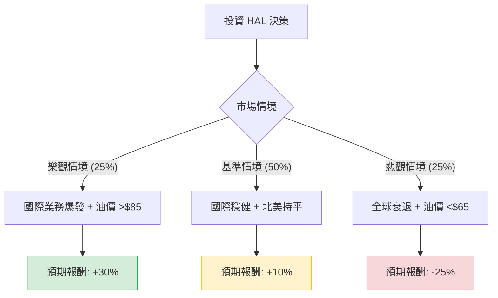

這份分析報告將結合您提供的基本面數據與當前市場動態（包含油價走勢、北美與國際市場需求、以及 Halliburton (HAL) 的最新財報表現），利用**決策樹（Decision Tree）**與**期望值分析（Expected Value Analysis）**評估其投資價值。

---

### 一、 核心假設與市場背景分析

在建立決策樹之前，我們基於最新資訊設定以下核心假設：

1.  **產業趨勢**：北美陸上鑽探活動（HAL 的強項）近期趨於平緩，但國際市場（中東、拉丁美洲）與離岸業務需求強勁。
2.  **財務狀況**：HAL 的 Forward P/E 為 12.75，低於目前的 18.61，顯示市場預期未來獲利將改善。然而，EPS Q/Q 大幅下滑（-96.73%）反映了短期成本壓力或非經常性損益影響。
3.  **油價環境**：預期 WTI 原油價格維持在 $70 - $85 區間。若跌破 $65，HAL 的北美業務將受重創；若升破 $90，則會刺激資本支出。
4.  **分析師目標價**：平均目標價約為 $31.17，較目前股價（$28.15）約有 **10.7%** 的上行空間。

---

### 二、 決策樹分析 (Decision Tree)

以下為 HAL 未來一年的投資情境預測：

#### 節點詳細說明：

1.  **樂觀情境 (Bull Case) - 25% 機率**：
    *   **條件**：地緣政治緊張導致油價維持高位，國際資本支出（CAPEX）超預期增長，HAL 成功轉嫁通膨成本。
    *   **預期報酬**：股價回升至 52 週高點以上，約 **+30%**（含股息）。

2.  **基準情境 (Base Case) - 50% 機率**：
    *   **條件**：北美市場如預期疲軟但已見底，國際業務抵銷北美缺口。公司持續執行庫藏股與派息。
    *   **預期報酬**：接近分析師目標價 $31.17，加上股息，約 **+10%**。

3.  **悲觀情境 (Bear Case) - 25% 機率**：
    *   **條件**：全球經濟衰退導致需求萎縮，油價跌破 $65，北美頁岩油商大幅削減支出。
    *   **預期報酬**：股價回測 52 週低點（約 $18.72），約 **-25%**。

---

### 三、 期望值計算 (Expected Value Analysis)

我們將各情境的機率與預期報酬相乘，得出整體期望報酬率：

| 情境 | 機率 (P) | 預期報酬 (R) | 期望值 (P * R) |
| :--- | :--- | :--- | :--- |
| **樂觀情境** | 0.25 | +30% | +7.5% |
| **基準情境** | 0.50 | +10% | +5.0% |
| **悲觀情境** | 0.25 | -25% | -6.25% |
| **總計期望報酬** | **1.00** | | **+6.25%** |

**計算過程：**
$EV = (0.25 \times 0.30) + (0.50 \times 0.10) + (0.25 \times -0.25)$
$EV = 0.075 + 0.05 - 0.0625 = 0.0625$ (即 **6.25%**)

---

### 四、 綜合評估與最終結論

#### 1. 基本面數據亮點與隱憂：
*   **優勢**：Forward P/E (12.75) 顯示估值相對便宜；SMA200 (+20.85%) 顯示長期趨勢仍向上；現金流穩定（P/FCF 12.62）。
*   **劣勢**：EPS Q/Q (-96.73%) 是一個嚴重的警訊，顯示短期獲利能力不穩定；內部人交易 (Insider Trans -4.36%) 顯示內部人近期在減持。

#### 2. 投資判斷：

**結論：適合投資 (建議：分批買入 / 持有)**

**理由：**
1.  **期望值為正**：經過風險權衡後，6.25% 的期望報酬率雖不算極高，但在當前高利率環境下仍具備吸引力，且優於持有現金。
2.  **估值安全邊際**：目前股價 ($28.15) 距離分析師目標價有約 10% 的空間，且 Forward P/E 較低，提供了緩衝。
3.  **結構性轉型**：HAL 正在減少對波動巨大的北美陸上業務的依賴，轉向利潤更穩定的國際與數位化服務，這有助於長期估值修復。
4.  **技術面支撐**：股價目前站穩在 SMA50 與 SMA200 之上，顯示市場買盤支撐強勁。

**風險提示：**
投資者應密切關注 **WTI 原油價格是否跌破 $70** 以及 **下一季 EPS 是否能如預期回升**。若悲觀情境發生（油價暴跌），應嚴格執行止損（建議設在 $24.5 附近，即 SMA200 支撐位下方）。