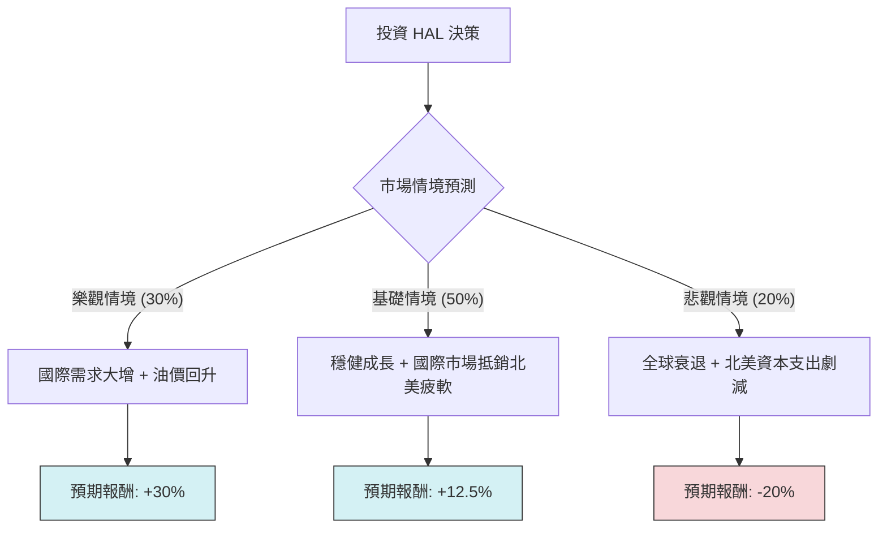

針對美股能源服務龍頭 **Halliburton (HAL)** 的投資評估，我結合了你提供的基本面數據以及最新的市場動態（包含 2024 年第四季後的展望、油價走勢及國際市場開發狀況），進行決策樹與期望值分析。

---

### 一、 市場現況與核心假設

在進入模型前，以下是基於最新資訊的關鍵背景：
1.  **市場動態**：北美陸地鑽井活動趨於平緩，但國際市場（特別是中東與拉丁美洲）與深海鑽探需求強勁。
2.  **財務表現**：HAL 的 Forward P/E (12.64) 低於當前 P/E (18.35)，顯示市場預期未來獲利將改善。雖然近期 EPS Q/Q 下滑，但其自由現金流（P/FCF 12.45）依然穩健。
3.  **外部因素**：油價波動（WTI 維持在 70-80 美元區間）、地緣政治風險、以及該公司從 2024 年 8 月的網路攻擊事件中恢復後的營運效率。

---

### 二、 決策樹分析 (Decision Tree)

決策點：**目前是否買入 HAL 股票？**

#### 節點詳細說明：

| 情境名稱 | 機率 (P) | 觸發條件 | 預期報酬 (R) | 期望值 (P * R) |
| :--- | :--- | :--- | :--- | :--- |
| **樂觀情境** | 30% (0.3) | 油價穩定在 $85 以上，國際營收成長超預期，回購股數增加。 | +30% | +9.0% |
| **基礎情境** | 50% (0.5) | 油價在 $70-$80 震盪，公司達到 Target Price ($31.17)，股利穩定。 | +12.5% | +6.25% |
| **悲觀情境** | 20% (0.2) | 油價跌破 $65，北美客戶大幅縮減開支，網路攻擊餘波影響獲利。 | -20% | -4.0% |
| **總計** | **100%** | | | **11.25%** |

---

### 三、 期望值分析 (Expected Value Analysis) 計算過程

#### 1. 核心假設
*   **基準價格**：$27.72 (當前收盤價)。
*   **目標價格 (Target Price)**：參考分析師平均目標價 $31.17，隱含漲幅約 **12.5%**（基礎情境來源）。
*   **樂觀目標**：考慮 Forward P/E 估值修復至歷史平均，目標價約 $36，隱含漲幅約 **30%**。
*   **悲觀下限**：回測 52 週低點及支撐位，預估跌至 $22 附近，隱含跌幅約 **-20%**。

#### 2. 計算公式
$$EV = (P_{樂觀} \times R_{樂觀}) + (P_{基礎} \times R_{基礎}) + (P_{悲觀} \times R_{悲觀})$$

#### 3. 代入數值
*   $EV = (0.3 \times 0.30) + (0.5 \times 0.125) + (0.2 \times -0.20)$
*   $EV = 0.09 + 0.0625 - 0.04$
*   $EV = 0.1125$

**最終整體期望值：+11.25%**

---

### 四、 綜合評估與投資建議

#### 1. 數據深度解讀
*   **估值優勢**：Forward P/E 12.64 顯示其目前估值相對便宜。1.81 的推薦評分（Buy）顯示專業機構普遍看好。
*   **財務健康**：Quick Ratio 1.43 與 Current Ratio 1.95 顯示短期流動性極佳，無債務危機。
*   **技術面**：SMA200 (+19.6%) 顯示長期趨勢向上，目前股價略高於 SMA20/50，處於震盪整理後的上升段。
*   **隱憂**：EPS Q/Q 大幅下滑 (-96.7%) 反映了前一季可能的單次減損或北美市場放緩的壓力，這也是目前股價貼近 52 週高點卻未能突破的原因。

#### 2. 最終結論：**適合投資（分批買入）**

**理由如下：**
1.  **正向期望值**：經過風險權衡後，HAL 仍有 **11.25%** 的預期回報，高於目前的無風險利率及多數成熟工業股。
2.  **國際業務轉型**：Halliburton 正在成功將重心移往利潤較高的國際市場，這能有效抵銷北美頁岩油放緩的風險。
3.  **安全邊際**：目前的 P/E 處於合理區間，且有 2.45% 的股息提供下行支撐（現金流穩定）。
4.  **技術目標**：股價距離共識目標價 $31.17 仍有空間。

**建議操作策略：**
*   **進場點**：$27 - $28 之間分批建倉。
*   **停損點**：若跌破 $24.5 (52W Range 中軸線下方) 需重新評估產業基本面。
*   **獲利了結**：達到 $32 附近時可先回收部分利潤。

---
*免責聲明：此分析基於提供之數據與當前市場公開資訊，投資有風險，請根據個人財務狀況審慎決定。*