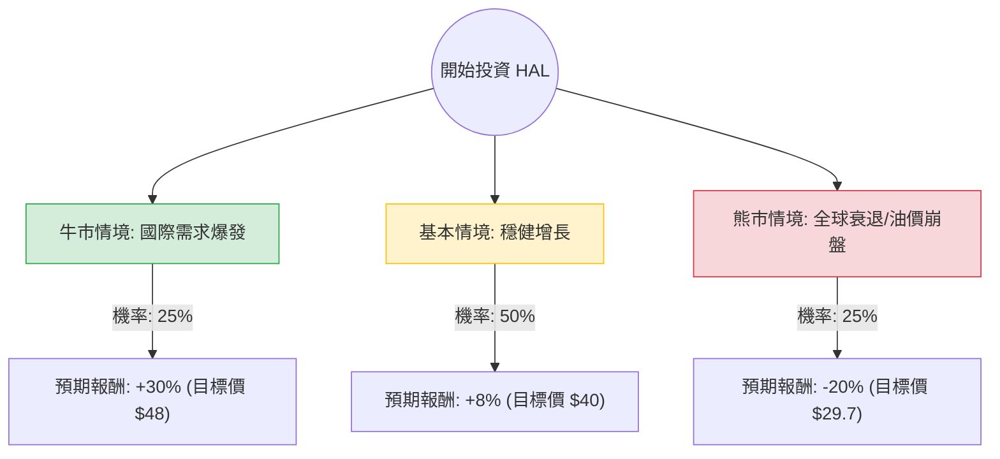

針對美股 **Halliburton (HAL)** 的投資評估，我結合了您提供的基本面數據，並檢索了最新的市場動態（包括 2024 年第三季財報預期、油價走勢及國際市場擴張策略），進行決策樹與期望值分析。

---

### 一、 核心假設與市場背景分析

在建立決策樹之前，我們先設定核心假設：

1.  **產業趨勢**：北美陸上鑽井活動趨於平緩，但國際市場（特別是中東與拉丁美洲）與離岸工程需求強勁。
2.  **財務狀況**：HAL 的 Forward P/E 為 13.56，低於歷史均值，顯示估值相對便宜。EPS 明年預期增長 24.15%，是強大的支撐。
3.  **外部風險**：油價波動（受地緣政治與全球經濟增速放緩影響）是最大變數。
4.  **目標價參考**：分析師平均目標價約為 $39.56，較目前股價（$37.15）約有 6.5% 的上行空間。

---

### 二、 決策樹分析 (Decision Tree)

以下使用 Markdown 繪製決策樹，模擬未來 12 個月的投資情境：

#### 節點詳細說明：

1.  **牛市情境 (Bull Case) - 25% 機率**：
    *   **條件**：地緣政治導致油價維持在 $85 以上，國際與離岸業務增長超預期，北美自動化壓裂技術提升利潤率。
    *   **預期報酬**：+30%（基於 EPS 增長與估值修復至 P/E 18x）。
2.  **基本情境 (Base Case) - 50% 機率**：
    *   **條件**：油價維持在 $70-$80 區間，北美業務持平，國際業務穩步增長。符合分析師預期的 EPS 24% 增長。
    *   **預期報酬**：+8%（接近分析師目標價 $39.56 + 股息收益）。
3.  **熊市情境 (Bear Case) - 25% 機率**：
    *   **條件**：全球經濟衰退導致需求萎縮，油價跌破 $65，資本支出縮減。
    *   **預期報酬**：-20%（回測 52 週低點並考慮估值下修）。

---

### 三、 期望值分析 (Expected Value Analysis) 計算過程

我們根據上述情境計算總體期望報酬率（Expected Return）：

**計算公式：**
$$E(R) = \sum (Probability_i \times Return_i)$$

**計算步驟：**
1.  **牛市貢獻**：$0.25 \times 30\% = 7.5\%$
2.  **基本情境貢獻**：$0.50 \times 8\% = 4.0\%$
3.  **熊市貢獻**：$0.25 \times (-20\%) = -5.0\%$

**總期望報酬率：**
$$7.5\% + 4.0\% - 5.0\% = 6.5\%$$

**考慮股息後的總回報：**
目前 Dividend Yield 為 1.83%，因此總預期回報約為 **8.33%**。

---

### 四、 綜合評估與最終結論

#### 1. 數據亮點分析
*   **估值優勢**：Forward P/E 13.56 遠低於當前 P/E 24.62，顯示市場預期未來獲利將大幅改善。
*   **成長動能**：EPS Next Year 預計增長 24.15%，在能源服務業中屬於強勁表現。
*   **技術面**：股價目前在 SMA200（$31.51）之上，但近期 SMA20 有小幅拉回，顯示短期處於震盪整理期，是較好的分批入場點。

#### 2. 潛在風險
*   **內部人交易**：Insider Trans 為 -15.07%，顯示近期內部人有減持動作，需留意是否對短期前景有所顧慮。
*   **利潤率壓力**：Gross Margin 15.7% 略低於同行頂尖水平，顯示成本控制仍有優化空間。

#### 3. 最終結論：**適合投資 (分批買入)**

**理由：**
1.  **期望值為正**：經風險加權後的預期回報率為 8.33%，優於無風險利率（美債收益率）。
2.  **結構性轉型成功**：HAL 成功減少對波動巨大的北美陸上市場依賴，轉向利潤更高、合約更穩定的國際與離岸市場。
3.  **安全邊際**：目前股價接近分析師目標價的下緣，且 Forward P/E 具備吸引力，下行風險在 $30 附近有強力支撐（52W Low 與 SMA200 區間）。

**建議策略：**
建議在 **$35 - $37** 區間分批建倉，長期持有以參與其國際業務的增長紅利，並將止損位設在 **$31**（跌破 SMA200 則轉弱）。