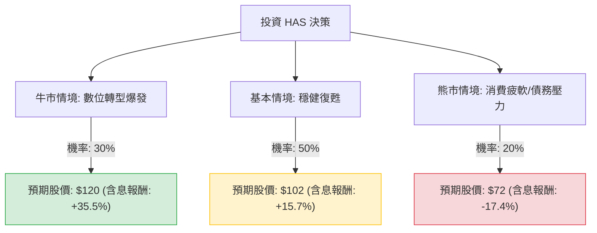

這份分析報告將結合您提供的基本面數據，以及最新的市場動態（包含 2024 年第三季財報表現與產業趨勢），利用**決策樹（Decision Tree）**與**期望值分析（Expected Value Analysis）**評估孩之寶（Hasbro, Inc., 代號：**HAS**）的投資價值。

---

### 一、 核心假設與市場背景分析

在建立模型前，我們先整合最新資訊以設定合理的機率與報酬預期：

1.  **數位轉型與授權金（利多）：** 孩之寶正從傳統玩具商轉型為「智財權（IP）驅動」的公司。其數位遊戲部門（Wizards of the Coast & Digital Gaming）表現強勁，特別是《Monopoly Go!》帶來的授權金收入與《萬智牌》（MTG）的穩定增長。
2.  **財務結構調整（中性偏多）：** 雖然數據顯示 `Debt/Eq` 高達 6.32，但這是因為先前出售 eOne 影視業務導致的資產減記。公司正積極利用現金流償還債務，且 `Forward P/E` 14.48 顯示市場預期明年獲利將大幅改善。
3.  **消費環境（風險）：** 儘管進入 Q4 傳統旺季，但高利率環境對非必需消費品仍有壓力。
4.  **技術面：** 目前股價 $90.61，低於分析師平均目標價 $114.92，且位於 SMA200（$83.77）之上，呈現多頭排列。

---

### 二、 決策樹分析 (Decision Tree)

以下使用 Markdown 繪製決策樹，模擬未來一年的三種主要情境：

#### 節點詳細說明：

1.  **牛市情境 (Bull Case) - 30%：**
    *   **條件：** 《Monopoly Go!》熱度不減，Q4 聖誕假期玩具銷售超預期，且聯準會降息節奏加快減輕債務利息負擔。
    *   **目標價：** $115 (Target Price) + $5 (溢價) = $120。
    *   **報酬計算：** [($120 - $90.61) / $90.61] + 3.09% (股息) ≈ **35.5%**。

2.  **基本情境 (Base Case) - 50%：**
    *   **條件：** 數位遊戲部門維持雙位數增長，傳統玩具部門（Consumer Products）止跌回穩，公司按計畫去槓桿。
    *   **目標價：** 參考 Forward P/E 15x 與預估 EPS，約 $102。
    *   **報酬計算：** [($102 - $90.61) / $90.61] + 3.09% (股息) ≈ **15.7%**。

3.  **熊市情境 (Bear Case) - 20%：**
    *   **條件：** 全球經濟衰退導致消費支出大幅萎縮，高債務比率引發信用評等疑慮，股價回測 52 週低點支撐。
    *   **目標價：** $72 (支撐位)。
    *   **報酬計算：** [($72 - $90.61) / $90.61] + 3.09% (股息) ≈ **-17.4%**。

---

### 三、 期望值分析 (Expected Value Analysis)

我們將各情境的報酬率與機率相乘，計算總體期望報酬率：

| 情境 | 機率 (P) | 預期報酬 (R) | P × R |
| :--- | :--- | :--- | :--- |
| 牛市情境 | 0.30 | +35.5% | +10.65% |
| 基本情境 | 0.50 | +15.7% | +7.85% |
| 熊市情境 | 0.20 | -17.4% | -3.48% |
| **總計期望值** | **1.00** | | **+15.02%** |

#### 計算過程：
$EV = (0.30 \times 35.5\%) + (0.50 \times 15.7\%) + (0.20 \times -17.4\%)$
$EV = 10.65\% + 7.85\% - 3.48\% = 15.02\%$

---

### 四、 最終結論

#### **評估結果：適合投資 (Suitable for Investment)**

**判斷理由：**
1.  **期望報酬率優異：** 經過風險加權後的期望報酬率為 **15.02%**，顯著高於美股長期平均回報（約 8-10%），且具備 3.09% 的股息收益作為下行保護。
2.  **轉型成效顯現：** 雖然帳面 ROE 為負，但這是受過去一次性資產減記影響。從 `Sales Q/Q (+30.78%)` 與 `EPS Q/Q (+675%)` 來看，營運拐點已經出現。
3.  **估值合理：** `Forward P/E` 僅 14.48 倍，相對於其在數位遊戲領域的高毛利（Gross Margin 62.46%）增長潛力，目前股價並未過熱。
4.  **技術面支撐：** 股價站穩 SMA200，且距離分析師目標價仍有約 26% 的上漲空間。

**風險提示：**
*   **高槓桿：** `Debt/Eq 6.32` 是最大隱憂，需密切關注其利息保障倍數與現金流狀況。
*   **庫存風險：** 若 Q4 旺季銷售不如預期，可能導致庫存積壓影響明年毛利。

**建議策略：**
考量到目前股價接近 52 週高點（$106.98）的回檔區，建議採**分批進場**策略，以降低短期波動風險，長期持有以參與其數位 IP 轉型的紅利。