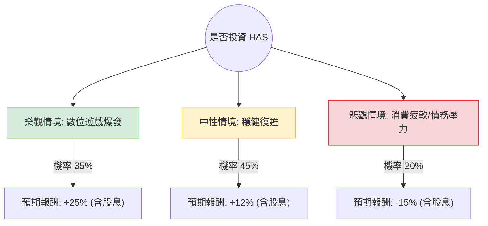

這份分析報告將結合您提供的基本面數據與最新的市場動態（如孩之寶 Hasbro 2024 年第二季財報、數位遊戲轉型進度及產業趨勢），利用**決策樹（Decision Tree）**與**期望值分析（Expected Value Analysis）**評估 HAS 的投資價值。

---

### 一、 核心背景與市場動態分析

在進入計算前，我們先整合最新的市場資訊：
1.  **數位轉型成功**：Hasbro 正在從傳統玩具商轉型為「數位遊戲與授權」驅動的公司。旗下《威世智（Wizards of the Coast）》與數位遊戲部門（如《博德之門 3》、《Monopoly Go!》授權金）利潤極高，毛利率高達 70.28% 正反映此趨勢。
2.  **財務瘦身**：公司已出售 eOne 影視業務，專注於核心 IP，這解釋了為何近期 EPS Q/Q 出現 673% 的爆發式增長，但也導致短期內帳面資產減損（ROE 為負）。
3.  **債務壓力**：Debt/Eq 高達 5.77，這是目前最大的風險點，但在降息預期下，利息壓力有望減輕。
4.  **技術面**：股價目前接近 52 週高點（$101.46），SMA20/50/200 均呈現多頭排列，顯示市場動能強勁。

---

### 二、 決策樹分析 (Decision Tree)

我們將未來一年的投資情境分為三種：**樂觀（牛市）**、**中性（基準）**與**悲觀（熊市）**。

#### 節點詳細說明：

1.  **樂觀情境 (Bull Case) - 35% 機率**：
    *   **假設**：數位遊戲授權金超預期，《魔力寶貝：對決》等新遊戲大成功，且聯準會降息幅度大，減輕債務負擔。
    *   **目標價**：$125 (超越分析師平均目標價 $116)。
    *   **預期報酬**：約 23.2% 價差 + 3.47% 股息 ≈ **26.67%**。

2.  **中性情境 (Base Case) - 45% 機率**：
    *   **假設**：傳統玩具部門止跌回升，Wizards of the Coast 保持穩定增長，公司按計畫償還債務。
    *   **目標價**：$113 (接近分析師目標價 $116)。
    *   **預期報酬**：約 11.4% 價差 + 3.47% 股息 ≈ **14.87%**。

3.  **悲觀情境 (Bear Case) - 20% 機率**：
    *   **假設**：全球消費支出因經濟放緩下降，高槓桿（Debt/Eq 5.77）導致利息支出侵蝕利潤，股價回測 SMA200。
    *   **目標價**：$82。
    *   **預期報酬**：約 -19.2% 價差 + 3.47% 股息 ≈ **-15.73%**。

---

### 三、 期望值分析 (Expected Value Analysis)

#### 1. 計算過程：
期望值 (EV) = Σ (各情境機率 × 各情境報酬)

*   **樂觀貢獻**：$0.35 \times 26.67\% = 9.33\%$
*   **中性貢獻**：$0.45 \times 14.87\% = 6.69\%$
*   **悲觀貢獻**：$0.20 \times (-15.73\%) = -3.15\%$

**總期望報酬率 (Total EV) = 9.33% + 6.69% - 3.15% = 12.87%**

#### 2. 核心假設說明：
*   **市場面**：假設未來 12 個月內美國經濟不進入深度衰退，且利率環境趨於寬鬆。
*   **財務面**：Forward P/E 為 16.29，相較於歷史平均並不昂貴，顯示市場認可其轉型後的獲利能力。
*   **產業趨勢**：Hasbro 的「輕資產」轉型（賣掉影視、專注 IP 授權）能有效提升利潤率（Gross Margin 70.28% 是極強的護城河）。

---

### 四、 最終結論

**判斷：適合投資 (Suitable for Investment)**

#### 理由：
1.  **正向期望值**：計算出的總期望報酬率為 **12.87%**，優於多數穩健型投資標的，且包含 3.47% 的穩定股息收益。
2.  **轉型紅利**：HAS 已成功從低毛利的玩具製造轉向高毛利的數位遊戲與 IP 授權，EPS Q/Q 的大幅增長證明了轉型成效。
3.  **估值合理**：雖然 P/B 較高，但 Forward P/E (16.29) 顯示未來的盈利能力將快速修復帳面價值。
4.  **技術動能**：股價站穩所有均線（SMA20/50/200），顯示機構投資者（Inst Trans +4.63%）正在增持。

**風險提示：**
*   **高債務比率**：投資者需密切關注其利息保障倍數，若利率維持高位過久，財務壓力會增加。
*   **追高風險**：目前股價接近 52 週高點，建議採取**分批進場**或**回測 SMA50 (約 $90-$95) 時布局**，以降低短期回檔風險。