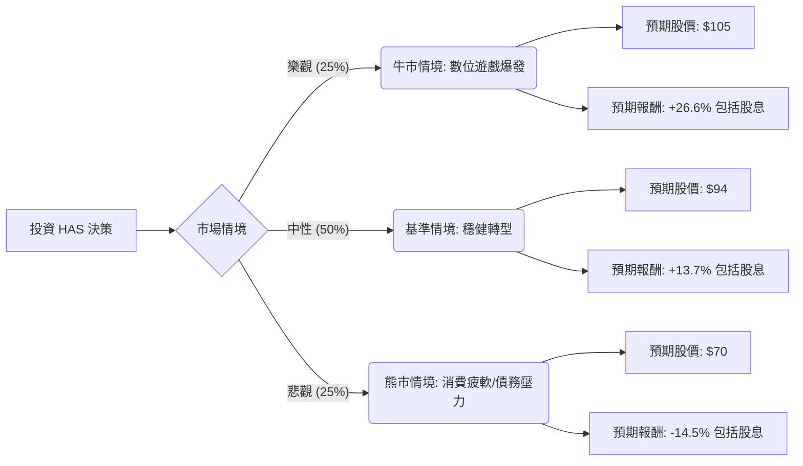

這份分析報告將結合您提供的財務數據與最新的市場動態（包含 2024 年第二季財報表現、Wizards of the Coast 的增長以及公司轉型策略），利用**決策樹（Decision Tree）**與**期望值分析（Expected Value Analysis）**評估孩之寶（Hasbro, Inc., 代號：HAS）的投資價值。

---

### 一、 核心假設與市場背景分析

在建立模型前，我們先整合基本面與最新市場資訊：

1.  **數位轉型與 WotC 引擎**：孩之寶正從傳統玩具商轉型為「遊戲與數位互動」公司。旗下《威世智（Wizards of the Coast）》與數位遊戲部門（如《博德之門 3》餘溫、《Monopoly Go!》授權金）利潤極高，是目前支撐股價的核心。
2.  **財務結構風險**：數據顯示 **Debt/Eq 高達 8.23**，負債比極高，且 **ROE 為負值 (-65.9%)**。這反映了過去收購 eOne 帶來的減損與高槓桿壓力。
3.  **庫存與利潤率改善**：公司推行「Fewer, Bigger, Better」策略，毛利率（Gross Margin）高達 67.9%，顯示成本控制與產品組合優化見效。
4.  **宏觀環境**：降息預期有利於高負債公司減輕利息負擔，並刺激節慶消費。

---

### 二、 決策樹分析 (Decision Tree)

我們以未來 12 個月的持有期為基準，設定三種情境：

#### 節點詳細說明：

1.  **牛市情境 (Bull Case) - 25% 機率**：
    *   **條件**：《Monopoly Go!》持續貢獻超額授權金，新遊戲開發進度超前，且傳統玩具部門在聖誕假期銷售超預期。
    *   **預期報酬**：股價達到 $105（突破 52W 高點），加上 3.27% 股息，總報酬約 **26.6%**。

2.  **基準情境 (Base Case) - 50% 機率**：
    *   **條件**：符合分析師平均目標價 $94。WotC 維持穩定增長，傳統玩具部門緩步復甦，債務透過現金流穩定償還。
    *   **預期報酬**：股價達到 $94，加上 3.27% 股息，總報酬約 **13.7%**。

3.  **熊市情境 (Bear Case) - 25% 機率**：
    *   **條件**：高利率環境持續壓抑消費，傳統玩具庫存再度積壓，且高槓桿（Debt/Eq 8.23）引發信用評等疑慮。
    *   **預期報酬**：股價回落至 $70（支撐位），扣除股息後總報酬約 **-14.5%**。

---

### 三、 期望值計算過程 (Expected Value Calculation)

我們將各情境的機率與預期報酬相乘，得出整體期望報酬率。

**計算公式：**
$EV = (P_{Bull} \times R_{Bull}) + (P_{Base} \times R_{Base}) + (P_{Bear} \times R_{Bear})$

*   **P (Probability)** = 發生機率
*   **R (Return)** = 預期總報酬（含股息 3.27%）

**計算步驟：**
1.  **樂觀貢獻**：$0.25 \times 26.6\% = 6.65\%$
2.  **中性貢獻**：$0.50 \times 13.7\% = 6.85\%$
3.  **悲觀貢獻**：$0.25 \times (-14.5\%) = -3.625\%$

**最終期望值 (EV)：**
$6.65\% + 6.85\% - 3.625\% = \mathbf{9.875\%}$

---

### 四、 最終結論與投資建議

#### **結論：適合投資 (謹慎看多)**

根據期望值分析，HAS 的預期總報酬率約為 **9.88%**，優於多數保守型投資工具，且在當前轉型階段展現出強勁的獲利修復能力。

#### **判斷理由：**
1.  **轉型成效顯著**：雖然 ROE 為負，但這是會計減損導致，實際營運利潤率（Oper. Margin 19.1%）與毛利率（67.9%）非常強勁，顯示核心業務（Magic: The Gathering）極具護城河。
2.  **估值合理**：Forward P/E 為 16.19，相較於其數位遊戲轉型的潛力，估值並未過熱。
3.  **技術面強勢**：目前股價高於 SMA20、50、200，呈現多頭排列，且距離分析師目標價 $94 仍有空間。
4.  **股息支撐**：3.27% 的股息率提供了下行保護，適合願意承擔一定債務風險以換取轉型紅利的投資者。

#### **風險提示：**
*   **債務風險**：Debt/Eq 8.23 是最大隱憂，若營收意外下滑，利息支出將嚴重侵蝕利潤。
*   **消費力波動**：若美國經濟進入硬著陸，非必需消費品的玩具部門將首當其衝。

**建議操作：** 可於 $85 附近分批布局，停損位設於 SMA200（約 $73.5 附近），目標價看 $94 - $100。