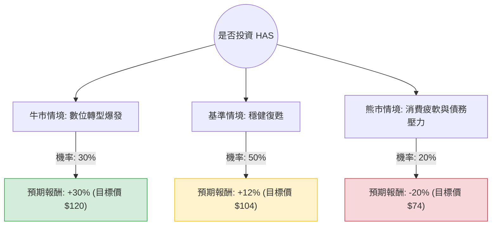

這份分析報告將結合您提供的基本面數據與最新的市場動態（包含 2024 年第三季財報表現、數位轉型進度及產業趨勢），利用**決策樹（Decision Tree）**與**期望值分析（Expected Value Analysis）**評估孩之寶（Hasbro, Inc., 股票代碼：**HAS**）的投資價值。

---

### 一、 核心假設與市場背景分析

在建立決策樹之前，我們基於數據與最新資訊設定以下核心假設：

1.  **數位轉型與授權金（核心動能）：** 《Monopoly Go!》的授權金收入與《魔法風雲會》（MTG）、《龍與地下城》（D&D）的數位化表現是利潤增長的主引擎。
2.  **消費品部門（潛在拖累）：** 傳統玩具市場仍疲軟，但庫存清理已接近尾聲，毛利率（Gross Margin 62.46%）顯著改善。
3.  **財務結構（風險點）：** 債務股本比（Debt/Eq）高達 6.32，利息支出壓力大，但出售 eOne 後資產負債表正在優化。
4.  **宏觀環境：** 降息循環有利於消費性支出及減輕債務負擔。

---

### 二、 決策樹分析 (Decision Tree)

以下為針對未來 12 個月投資 HAS 的決策樹模型：

#### 節點詳細說明：

1.  **牛市情境 (Bull Case) - 30% 機率：**
    *   **條件：** 《Monopoly Go!》持續貢獻超額授權金；Q4 聖誕假期玩具銷售超預期；聯準會降息速度加快。
    *   **預期報酬：** 參考分析師目標價 $115.08 並考慮動能，預估報酬約 **+30%**。
2.  **基準情境 (Base Case) - 50% 機率：**
    *   **條件：** 數位遊戲部門穩定增長；消費品部門止跌回升；Forward P/E 14.85 倍得到市場認可。
    *   **預期報酬：** 股息 (3%) + 資本利得 (9%) = **+12%**。
3.  **熊市情境 (Bear Case) - 20% 機率：**
    *   **條件：** 高債務（Debt/Eq 6.32）在利率維持高位時引發財務危機；核心 IP（如 MTG）過度開發導致玩家流失。
    *   **預期報酬：** 股價回測 52 週低點區域，預估報酬 **-20%**。

---

### 三、 期望值計算過程 (Expected Value Calculation)

我們將各情境的機率與預期報酬相乘，得出整體期望報酬率：

*   **計算公式：**
    $EV = (P_{Bull} \times R_{Bull}) + (P_{Base} \times R_{Base}) + (P_{Bear} \times R_{Bear})$

*   **數值帶入：**
    1.  牛市部分：$0.30 \times 30\% = 9\%$
    2.  基準部分：$0.50 \times 12\% = 6\%$
    3.  熊市部分：$0.20 \times (-20\%) = -4\%$

*   **總期望報酬率：**
    $9\% + 6\% - 4\% = \mathbf{11\%}$

*   **期望價值 (以目前股價 $92.99 計算)：**
    $92.99 \times (1 + 11\%) = \mathbf{103.22}$

---

### 四、 綜合評估與最終結論

#### 1. 數據洞察補充：
*   **獲利能力轉向：** 雖然 ROE (-38%) 目前為負，但這是受過去資產減損影響。**Forward P/E (14.85)** 遠低於行業平均，且 **EPS Q/Q (6.75倍)** 顯示獲利正在極速修復。
*   **現金流與股利：** P/FCF 為 15.76，顯示公司產生現金的能力尚可，足以支撐 **3.01% 的股息率**，這為股價提供了下行保護。
*   **技術面：** 股價位於 SMA200 (+14%) 之上，顯示長期趨勢偏多，近期 SMA20/50 的微幅回檔提供了較佳的介入點。

#### 2. 最終判斷：**適合投資 (建議分批買進)**

#### 3. 理由總結：
1.  **期望值為正 (11%)：** 儘管存在債務風險，但數位轉型帶來的利潤率提升（Gross Margin 62.46%）足以覆蓋風險。
2.  **轉型成效顯現：** 孩之寶已從單純的玩具製造商轉型為「輕資產、高授權」的 IP 運營商，這將提升其估值倍數（Re-rating）。
3.  **安全邊際：** 目前股價距離分析師平均目標價 ($115.08) 仍有約 23% 的上漲空間，且 3% 的股息在等待轉型期間提供了穩定的現金流。

**風險提示：** 需密切關注其 **Debt/Eq (6.32)** 的去槓桿進度。若未來兩季利息保障倍數下降，需重新評估熊市機率。