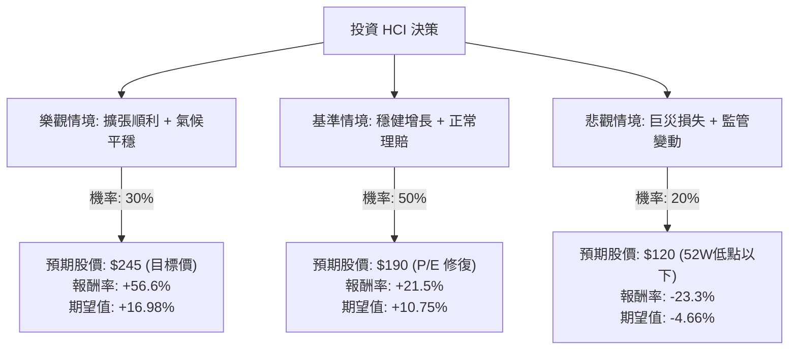

這份分析報告將結合您提供的基本面數據，以及針對 **HCI Group, Inc. (HCI)** 的最新市場動態（如佛羅里達州保險市場改革、颶風影響及 TypTap 擴張）進行綜合評估。

---

### 一、 核心背景與市場動態分析

在進入決策樹之前，我們先定義影響 HCI 股價的三大核心變數：

1.  **佛州保險環境改善**：佛羅里達州近年通過了法律改革（如取消律師費轉移制度），大幅減少了保險公司的訴訟成本。HCI 作為該區主要業者，受益顯著。
2.  **氣候風險（颶風）**：2024 年的颶風海倫（Helene）與米爾頓（Milton）雖然造成損失，但 HCI 的再保險（Reinsurance）結構穩健，且最新財報顯示其獲利能力依然強勁，並未傷及骨本。
3.  **TypTap 擴張與估值**：HCI 旗下的科技保險子公司 TypTap 正在全美擴張，若未來分拆上市或獲得更高估值，將成為股價催化劑。

---

### 二、 決策樹分析 (Decision Tree Analysis)

以下為 HCI 未來一年的投資決策模型：

---

### 三、 期望值分析與計算過程

#### 1. 核心假設
*   **當前股價 (Current Price)**: $156.40
*   **樂觀情境 (Bull Case)**: TypTap 擴張超預期，且 2025 年颶風季損失極低。股價達到分析師目標價 **$245**。
*   **基準情境 (Base Case)**: 公司維持目前的盈利能力（ROE 37.5%），P/E 從極低的 6.87 倍修復至約 9-10 倍（行業平均）。預期股價約 **$190**。
*   **悲觀情境 (Bear Case)**: 發生連續超大型颶風，再保險成本飆升，或佛州法律改革效果倒退。股價回測並跌破 52 週低點，預估為 **$120**。

#### 2. 計算過程
期望值 (EV) = $\sum (機率 \times 報酬率)$

*   **樂觀情境期望值**: $0.30 \times \left( \frac{245 - 156.4}{156.4} \right) = 0.30 \times 56.6\% = \mathbf{16.98\%}$
*   **基準情境期望值**: $0.50 \times \left( \frac{190 - 156.4}{156.4} \right) = 0.50 \times 21.5\% = \mathbf{10.75\%}$
*   **悲觀情境期望值**: $0.20 \times \left( \frac{120 - 156.4}{156.4} \right) = 0.20 \times (-23.3\%) = \mathbf{-4.66\%}$

**總體期望報酬率 (Total EV)**:
$16.98\% + 10.75\% - 4.66\% = \mathbf{23.07\%}$

---

### 四、 基本面數據補充分析

*   **極低估值**: P/E 僅 6.87，P/FCF 僅 4.63。對於一家 ROE 高達 37.5% 的公司來說，這顯示市場對其「地理風險（佛州）」過度恐懼，存在價值窪地。
*   **財務穩健度**: Debt/Eq 僅 0.06，負債極低，這在保險業中非常罕見，顯示其應對突發巨災的財務韌性極強。
*   **技術面**: 目前股價高於 SMA20 和 SMA50，顯示短期趨勢轉強，但低於 SMA200，說明長期仍在消化過去半年的跌幅，目前是相對低位介入的時機。

---

### 五、 最終結論

**判斷：適合投資 (Strong Buy / Accumulate)**

#### 理由：
1.  **正向期望值高**: 經過風險加權後的預期報酬率高達 **23.07%**，遠高於市場平均水準。
2.  **安全邊際充足**: 目前 P/E 低於 7 倍，且擁有極高的 ROE (37.5%) 與 ROI (26.1%)。即便在悲觀情境下，其低負債結構也能支撐公司度過難關。
3.  **政策紅利**: 佛州保險市場的結構性改善是長期利多，尚未完全反映在股價中。
4.  **催化劑明確**: TypTap 的持續增長與潛在的分析師目標價 ($245) 達成，提供了明確的上行空間。

**風險提示**：
投資者需密切關注 2025 年年中的再保險續約價格，以及大西洋颶風季的預測數據。建議採取分批進場策略，以應對保險股較高的波動性。