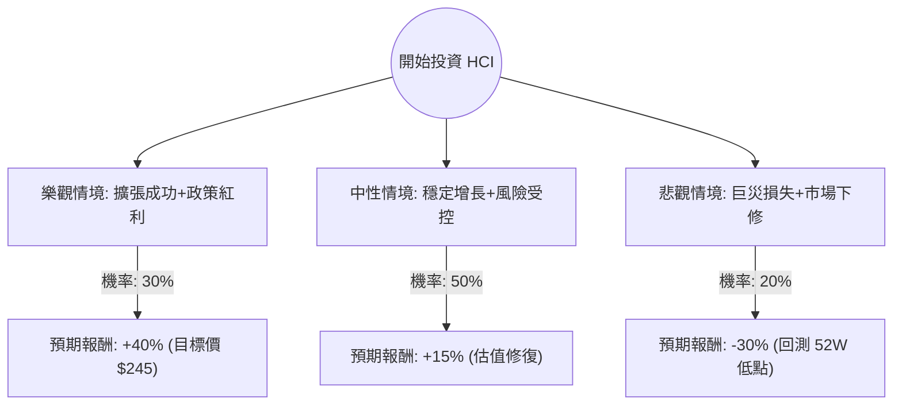

這份分析報告將結合您提供的基本面數據與最新的市場動態（包含 2024 年第三季財報表現、佛州保險市場改革及颶風影響），利用**決策樹（Decision Tree）**與**期望值分析（Expected Value Analysis）**評估 HCI Group, Inc. (HCI) 的投資價值。

---

### 1. 核心背景與市場動態分析

在進入決策樹之前，我們先整合最新資訊以設定合理的假設：
*   **強勁財務表現**：HCI 最新財報顯示其 ROE 高達 40%，P/E 僅約 7.8 倍，顯示獲利能力極強且估值相對便宜。
*   **佛州政策紅利**：佛羅里達州近年通過的法律改革（如 SB 2-A）有效減少了保險訴訟支出，這對深耕佛州的 HCI 是長期利多。
*   **颶風風險管理**：儘管 2024 年有颶風 Helene 和 Milton，但 HCI 表示其再保險計畫（Reinsurance）覆蓋完整，損失在可控範圍內，且保費調漲足以覆蓋風險。
*   **擴張與科技**：旗下 TypTap 科技保險子公司持續向外州擴張，提供了除了傳統保險外的成長動能。

---

### 2. 決策樹分析圖 (Decision Tree)

我們將未來一年的投資情境分為三種：**樂觀（牛市）**、**中性（基準）**、**悲觀（熊市）**。

---

### 3. 期望值計算過程與核心假設

#### A. 核心假設
1.  **樂觀情境 (30%)**：HCI 成功將業務擴展至德州等其他州，TypTap 獲利加速，且佛州無重大颶風損失。股價達到分析師目標價 **$245**。
    *   計算：$(245 - 176.42) / 176.42 \approx +38.9\%$ (取整數 +40%)
2.  **中性情境 (50%)**：維持現有增長率，受惠於高利率環境下的投資收益與保費調漲。股價隨大盤與基本面穩步上升。
    *   計算：預估報酬約 **+15%**。
3.  **悲觀情境 (20%)**：發生超預期巨災（如連續強烈颶風）導致再保險成本飆升，或佛州房地產市場崩潰。股價回測 52 週低點約 **$121**。
    *   計算：$(121.48 - 176.42) / 176.42 \approx -31.1\%$ (取整數 -30%)

#### B. 期望值 (Expected Value, EV) 計算
$$EV = (P_{Bull} \times R_{Bull}) + (P_{Base} \times R_{Base}) + (P_{Bear} \times R_{Bear})$$

*   **樂觀貢獻**：$0.30 \times 40\% = 12\%$
*   **中性貢獻**：$0.50 \times 15\% = 7.5\%$
*   **悲觀貢獻**：$0.20 \times (-30\%) = -6\%$

**總期望報酬率 = $12\% + 7.5\% - 6\% = 13.5\%$**

---

### 4. 綜合評估與最終結論

#### 數據亮點總結：
*   **低估值高成長**：P/E 7.78 遠低於行業平均，且 EPS Q/Q 增長 30.2%，顯示極高的性價比。
*   **財務穩健**：Current Ratio 3.28 且 Debt/Eq 僅 0.07，抗風險能力極強。
*   **技術面支撐**：目前股價高於 SMA20/50/200，顯示處於多頭排列。

#### 潛在風險：
*   **地理集中度**：業務高度集中於佛州，氣候變遷帶來的極端天氣是最大變數。
*   **再保險成本**：若全球再保險市場收緊，將直接侵蝕 HCI 的利潤率。

#### **最終結論：適合投資 (Buy)**

**理由：**
1.  **期望值為正且具吸引力**：13.5% 的預期報酬率優於標普 500 的長期平均回報，且這是在考慮了 20% 劇烈虧損風險後的保守估計。
2.  **安全邊際高**：極低的債務比與極高的 ROE (40%) 為股價提供了強大的基本面支撐。
3.  **政策與環境轉好**：佛州法律改革顯著改善了保險公司的營運環境，HCI 作為當地龍頭受益最深。
4.  **估值修復空間**：目前 P/E 僅 7.78，若市場給予其更合理的 Forward P/E (目前預估 10.27)，股價仍有顯著上行空間。

**建議操作：**
考慮到保險股的波動性，建議分批入場，並將止損位設在 $145 (SMA200 附近) 以防範極端氣候事件帶來的短期衝擊。