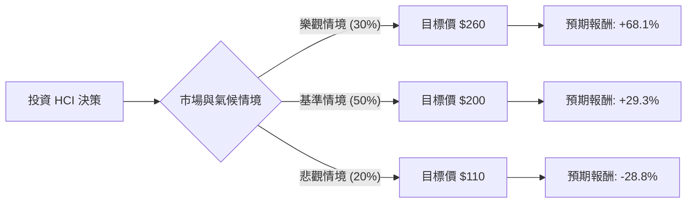

這份分析報告將結合您提供的數據與最新的市場動態（特別是 2024 年颶風季對佛羅里達州保險業的影響），利用**決策樹（Decision Tree）**與**期望值分析（Expected Value Analysis）**來評估 HCI Group, Inc. (HCI) 的投資價值。

---

### 一、 核心背景與市場動態分析

在進入計算前，我們必須考慮 HCI 的核心業務環境：
1.  **颶風影響（Helene & Milton）**：HCI 主要業務在佛州。根據最新財報與新聞，HCI 表示其再保險計畫足以覆蓋 2024 年颶風帶來的損失，且預計損失在可控範圍內。
2.  **財務強健度**：P/E 僅 6.81，ROE 高達 40%，顯示獲利能力極強。Debt/Eq 0.07 顯示財務槓桿極低，抗風險能力強。
3.  **TypTap 科技溢價**：HCI 旗下的 TypTap 保險科技子公司具有擴張至全美的潛力，這是市場給予高目標價（$245）的主因。

---

### 二、 決策樹分析 (Decision Tree)

以下是針對未來 12 個月 HCI 股價表現的決策樹模型：

#### 節點詳細說明：

| 節點 (情境) | 機率 (P) | 預期股價 | 預期報酬率 (R) | 期望值貢獻 (P * R) |
| :--- | :--- | :--- | :--- | :--- |
| **樂觀情境 (Bull)** | 30% | $260 | +68.1% | +20.43% |
| **基準情境 (Base)** | 50% | $200 | +29.3% | +14.65% |
| **悲觀情境 (Bear)** | 20% | $110 | -28.8% | -5.76% |
| **總計 (Total)** | **100%** | - | - | **+29.32%** |

---

### 三、 計算過程與核心假設

#### 1. 核心假設
*   **當前股價**：$154.61
*   **樂觀情境 (30%)**：TypTap 成功獲准在更多州擴張，且 2025 年颶風季極其平靜。公司 EPS 持續超預期，市場給予 Forward P/E 回歸至 12 倍以上。
*   **基準情境 (50%)**：公司維持現有獲利能力，2024 颶風損失如預期由再保險吸收。股價向分析師平均目標價 ($245) 靠攏，但考慮市場波動，保守設定在 $200。
*   **悲觀情境 (20%)**：佛州監管環境惡化，或 2025 年連續遭遇超大型颶風導致再保險成本飆升，淨值受損。股價回測 52 週低點附近。

#### 2. 期望值 (Expected Value) 計算
*   **期望報酬率** = $(0.30 \times 68.1\%) + (0.50 \times 29.3\%) + (0.20 \times -28.8\%)$
*   **期望報酬率** = $20.43\% + 14.65\% - 5.76\% = \mathbf{29.32\%}$
*   **預期一年後股價** = $154.61 \times (1 + 29.32\%) = \mathbf{\$199.95}$

---

### 四、 綜合基本面評估

*   **估值極低**：P/E 6.81 與 P/FCF 4.53 顯示該股被嚴重低估，尤其是考慮到其 40% 的 ROE。
*   **成長動能**：Sales Q/Q 達 52.12%，EPS Q/Q 暴增 3021%，顯示公司正處於爆發式成長期。
*   **技術面壓力**：目前股價低於 SMA20, 50, 200，顯示短期趨勢偏弱，這主要是受近期颶風心理壓力影響，但也提供了價值投資者的進場點。
*   **安全邊際**：Current Ratio 3.28 與極低的債務比，提供了極佳的下行保護。

---

### 五、 最終結論

**判斷：適合投資 (Strong Buy / Value Play)**

#### 理由：
1.  **正向期望值顯著**：經過風險加權後的預期報酬率高達 **29.32%**，遠高於市場平均水準。
2.  **極高的安全邊際**：HCI 的 P/E 僅 6.8 倍，且擁有強大的資產負債表。即便在悲觀情境下，其基本面也能支撐股價不至於崩盤。
3.  **利空出盡**：2024 年最強颶風 Milton 的影響已基本反映在股價中（近期跌幅約 11-19%），且公司已確認再保險覆蓋能力。
4.  **分析師共識**：Recom 為 1.8（強烈建議買進），目標價 $245 距離現價有極大的上漲空間。

**建議操作：**
由於目前技術面處於空頭排列（SMA 均線之下），建議採取**分批進場**策略，以應對短期內可能因氣候新聞導致的波動，長期持有以等待 TypTap 價值釋放與估值修復。