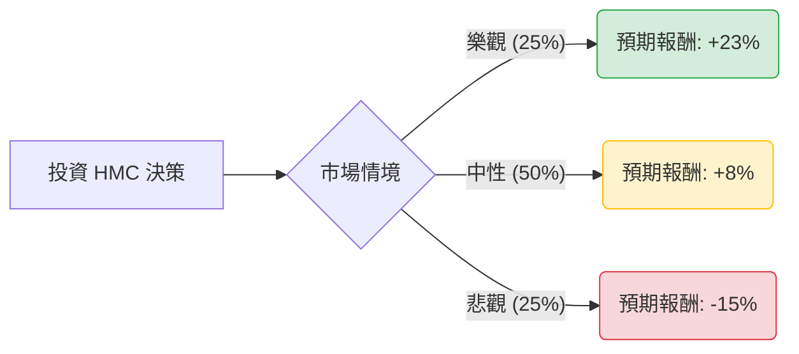

針對本田汽車（Honda Motor Co., Ltd., 股票代碼：**HMC**）的投資評估，我已結合您提供的基本面數據，並整合了最新的市場動態（如 2024/25 財年第二季財報、中國市場挑戰、電動化轉型進度等）進行深度分析。

以下是基於**決策樹分析**與**期望值分析**的評估報告。

---

### 一、 核心背景與市場動態（最新資訊補充）

1.  **中國市場潰敗**：根據最新財報，本田在中國的銷量大幅下滑（Q2 銷量下降約 15%），主因是無法競爭過比亞迪等本土電動車企。這導致其全球利潤受到嚴重拖累。
2.  **美國市場與混合動力（Hybrid）優勢**：與中國相反，本田在美國市場表現強勁，特別是 CR-V 和 Accord 的混合動力車型需求旺盛，這成為目前支撐股價的核心支柱。
3.  **日圓匯率波動**：日圓近期走勢不穩，雖然日圓貶值有利於出口利潤，但若日圓回升，將對 HMC 的換算收益造成打擊。
4.  **極低估值與回購**：P/B 僅 0.4，顯示股價極度低估（清算價值高於市值）。公司正積極進行股份回購以提升股東回報。

---

### 二、 決策樹分析（Decision Tree）

我們將未來一年的投資情境分為三種：**樂觀（轉型成功/美市強勁）**、**中性（維持現狀/震盪）**、**悲觀（中國崩盤/全球衰退）**。

#### 決策樹節點詳細說明：

| 節點 (情境) | 發生機率 | 預期報酬率 (含股息) | 期望值 (EV) | 觸發條件 |
| :--- | :--- | :--- | :--- | :--- |
| **樂觀情境** | 25% | **+23.1%** | 5.775% | 美國銷量持續增長，中國市場止跌，日圓維持弱勢，股價回歸目標價 $29.65。 |
| **中性情境** | 50% | **+8.0%** | 4.000% | 中國持續萎縮但被美國抵消，維持 2.7% 股息，股價在 $24-$27 區間震盪。 |
| **悲觀情境** | 25% | **-15.4%** | -3.850% | 中國市場全面潰敗，全球經濟衰退導致汽車需求下降，股價跌破 52W 低點至 $20。 |
| **總計** | **100%** | | **5.925%** | **加權平均期望報酬率** |

---

### 三、 期望值分析與計算過程

#### 1. 核心假設
*   **當前股價**：$24.74
*   **分析師目標價**：$29.65（隱含約 20% 上漲空間）
*   **股息收益率**：2.74%
*   **估值底線**：P/B 0.4 提供極強支撐，除非發生破產風險，否則進一步大跌空間受限。

#### 2. 計算過程
期望值 (EV) = $\sum (機率 \times 預期報酬)$

*   **樂觀 (EV1)**: $0.25 \times (20\% \text{ 價差} + 3.1\% \text{ 總息}) = 0.25 \times 23.1\% = 5.775\%$
*   **中性 (EV2)**: $0.50 \times (5\% \text{ 價差} + 3\% \text{ 總息}) = 0.50 \times 8\% = 4.0\%$
*   **悲觀 (EV3)**: $0.25 \times (-18\% \text{ 價差} + 2.6\% \text{ 總息}) = 0.25 \times -15.4\% = -3.85\%$

**總期望報酬率 = 5.775% + 4.0% - 3.85% = 5.925%**

---

### 四、 綜合評估與最終結論

#### 1. 財務數據亮點與隱憂
*   **優勢**：**P/B 0.4** 與 **P/S 0.22** 顯示該股處於極度超賣與低估區域。現金流相對充裕（P/C 1.04）。
*   **劣勢**：**PEG 5.09** 顯示相對於其微弱的增長，股價並不便宜。**EPS Q/Q -41.25%** 是一個嚴重的警訊，反映了中國市場的衝擊。
*   **技術面**：SMA20, 50, 200 全線向下，顯示目前處於強勢空頭排列，尚未看到止跌跡象。

#### 2. 最終判斷：**不適合短期投資，僅適合極長線價值投資者（觀望為主）**

**結論：不建議目前立即買入 (Neutral / Avoid)**

#### 3. 理由：
1.  **期望值過低**：計算出的年化期望報酬率僅約 **5.93%**。考慮到目前美債無風險利率約 4.3%-4.5%，投資 HMC 所承擔的個股風險（尤其是中國市場的不確定性）與回報不成正比。
2.  **價值陷阱風險**：雖然 P/B 極低，但 ROE 僅 4.11%，顯示公司利用資產獲利的能力較弱。在汽車產業轉型期，低估值往往是「價值陷阱」而非「價值窪地」。
3.  **缺乏催化劑**：目前技術面極差（Perf Month -18.27%），且短期內看不到中國業務好轉的跡象。建議等待 EPS 增長率止跌回升，或股價在 $24 附近放量築底後再行考慮。

**建議操作：**
*   若已持股：可考慮賣出 Cover Call 賺取權利金，或利用股息進行再投資，等待日圓走勢明朗。
*   若未持股：建議觀察下一個財報季關於電動車（EV）與 Sony 合作車款的進度，目前資金效率有更好的去處（如標普500指數或強勢科技股）。