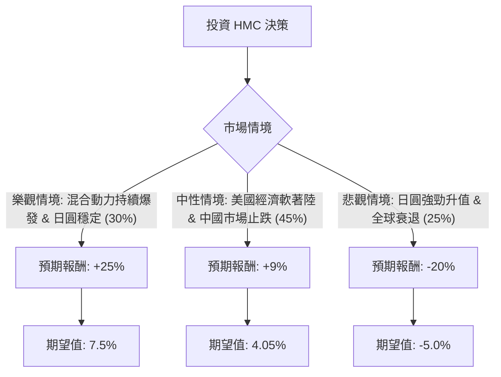

這份分析報告將結合您提供的基本面數據，以及最新的市場動態（包含 2024 年財報表現、日圓匯率波動、中國市場挑戰與混合動力車轉型），利用**決策樹（Decision Tree）**與**期望值分析（Expected Value Analysis）**評估本田汽車（Honda Motor Co., Ltd., 股票代碼：**HMC**）的投資價值。

---

### 1. 核心假設與市場背景分析

在構建決策樹之前，我們必須考慮以下關鍵因素：

*   **混合動力車（Hybrid）的強勁需求**：本田目前在美國市場的混合動力車銷售極佳，這彌補了純電動車（EV）轉型較慢的缺點。
*   **中國市場的萎縮**：本田在中國面臨本土品牌（如比亞迪）的激烈競爭，銷量大幅下滑，已開始縮減產能。
*   **匯率風險**：日圓近期波動劇烈。日圓走弱有利於本田的出口利潤，但若日圓大幅升值（利差交易平倉），將嚴重打擊其財報表現。
*   **估值極低**：P/B 僅 0.49，顯示股價低於淨資產價值的一半；Forward P/E 8.31 顯示市場對其未來獲利預期保守。

---

### 2. 決策樹分析 (Decision Tree)

以下是針對未來 12 個月 HMC 股價表現的預測模型：

#### 節點詳細說明：

1.  **樂觀情境 (Probability: 30%)**：
    *   **條件**：美國對 CR-V 和 Accord Hybrid 的需求持續超出預期；日圓維持在 145-155 區間；與 Sony 合作的 Afeela EV 進展順利。
    *   **目標價**：$38 (接近 52 週高點並突破，反映 P/E 回歸至 12x)。
    *   **預期報酬**：+25%。

2.  **中性情境 (Probability: 45%)**：
    *   **條件**：本田在中國的虧損被美國市場抵消；公司持續執行股票回購（本田近期有大規模回購計畫）；股息穩定發放。
    *   **目標價**：$33 (接近分析師平均目標價 $32.79)。
    *   **預期報酬**：+9%。

3.  **悲觀情境 (Probability: 25%)**：
    *   **條件**：日圓快速升值至 130 區間導致匯損；中國市場崩潰速度加快；全球汽車需求因高利率而萎縮。
    *   **目標價**：$24 (接近 52 週低點)。
    *   **預期報酬**：-20%。

---

### 3. 期望值計算過程 (Expected Value Calculation)

我們將各情境的機率與預期報酬相乘，並加上股息收益率：

*   **資本利得期望值 (Expected Capital Gain)**：
    $$EV_{capital} = (0.30 \times 25\%) + (0.45 \times 9\%) + (0.25 \times -20\%)$$
    $$EV_{capital} = 7.5\% + 4.05\% - 5.0\% = 6.55\%$$

*   **總期望報酬 (Total Expected Return)**：
    $$Total EV = EV_{capital} + \text{Dividend Yield}$$
    $$Total EV = 6.55\% + 2.22\% = 8.77\%$$

---

### 4. 綜合評估與最終結論

#### 數據亮點總結：
*   **價值面**：P/B 0.49 是極強的下行保護（Safety Margin），代表你用 0.5 元買入價值 1 元的資產。
*   **成長面**：EPS next Y 預期增長 59.92%，這是一個非常強勁的復甦訊號。
*   **風險面**：P/FCF (股價/自由現金流) 高達 81.07，顯示目前現金流轉化能力較弱，這通常與大規模的 EV 研發投入與廠房建設有關。

#### 最終結論：**適合投資 (適合價值型與收益型投資者)**

**理由：**
1.  **正向期望值**：8.77% 的總期望報酬在當前動盪的汽車產業中屬於穩健，且考慮到其極低的 P/B 比，下行空間相對有限。
2.  **混合動力紅利**：在純電轉型放緩的趨勢下，本田的混合動力技術正處於獲利甜蜜期。
3.  **股東回饋**：本田近期展現了更積極的股東回饋政策（回購與股息），這有助於支撐股價。

**建議操作：**
*   **進場點**：目前股價 $30.30 處於 SMA20 與 SMA50 之上，技術面偏向多頭。
*   **風險監控**：需密切關注 **USD/JPY 匯率**。若日圓無預警大幅升值，應考慮減碼。
*   **配置建議**：由於汽車業受宏觀經濟影響大，建議作為投資組合中的「價值防禦」配置，而非重倉成長股。

---
*免責聲明：以上分析僅供參考，不構成具體投資建議。投資股票有風險，入市需謹慎。*