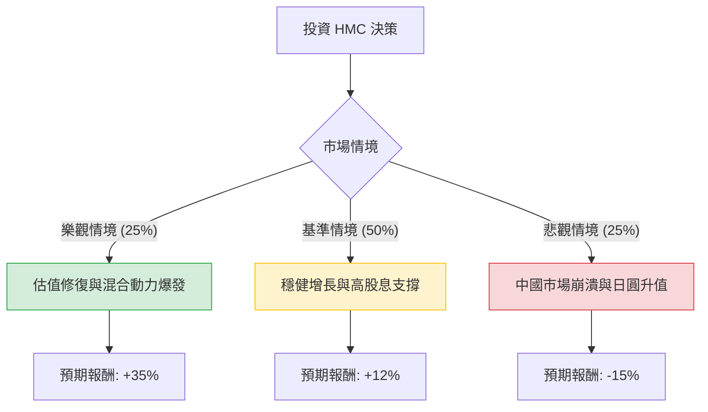

針對本田汽車（Honda Motor Co., Ltd., 股票代碼：**HMC**）的投資評估，我結合了您提供的基本面數據以及最新的市場動態（包含 2024 年財報表現、日圓匯率波動、中國市場挑戰及電動化轉型進度）進行分析。

以下是基於**決策樹分析**與**期望值分析**的詳細報告。

---

### 一、 核心假設與市場背景分析

在建立決策樹之前，我們先定義影響 HMC 股價的三大核心變數：

1.  **混合動力（Hybrid）與美國市場需求**：本田目前在美國市場的混合動力車（如 CR-V, Accord Hybrid）需求強勁，這是目前利潤的主要支撐。
2.  **中國市場的結構性衰退**：本田在中國面臨本土電動車品牌（如比亞迪）的劇烈競爭，銷量持續下滑，這是一個重大的下行風險。
3.  **資本效率與股東回饋**：HMC 目前 **P/B 僅 0.4**，遠低於帳面價值。公司近期積極進行股份回購（Buyback）並維持高股息（5.3%），以回應東京證交所對提升企業價值的要求。
4.  **匯率因素**：日圓走勢對出口利潤影響極大。若日圓大幅升值，將侵蝕換算回日圓的獲利。

---

### 二、 決策樹分析 (Decision Tree)

我們以 **1 年持有期**為基準，預測三種可能的情境：

#### 節點詳細說明：

1.  **樂觀情境 (Bull Case) - 25% 機率**
    *   **條件**：美國混合動力車銷量超預期；中國市場透過裁員與產線調整成功止血；日圓維持相對弱勢。
    *   **預期報酬**：股價回升至 P/B 0.6 左右，加上 5.3% 股息，總報酬約 **+35%**。

2.  **基準情境 (Base Case) - 50% 機率**
    *   **條件**：全球銷量持平；中國市場持續萎縮但被美國市場抵消；公司持續執行大規模回購。
    *   **預期報酬**：股價接近分析師目標價 $27.4，加上股息，總報酬約 **+12%**。

3.  **悲觀情境 (Bear Case) - 25% 機率**
    *   **條件**：全球經濟衰退導致汽車需求下降；日圓急劇升值；電動車轉型進度落後導致長期競爭力受損。
    *   **預期報酬**：股價下探 52 週低點，扣除股息後總報酬約 **-15%**。

---

### 三、 期望值 (Expected Value, EV) 計算過程

我們根據上述情境的機率與報酬率進行加權計算：

$$EV = (P_{Bull} \times R_{Bull}) + (P_{Base} \times R_{Base}) + (P_{Bear} \times R_{Bear})$$

*   **計算步驟**：
    1.  樂觀貢獻：$0.25 \times 35\% = 8.75\%$
    2.  基準貢獻：$0.50 \times 12\% = 6.00\%$
    3.  悲觀貢獻：$0.25 \times (-15\%) = -3.75\%$
*   **總期望報酬率**：$8.75\% + 6.00\% - 3.75\% = \mathbf{11.0\%}$

---

### 四、 綜合數據分析與最新動態補充

1.  **極低估值（Deep Value）**：
    *   **P/B 0.4** 意味著市場認為本田的資產價值被打折了 60%。這提供了極強的下行保護（Margin of Safety）。
    *   **P/E 9.93** 處於歷史低位，反映了市場對其增長性的擔憂。
2.  **財務健康度**：
    *   **Current Ratio 1.36** 與 **Quick Ratio 1.09** 顯示短期流動性無虞。
    *   **Dividend 5.3%**：在當前降息預期下，高股息具有吸引力。
3.  **技術面與動能**：
    *   股價目前在 $24.62，接近 52 週低點（$23.25），且位於 SMA200（-18.55%）下方，顯示短期動能極弱，屬於「左側交易」或「價值陷阱」的邊緣。
4.  **最新動態**：
    *   本田近期宣布與 **Nissan（日產）** 達成戰略合作，共同研發電動車平台與軟體，這有助於分攤研發成本，緩解單打獨鬥的壓力。

---

### 五、 最終結論

#### **判斷：適合投資 (建議分批買入)**

**理由：**
1.  **期望值為正**：11.0% 的預期報酬率優於許多保守型投資工具，且已考慮了最壞的中國市場情境。
2.  **極高的安全邊際**：0.4 的 P/B 顯示股價已被過度拋售。即便公司清算，理論價值也高於現價。
3.  **股東友善政策**：5.3% 的股息率加上持續的股份回購，能為投資者在等待股價回升期間提供穩定的現金流。
4.  **過渡期優勢**：在純電動車（BEV）需求放緩的當下，本田強大的混合動力（HEV）產品線是未來 3-5 年的利潤保險。

**風險提示：**
*   **日圓波動**：若日圓兌美元快速升破 130，HMC 的獲利預期將被下修。
*   **中國市場**：若中國業務虧損擴大速度超過美國利潤增長，股價可能長期低迷（價值陷阱）。

**建議操作：**
由於目前股價處於技術面弱勢，建議採取**定期定額**或**分批佈局**策略，首要目標價看 $27.4，長期持有以領取股息並等待估值修復。