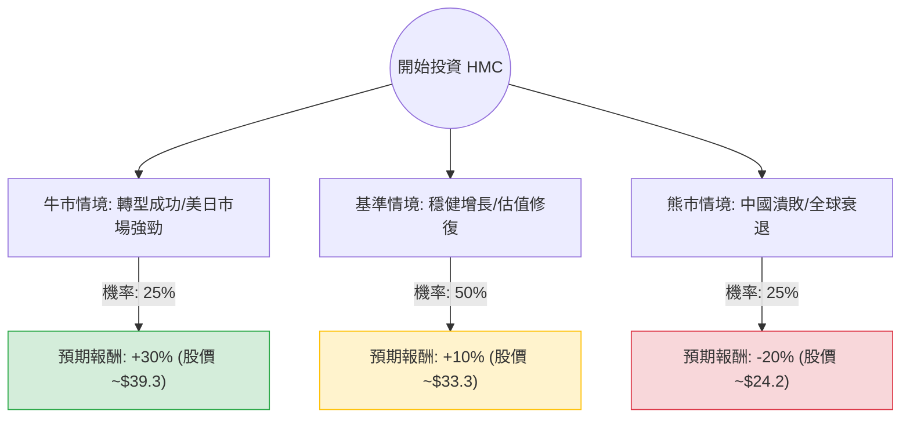

這份分析報告將針對 **Honda Motor Co., Ltd. (HMC)** 進行深入評估。我們結合了您提供的財務數據，並整合了最新的市場動態（如：與日產/三菱的電動車聯盟、中國市場挑戰、以及日圓匯率波動）來構建決策樹與期望值模型。

---

### 一、 核心假設與市場背景分析

在計算期望值前，我們設定以下三大核心假設：

1.  **產業趨勢（混合動力 vs. 純電）**：全球純電動車（EV）需求放緩，但混合動力車（HEV）需求強勁。本田在美國市場的混合動力車銷售表現優異，這將是短期利潤的主要支撐。
2.  **區域市場動態**：
    *   **正面**：北美市場需求穩定，且日圓疲軟有利於出口利潤。
    *   **負面**：中國市場面臨本土品牌（如比亞迪）的激烈價格戰，銷量持續承壓。
3.  **戰略轉型**：本田近期宣布與日產（Nissan）及三菱（Mitsubishi）建立戰略聯盟，共同開發電動車軟體與核心組件，這有助於分攤研發成本（R&D），提升長期競爭力。

---

### 二、 決策樹分析 (Decision Tree)

以下是針對未來 12 個月投資 HMC 的決策路徑圖：

#### 節點詳細說明：

1.  **牛市情境 (Optimistic - 25%)**：
    *   **條件**：混合動力車在北美銷量超預期；與日產的聯盟迅速產生協同效應降低成本；日圓維持相對弱勢。
    *   **預期報酬**：股價回升至 P/E 12x 左右，加上 2.23% 股息，總報酬約 **30%**。
2.  **基準情境 (Neutral - 50%)**：
    *   **條件**：達到分析師預期目標價 ($33.07)；EPS 下一年度增長 62.9% 的預測部分兌現；中國市場虧損縮小。
    *   **預期報酬**：股價回歸平均估值，總報酬約 **10%**。
3.  **熊市情境 (Pessimistic - 25%)**：
    *   **條件**：中國市場銷量崩跌導致大規模減值；全球經濟衰退影響汽車消費；日圓急升侵蝕海外利潤。
    *   **預期報酬**：股價回測 52 週低點，總報酬約 **-20%**。

---

### 三、 期望值分析 (Expected Value Analysis)

#### 1. 計算過程
期望值 (EV) = $\sum (機率 \times 預期報酬)$

*   **牛市**：$0.25 \times 30\% = 7.5\%$
*   **基準**：$0.50 \times 10\% = 5.0\%$
*   **熊市**：$0.25 \times (-20\%) = -5.0\%$

**總期望報酬率 (Total EV) = 7.5% + 5.0% - 5.0% = 7.5%**

#### 2. 財務數據支持點
*   **超低估值**：P/B 僅 **0.5**，意味著股價低於公司淨資產的一半，提供了極高的安全邊際（Margin of Safety）。
*   **增長潛力**：Next Year EPS 預計增長 **62.94%**，這反映了市場對其轉型與成本控制的樂觀預期。
*   **現金流與負債**：Current Ratio 1.36 且 Quick Ratio 1.09，財務結構穩健，足以支撐其 650 億美元的電動車轉型計畫。

---

### 四、 最終結論

#### **判斷：適合投資 (Buy / Accumulate)**

#### **理由：**
1.  **估值極具吸引力**：HMC 目前的 P/B (0.5) 與 Forward P/E (8.22) 顯示市場已過度反應其在中國市場的挫敗。即便在保守的基準情境下，仍有穩健的獲利空間。
2.  **期望值為正**：7.5% 的預期報酬率雖然不算爆發性增長，但考慮到其低波動性與穩定的股息（2.23%），對於價值型投資者來說非常理想。
3.  **戰略聯盟利多**：與日產、三菱的合作是重大的結構性利多，這將解決日本車廠在軟體定義汽車（SDV）領域落後的問題。
4.  **技術面支撐**：目前股價 ($30.27) 接近 52 週區間的中軸，且低於分析師目標價 ($33.07)，具備上行空間。

**風險提示**：需密切關注**日圓匯率**的劇烈波動以及**中國市場**的銷量數據。若中國市場銷量持續惡化且無止跌跡象，應重新評估熊市機率。