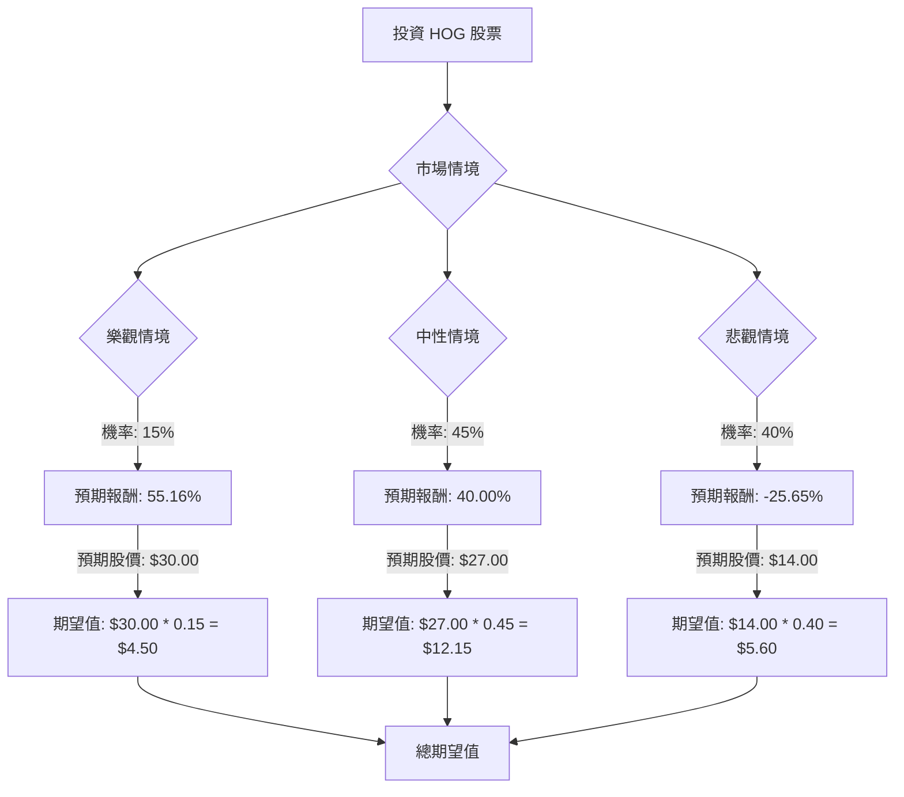

對美股公司 HOG (Harley-Davidson, Inc.) 進行投資評估，將結合其基本面數據、最新市場資訊，並運用決策樹分析與期望值分析。

### **核心假設**

1.  **市場趨勢：**
    *   全球摩托車市場預計在 2024 年至 2032 年間以 8.5% 的複合年增長率增長，而美國市場在 2025 年至 2030 年間預計以 4.1% 的複合年增長率增長，主要受休閒用途、城市化和技術進步（包括電動車型）的推動。
    *   高利率環境持續對消費者可支配支出造成壓力，特別是對於摩托車這類大額消費品。
    *   Harley-Davidson 在美國巡航車市場仍佔主導地位（2024 年市佔率達 74.5%），但整體銷量已落後於 Kawasaki 和 Honda，顯示競爭加劇。
2.  **財務狀況：**
    *   Harley-Davidson 的「Hardwire」五年戰略計劃（2021-2025）旨在通過專注於高利潤產品（旅行車、大型巡航車、三輪車）和全球擴張來實現盈利增長。
    *   與 KKR 和 PIMCO 達成的 HDFS (Harley-Davidson Financial Services) 債務交易（2025 年 7 月）預計將在 2026 年第一季度釋放 12.5 億美元的自由支配現金，顯著提升財務靈活性，並將 HDFS 轉變為「輕資本」業務模式。
    *   儘管預計 2023 年至 2026 年收入將下降 35%，且 2026 年的非 GAAP 每股收益預計為 2.09 美元（2022 年為 4.96 美元），但公司預計通過去槓桿化和成本削減仍能保持盈利。
    *   LiveWire 電動摩托車部門雖然具有戰略意義，但預計在 2025 年將繼續產生 7,000 萬至 8,000 萬美元的運營虧損，單位銷量預計在 1,000 至 1,500 輛之間。
3.  **產業趨勢與公司策略：**
    *   Harley-Davidson 面臨傳統摩托車銷量和市場份額的長期下滑，以及客戶群老齡化的挑戰。
    *   公司正努力吸引年輕買家並多元化產品線，包括電動摩托車 (LiveWire) 和冒險旅行車型。
    *   新的旅行車平台產品預計將推動 2024 年的零售銷售增長。
    *   分析師對 HOG 的共識評級為「持有」，平均目標價在 27.00 美元至 28.06 美元之間，表明存在潛在的上漲空間。

### **決策樹分析 (Decision Tree Analysis)**

**起始點：投資 HOG 股票**
*   **當前股價 (P0):** $19.80
*   **股息率:** 3.64%

我們將考慮三種未來情境：樂觀、中性、悲觀。

### **計算過程**

**1. 樂觀情境 (Optimistic Scenario)**
*   **情境名稱：** Hardwire 戰略超預期成功與市場強勁反彈
*   **情境描述：** Harley-Davidson 的「Hardwire」戰略顯著超越預期，新車型（特別是旅行車）帶來強勁的零售增長，LiveWire 電動摩托車意外獲得市場青睞，宏觀經濟狀況大幅改善，刺激了可支配支出。HDFS 交易提供的資本被有效再投資。
*   **機率 (Probability)：** 15% (考慮到長期趨勢和 EPS 預期，此情境發生機率較低)
*   **預期股價 (P1)：** $30.00 (接近 52 週高點，略高於分析師平均目標價，反映強勁復甦)
*   **資本增值：** ($30.00 - $19.80) / $19.80 = 51.52%
*   **總預期報酬：** 51.52% (資本增值) + 3.64% (股息) = 55.16%
*   **期望值 (Expected Value)：** $30.00 (預期股價) * 0.15 (機率) = $4.50

**2. 中性情境 (Moderate Scenario)**
*   **情境名稱：** Hardwire 戰略部分有效，但面臨持續逆風
*   **情境描述：** 「Hardwire」戰略有助於穩定核心業務並防止市場份額進一步大幅流失，但整體銷售仍受老齡化客戶群和高利率的挑戰。LiveWire 繼續按預期產生虧損。HDFS 交易提供穩定性，但未能完全抵消核心業務的疲軟。股價向分析師平均目標價靠攏。
*   **機率 (Probability)：** 45% (基於當前混合信號和分析師共識，這是最可能的情境)
*   **預期股價 (P1)：** $27.00 (參考近期分析師平均目標價)
*   **資本增值：** ($27.00 - $19.80) / $19.80 = 36.36%
*   **總預期報酬：** 36.36% (資本增值) + 3.64% (股息) = 40.00%
*   **期望值 (Expected Value)：** $27.00 (預期股價) * 0.45 (機率) = $12.15

**3. 悲觀情境 (Pessimistic Scenario)**
*   **情境名稱：** Hardwire 戰略失敗與加速衰退
*   **情境描述：** 「Hardwire」戰略未能有效阻止銷量下滑，新車型表現不佳，LiveWire 虧損擴大且單位銷量未見顯著增長。高利率持續或惡化，進一步抑制需求。市場份額侵蝕加速，公司面臨更激烈的競爭壓力。
*   **機率 (Probability)：** 40% (考慮到未來一年 EPS 預期大幅下降和長期收入下滑趨勢，此情境發生機率較高)
*   **預期股價 (P1)：** $14.00 (顯著跌破當前股價和 52 週低點，反映嚴峻的經營狀況)
*   **資本增值：** ($14.00 - $19.80) / $19.80 = -29.29%
*   **總預期報酬：** -29.29% (資本增值) + 3.64% (股息) = -25.65%
*   **期望值 (Expected Value)：** $14.00 (預期股價) * 0.40 (機率) = $5.60

**總期望值 (Overall Expected Value)**

總期望值 = (樂觀情境期望值) + (中性情境期望值) + (悲觀情境期望值)
總期望值 = $4.50 + $12.15 + $5.60 = $22.25

### **最終結論**

根據決策樹分析和期望值計算，HOG 股票的總期望值為 **$22.25**。

*   **適合投資 / 不適合投資：** 適合投資

*   **簡短理由：**
    儘管 Harley-Davidson 面臨傳統業務下滑、客戶群老齡化以及電動摩托車 LiveWire 仍在虧損等挑戰，但其當前股價 $19.80 遠低於計算出的總期望值 $22.25。這表明在考慮了各種市場情境及其相應機率後，該股票仍具有潛在的上漲空間。公司正在積極執行「Hardwire」戰略以重振核心業務並探索新市場，同時 HDFS 的債務交易也為其提供了重要的財務靈活性。分析師的平均目標價也普遍高於當前股價。因此，從期望值角度來看，HOG 目前適合投資，但投資者應密切關注其戰略執行情況和宏觀經濟環境的變化。