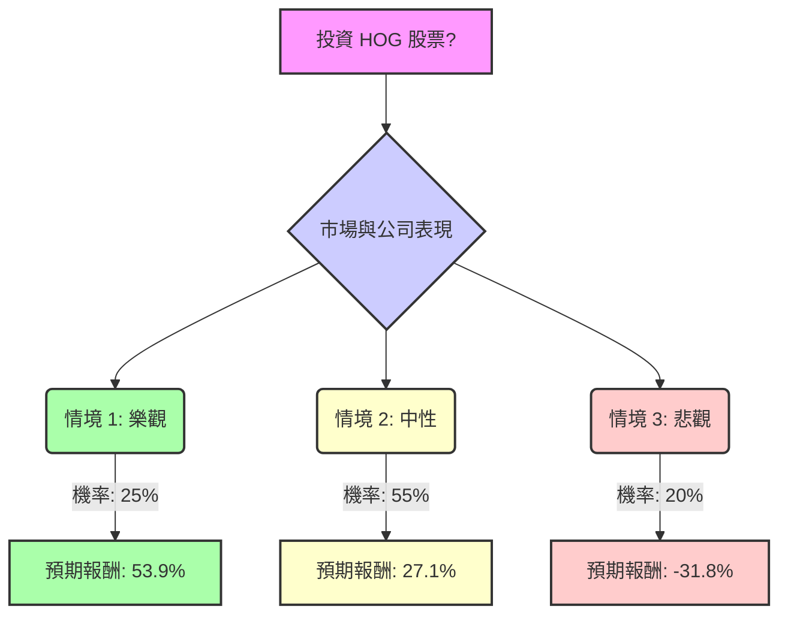

根據您提供的基本面數據以及最新的市場資訊，以下是針對美股公司 **HOG (Harley-Davidson, Inc.)** 的決策樹分析與期望值評估：

### **HOG 基本面數據概覽**

*   **收盤價 (Close)**: 18.68
*   **本益比 (P/E)**: 7.17
*   **股價淨值比 (P/B)**: 0.62
*   **股息率 (Dividend %)**: 3.85%
*   **52週高點 (52W High)**: -0.4022 (表示當前價格較52週高點低40.22%)
*   **52週低點 (52W Low)**: -0.0171 (表示當前價格較52週低點低1.71%)
*   **市值 (Market Cap)**: 22.1 億美元
*   **股東權益報酬率 (ROE)**: 10.71%
*   **資產報酬率 (ROA)**: 3.4%
*   **投資報酬率 (ROI)**: 7.05%
*   **目標價 (Target Price)**: 23.11 (來自您提供的數據，分析師平均目標價範圍更廣)
*   **遠期本益比 (Forward P/E)**: 11.3
*   **下一年度EPS成長率 (EPS next Y_%)**: 118.26% (此數據與近期財報展望存在較大差異，需謹慎評估)
*   **推薦評級 (Recom)**: 2.39 (接近「持有」評級，其中1為強烈買入，5為強烈賣出)

### **最新市場資訊與產業趨勢**

1.  **分析師評級與目標價**: 截至2026年2月，分析師對HOG的共識評級為「持有」(Hold)。平均12個月目標價介於22.17美元至27.04美元之間，最高目標價為34.00美元，最低為12.00美元。
2.  **近期財務表現 (2024年第四季度及2024/2025財年)**:
    *   **2024年第四季度 (2025年2月5日發布)**: 稀釋後每股虧損0.93美元，營收同比下降35%，HDMC (Harley-Davidson Motor Company) 營收下降47%，全球摩托車出貨量下降53%。
    *   **2024財年 (2025年2月5日發布)**: 稀釋後每股收益3.44美元 (較2023年下降29%)，營收下降11%至51.9億美元，全球摩托車出貨量下降17%。
    *   **2025年第四季度 (2026年2月10日發布)**: 稀釋後每股虧損2.44美元，綜合營收下降28%，HDMC營收下降10%，HDFS (Harley-Davidson Financial Services) 營收下降59%。全球零售摩托車銷量下降1%。
    *   **2025財年 (2026年2月10日發布)**: 稀釋後每股收益2.78美元 (較2024年的3.44美元下降)。全球零售摩托車銷量下降12%。HDMC錄得2900萬美元的營運虧損。
3.  **2026年展望 (2026年2月10日發布)**: HDMC全球摩托車零售銷量預計為130,000至135,000輛。HDMC營運收入預計為虧損4000萬美元至盈利1000萬美元之間。
4.  **主要挑戰**: 高利率環境影響消費者信心，全球摩托車出貨量下降，市場需求疲軟，關稅成本增加，營運槓桿負面。 電動摩托車LiveWire的銷量在2024年第四季度也顯著下降。
5.  **積極因素**: 在美國旅行車 (Touring) 細分市場佔有率強勁 (2024年為74.5%)，北美旅行車、三輪車和CVO車型零售銷量增長，HDFS營運收入增加 (儘管2025年第四季度HDFS營收下降)，現金狀況良好，HDFS通過戰略合作夥伴關係轉型為輕資本業務。
6.  **產業趨勢**: 全球摩托車市場整體增長 (主要由亞太地區帶動)，但電動摩托車銷量在2024年上半年有所下降。 先進駕駛輔助系統 (ARAS) 和電動摩托車是關鍵技術趨勢。 2024年美國註冊摩托車數量創歷史新高，但新車銷售持平。
7.  **股息**: 季度股息為每股0.1875美元，年化約0.75美元，股息率約3.9%-4%。

### **核心假設**

*   **市場假設**: 全球經濟增長放緩，高利率環境持續對消費者可支配支出造成壓力，尤其影響非必需品如摩托車的銷售。
*   **財務假設**: HOG的HDMC部門將繼續面臨銷售和盈利壓力，但HDFS部門有望通過其輕資本戰略保持穩定貢獻。公司將繼續執行「Hardwire」戰略以穩定業務並恢復經銷商信心。
*   **產業趨勢假設**: 傳統燃油摩托車市場面臨挑戰，電動摩托車市場雖具潛力但短期內仍處於發展初期並可能帶來虧損。美國本土市場，特別是高端旅行車型，仍是HOG的優勢所在。

### **決策樹分析**

**當前股價 (Current Price): 18.68 美元**

### **情境分析與計算過程**

我們將預期報酬定義為 (預期股價 - 當前股價) / 當前股價 + 股息率。當前股息率約為 4% (0.75美元/年 / 18.68美元)。

**1. 情境 1: 樂觀 (Market Recovery & Strategic Success)**
*   **情境描述**: 全球經濟顯著復甦，消費者信心回升，HOG的「Hardwire」戰略成功推動銷售增長和盈利能力改善。LiveWire電動摩托車業務開始展現增長潛力並減少虧損。公司在核心的美國旅行車市場保持強勁勢頭，並有效控制成本。
*   **機率 (Probability)**: 25%
*   **預期股價 (Expected Price)**: 28.00 美元 (接近分析師目標價區間中高位)
*   **預期報酬 (Expected Return)**:
    *   股價增值: (($28.00 - $18.68) / $18.68) = $9.32 / $18.68 ≈ 0.499 (49.9%)
    *   總預期報酬: 0.499 + 0.04 (股息率) = 0.539 (53.9%)
*   **期望值 (Expected Value)**: 0.25 * 0.539 = 0.13475

**2. 情境 2: 中性 (Stagnation & Continued Headwinds)**
*   **情境描述**: 市場環境保持現狀，高利率和通脹壓力持續影響消費者支出。HOG的銷售和出貨量保持平穩或略有下降，符合2026年HDMC營收持平至下降5%的展望。公司在美國本土市場表現穩定，但國際市場仍面臨挑戰。LiveWire業務繼續產生營運虧損。分析師的「持有」評級反映了這種預期。
*   **機率 (Probability)**: 55%
*   **預期股價 (Expected Price)**: 23.00 美元 (接近分析師平均目標價的較低端，反映持續挑戰)
*   **預期報酬 (Expected Return)**:
    *   股價增值: (($23.00 - $18.68) / $18.68) = $4.32 / $18.68 ≈ 0.231 (23.1%)
    *   總預期報酬: 0.231 + 0.04 (股息率) = 0.271 (27.1%)
*   **期望值 (Expected Value)**: 0.55 * 0.271 = 0.14905

**3. 情境 3: 悲觀 (Deterioration & Failed Strategy)**
*   **情境描述**: 經濟狀況惡化，消費者信心大幅下降，導致摩托車需求進一步萎縮。HOG的「Hardwire」戰略未能有效應對市場挑戰，競爭加劇導致市場份額和盈利能力嚴重受損。LiveWire業務虧損擴大，成為公司沉重負擔。公司可能面臨更嚴重的財務壓力。
*   **機率 (Probability)**: 20%
*   **預期股價 (Expected Price)**: 12.00 美元 (接近分析師最低目標價)
*   **預期報酬 (Expected Return)**:
    *   股價增值: (($12.00 - $18.68) / $18.68) = -$6.68 / $18.68 ≈ -0.358 (-35.8%)
    *   總預期報酬: -0.358 + 0.04 (股息率) = -0.318 (-31.8%)
*   **期望值 (Expected Value)**: 0.20 * -0.318 = -0.0636

### **整體期望值計算**

整體期望值 = (情境 1 期望值) + (情境 2 期望值) + (情境 3 期望值)
整體期望值 = 0.13475 + 0.14905 + (-0.0636)
整體期望值 = 0.2838 - 0.0636
**整體期望值 = 0.2202 (或 22.02%)**

### **最終結論**

根據上述決策樹分析和期望值計算，HOG 股票的整體期望值為 **22.02%**。

**判斷**: **適合投資**

**理由**: 儘管Harley-Davidson近期面臨全球摩托車銷量下滑、高利率環境以及LiveWire業務虧損等挑戰，導致其2024年和2025年財報表現不佳，且分析師普遍給予「持有」評級。然而，其在美國旅行車市場的強勁佔有率、HDFS部門的穩定貢獻以及公司正在執行的「Hardwire」戰略，為其提供了潛在的穩定性和未來轉機。

目前的股價18.68美元處於52週低點附近，且P/E為7.17、P/B為0.62，顯示估值相對較低。 雖然「下一年度EPS成長率」118.26%與公司最新展望存在差異，但若公司能成功執行其戰略並在未來幾年內實現盈利能力的反彈，目前的低估值可能提供較大的上漲空間。

綜合來看，儘管存在風險，但22.02%的整體期望值表明，在當前價格下，HOG股票具有一定的投資吸引力，尤其對於願意承擔一定風險以追求潛在資本增值和穩定股息的投資者而言。投資者應密切關注公司「Hardwire」戰略的執行情況、全球經濟復甦進度以及LiveWire業務的發展。