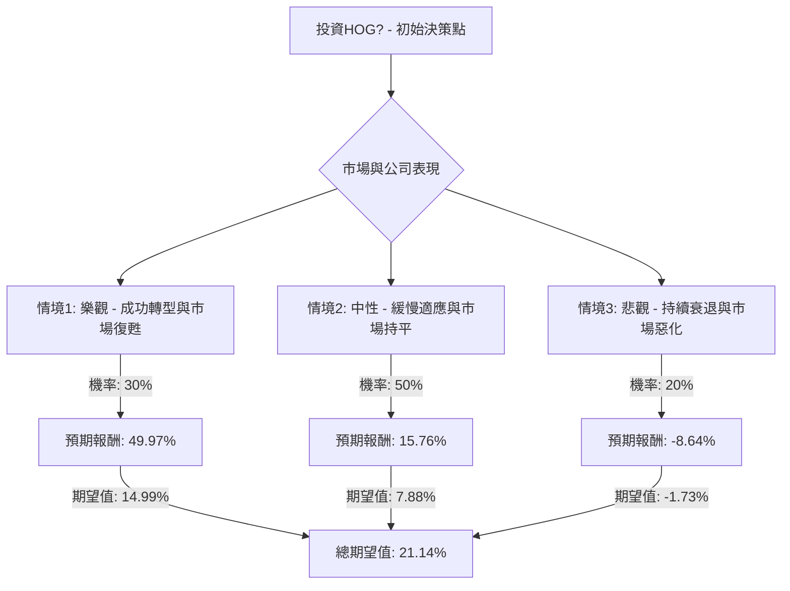

根據對美股公司HOG（Harley-Davidson, Inc.）基本面數據及最新市場資訊的綜合評估，以下將透過決策樹分析與期望值分析，評估其目前是否適合投資。

### **核心假設**

在進行決策樹分析前，我們基於收集到的資訊，建立以下核心假設：

*   **市場趨勢：** 全球機車市場面臨挑戰，特別是高利率環境影響消費者可支配支出。然而，電動機車、冒險旅行車款以及輕量化、高科技車款的需求正在增長。
*   **財務狀況：** HOG近期面臨銷售下滑，尤其在2024年及2025年上半年表現不佳。但公司透過HDFS（Harley-Davidson Financial Services）的策略性交易，預計在2026年第一季度釋放約12-12.5億美元的現金，並維持穩定的股息政策及股票回購計畫。2025年第三季度的EPS表現優於預期，顯示出一定的韌性。
*   **產業競爭：** 傳統重型機車市場面臨年輕客群流失的挑戰，同時電動機車領域的競爭日益激烈。HOG正努力透過LiveWire電動品牌和Pan America冒險車款來吸引新世代騎士。
*   **管理層策略：** 執行長Jochen Zeitz的「Hardwire」策略旨在重振品牌，並透過新產品線（如2026年多款車型更新）和更貼近經銷商的政策來應對市場變化。

### **決策樹分析**

我們將當前投資HOG的決策分為三個主要情境，並估計其發生機率及預期報酬。

*   **當前股價 (Current Price):** $20.49
*   **股息率 (Dividend Yield):** 3.51%

### **計算過程**

以下是各情境的詳細計算：

**1. 情境1: 樂觀 - 成功轉型與市場復甦**
*   **情境描述：** HOG的「Hardwire」策略成功執行，LiveWire電動機車和Pan America冒險車款獲得市場廣泛接受。全球經濟環境改善，消費者信心回升，可支配支出增加。HDFS交易成功釋放大量現金，用於再投資或回饋股東。公司銷售額和利潤率顯著提升。
*   **預期股價 (12-18個月後):** $30.00 (接近52週高點 $31.25 及部分分析師高目標價 $32-$45)
*   **股價報酬率:** ($30.00 - $20.49) / $20.49 = 0.4646 (46.46%)
*   **總預期報酬率:** 股價報酬率 + 股息率 = 0.4646 + 0.0351 = 0.4997 (49.97%)
*   **機率 (Probability):** 30%
*   **期望值 (Expected Value):** 0.30 * 0.4997 = 0.14991 (14.99%)

**2. 情境2: 中性 - 緩慢適應與市場持平**
*   **情境描述：** HOG的轉型努力取得一定進展，但速度較慢，未能完全抵消傳統市場的下滑。經濟環境保持穩定，但沒有顯著改善。HDFS交易提供流動性，但對核心機車業務的提振有限。公司業績大致持平或略有波動，股價維持在分析師平均目標價附近。
*   **預期股價 (12-18個月後):** $23.00 (接近近期分析師目標價 $23.00)
*   **股價報酬率:** ($23.00 - $20.49) / $20.49 = 0.1225 (12.25%)
*   **總預期報酬率:** 股價報酬率 + 股息率 = 0.1225 + 0.0351 = 0.1576 (15.76%)
*   **機率 (Probability):** 50%
*   **期望值 (Expected Value):** 0.50 * 0.1576 = 0.07880 (7.88%)

**3. 情境3: 悲觀 - 持續衰退與市場惡化**
*   **情境描述：** HOG未能有效吸引年輕客群，傳統重型機車銷售持續大幅下滑。全球經濟惡化，高通膨和高利率進一步抑制消費者支出。新產品線（LiveWire、Pan America）未能達到預期，競爭加劇導致市場份額流失。公司盈利能力持續受損，股價跌至分析師最低目標價甚至更低。
*   **預期股價 (12-18個月後):** $18.00 (分析師最低目標價 $18.00)
*   **股價報酬率:** ($18.00 - $20.49) / $20.49 = -0.1215 (-12.15%)
*   **總預期報酬率:** 股價報酬率 + 股息率 = -0.1215 + 0.0351 = -0.0864 (-8.64%)
*   **機率 (Probability):** 20%
*   **期望值 (Expected Value):** 0.20 * -0.0864 = -0.01728 (-1.73%)

**整體期望值 (Overall Expected Value):**
將各情境的期望值加總：
0.14991 (樂觀) + 0.07880 (中性) - 0.01728 (悲觀) = 0.21143

因此，投資HOG的整體期望報酬率約為 **21.14%**。

### **最終結論**

根據上述決策樹分析和期望值計算，HOG目前的整體期望報酬率為 **21.14%**。

**判斷：適合投資**

**簡短理由：**
儘管Harley-Davidson面臨傳統市場銷售下滑、年輕客群吸引力不足以及電動化轉型挑戰等顯著逆風，但其目前的股價（約$20.49）已接近52週低點，且遠低於分析師平均目標價（約$27.00 - $27.50），顯示出潛在的估值修復空間。公司透過HDFS交易預計將釋放大量現金，並持續進行股票回購及提供具吸引力的股息（3.51%），這些都為股東提供了下行保護和潛在回報。此外，公司在電動機車（LiveWire）和冒險旅行車款（Pan America）的創新努力，以及新管理層對經銷商關係的改善，有望在長期內推動品牌轉型和市場適應。雖然存在悲觀情境的風險，但樂觀和中性情境的較高機率和正向回報，使得整體期望值為正，表明HOG目前具備一定的投資吸引力。