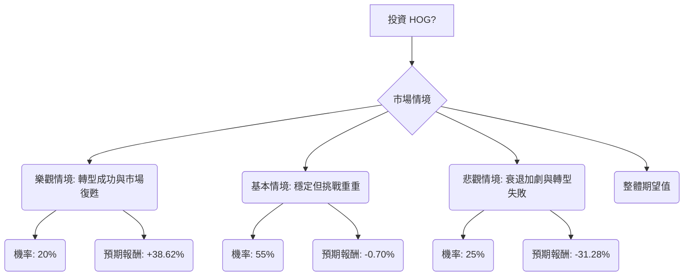

根據您提供的基本面數據以及最新的市場資訊，我們將對美股公司 HOG (Harley-Davidson, Inc.) 進行決策樹分析與期望值分析，以評估其目前的投資適合性。

### 核心假設

在進行決策樹分析之前，我們基於收集到的資訊建立以下核心假設：

*   **市場趨勢：** 整體摩托車市場面臨挑戰，傳統大型重機銷量下滑，但小型化、運動型和探險型摩托車市場有所增長。電動摩托車市場（LiveWire）仍處於發展初期，短期內可能持續虧損。
*   **財務狀況：** HOG 在2025年面臨營收和摩托車業務（HDMC）營運虧損的挑戰，但金融服務部門（HDFS）表現強勁，並透過策略合作夥伴關係實現資本輕量化。 公司預計2026年HDMC營運收入接近損益兩平，LiveWire將繼續虧損。
*   **產業趨勢與公司策略：** HOG 正透過「Hardwire」計畫專注於核心盈利領域（Touring, Large Cruiser, Trike），並積極探索全球市場和電動化轉型。 公司也正努力吸引年輕客群，並重塑品牌形象。 然而，其主要客戶群體年齡偏高，且面臨高利率、通膨和關稅等經濟逆風。
*   **分析師共識：** 大多數分析師對 HOG 持「持有 (Hold)」評級，平均目標價略低於或接近當前股價，但存在較大的高低目標價區間。

### 決策樹分析

我們將考慮三種未來情境：樂觀、基本和悲觀，並為每個情境分配機率和預期報酬。

**當前股價 (Close):** $22.89 (截至提供數據)

#### 1. 繪製完整的決策樹 (使用 Markdown)

#### 2. 明確列出所有計算過程

**核心假設與情境定義：**

*   **樂觀情境 (Successful Transformation & Market Recovery)**
    *   **假設：** HOG 的「Hardwire」計畫成功重振品牌並吸引年輕客群。LiveWire 在電動車市場取得顯著進展。全球經濟狀況改善，提振可支配支出。關稅影響減輕或有效吸收。HDFS 持續提供穩定收入。
    *   **機率 (Probability):** 20%
    *   **預期股價：** $31.00 (參考分析師最高目標價區間，並考慮公司轉型成功帶來的溢價)
    *   **預期報酬計算：**
        *   股價報酬 = ($31.00 - $22.89) / $22.89 = 0.3543
        *   總報酬 = 股價報酬 + 股息率 = 0.3543 + 0.0319 = 0.3862 (約 38.62%)

*   **基本情境 (Stable but Challenging)**
    *   **假設：** HOG 在核心業務保持市場份額，但在吸引新客群方面進展有限。LiveWire 繼續虧損但有所改善。經濟逆風持續，但公司有效控制成本。表現符合分析師「持有」共識和公司謹慎的2026年展望。
    *   **機率 (Probability):** 55%
    *   **預期股價：** $22.00 (參考分析師平均目標價 $21.67 或 $20.00，略低於當前股價，反映「持有」評級下的平穩或微幅下跌)
    *   **預期報酬計算：**
        *   股價報酬 = ($22.00 - $22.89) / $22.89 = -0.0389
        *   總報酬 = 股價報酬 + 股息率 = -0.0389 + 0.0319 = -0.0070 (約 -0.70%)

*   **悲觀情境 (Accelerated Decline & Failed Transformation)**
    *   **假設：** 經濟下行加劇，嚴重影響可支配支出。傳統摩托車銷量加速下滑。LiveWire 未能成功拓展市場，成為更大的財務負擔。關稅成本增加，公司重組措施不足以應對挑戰。分析師「賣出」評級被證實。
    *   **機率 (Probability):** 25%
    *   **預期股價：** $15.00 (參考分析師最低目標價 $12.00 - $15.00)
    *   **預期報酬計算：**
        *   股價報酬 = ($15.00 - $22.89) / $22.89 = -0.3447
        *   總報酬 = 股價報酬 + 股息率 = -0.3447 + 0.0319 = -0.3128 (約 -31.28%)

**整體期望值 (Overall Expected Value) 計算：**

整體期望值 = (樂觀情境機率 × 樂觀情境預期報酬) + (基本情境機率 × 基本情境預期報酬) + (悲觀情境機率 × 悲觀情境預期報酬)

整體期望值 = (0.20 × 0.3862) + (0.55 × -0.0070) + (0.25 × -0.3128)
整體期望值 = 0.07724 + (-0.00385) + (-0.0782)
整體期望值 = -0.00481

因此，整體期望值約為 **-0.48%**。

### 最終結論

根據我們的決策樹分析和期望值計算，美股公司 HOG 目前的整體期望值為 **-0.48%**。

基於此計算結果，**不適合投資**。

**簡短理由：**
儘管 HOG 擁有強大的品牌忠誠度 和積極的轉型策略，但其面臨的挑戰（包括傳統業務下滑、客戶群老化、經濟逆風和關稅成本）使得其未來表現存在較大不確定性。整體期望值為負，表明在考慮不同情境及其機率後，預期投資回報為負值。分析師普遍持「持有」評級，且平均目標價與當前股價相近或略低，也反映了市場對其短期增長潛力的謹慎態度。 雖然存在樂觀情境下的高回報潛力，但其機率相對較低，且被基本情境和悲觀情境下的負回報所抵消。