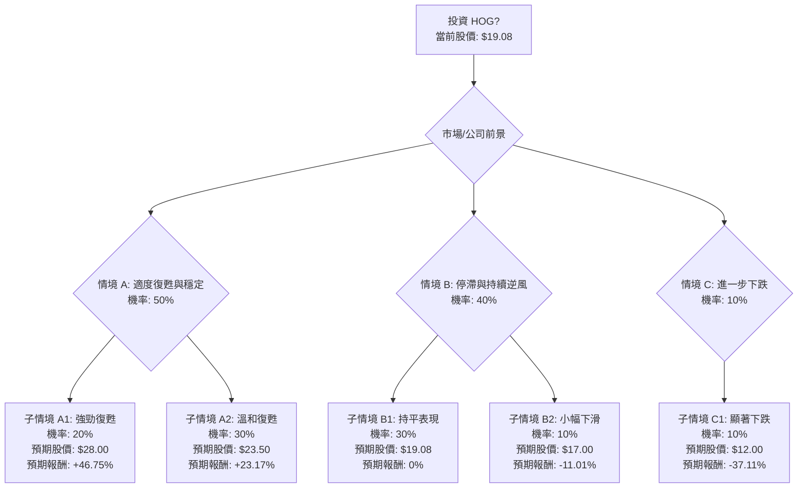

根據對美股公司 **HOG (Harley-Davidson, Inc.)** 的決策樹分析與期望值分析，並結合其基本面數據及最新的市場資訊，以下是詳細評估：

### 核心假設

1.  **市場趨勢：** 全球摩托車市場面臨挑戰，特別是重型巡航車領域，受人口結構老化和消費者偏好轉變影響，呈現結構性下滑。然而，電動摩托車和中量級車款市場存在成長潛力，個性化定制需求依然強勁。
2.  **公司財務狀況：** Harley-Davidson Motor Company (HDMC) 正處於「重置」階段，旨在調整批發量以符合零售需求並提升盈利能力。公司面臨關稅和全球銷量下滑的重大阻力，但北美地區的銷售在近期表現出積極趨勢。Harley-Davidson Financial Services (HDFS) 在2025年表現強勁，但預計2026年將回歸正常水平。電動摩托車部門 LiveWire 仍處於成長初期，持續虧損。
3.  **管理策略：** 管理層專注於成本節約、庫存削減和優化資本配置，同時優先發展高利潤產品並服務現有客戶群。公司也在探索新的產品類別，例如潛在的低於6,000美元的車款。
4.  **估值：** HOG 目前股價為19.08美元，接近其52週低點17.11美元。分析師普遍給予「持有」評級，中位目標價為23.50美元，暗示存在溫和上漲空間。

### 決策樹分析

**起始點：投資 HOG (當前股價 $19.08)**

### 計算過程

**1. 情境 A: 適度復甦與穩定 (總機率: 50%)**
*   **核心假設：** HOG 成功執行「重置」策略，關稅壓力減輕，LiveWire 取得顯著進展，高端摩托車市場反彈，成本節約措施見效，北美銷售保持穩定。
    *   **子情境 A1: 強勁復甦**
        *   機率 (P): 20%
        *   預期股價：$28.00 (介於分析師中位目標與高目標之間，反映強勁表現)
        *   預期報酬：($28.00 - $19.08) / $19.08 = 46.75%
        *   期望值 (EV): 0.20 * 46.75% = 9.35%
    *   **子情境 A2: 溫和復甦**
        *   機率 (P): 30%
        *   預期股價：$23.50 (分析師中位目標價)
        *   預期報酬：($23.50 - $19.08) / $19.08 = 23.17%
        *   期望值 (EV): 0.30 * 23.17% = 6.95%

**2. 情境 B: 停滯與持續逆風 (總機率: 40%)**
*   **核心假設：** HOG 難以實現 HDMC 的成長，但 HDFS 和 LiveWire 避免了重大損失。市場狀況充滿挑戰但未顯著惡化。公司2026年營運收入指引接近盈虧平衡。
    *   **子情境 B1: 持平表現**
        *   機率 (P): 30%
        *   預期股價：$19.08 (當前股價，盈虧平衡)
        *   預期報酬：0%
        *   期望值 (EV): 0.30 * 0% = 0%
    *   **子情境 B2: 小幅下滑**
        *   機率 (P): 10%
        *   預期股價：$17.00 (略低於當前股價，但高於52週低點)
        *   預期報酬：($17.00 - $19.08) / $19.08 = -11.01%
        *   期望值 (EV): 0.10 * -11.01% = -1.10%

**3. 情境 C: 進一步下跌 (總機率: 10%)**
*   **核心假設：** 經濟衰退加劇，關稅問題惡化，HDMC 的「重置」策略失敗，LiveWire 表現不佳，競爭加劇。
    *   **子情境 C1: 顯著下跌**
        *   機率 (P): 10%
        *   預期股價：$12.00 (分析師最低目標價)
        *   預期報酬：($12.00 - $19.08) / $19.08 = -37.11%
        *   期望值 (EV): 0.10 * -37.11% = -3.71%

**整體期望值分析 (Expected Value Analysis):**

將所有子情境的期望值加總，得出整體預期報酬：
整體預期報酬 = 9.35% (A1) + 6.95% (A2) + 0% (B1) - 1.10% (B2) - 3.71% (C1)
**整體預期報酬 = 11.49%**

基於當前股價 $19.08，預期投資的最終價值為：
預期最終股價 = $19.08 * (1 + 0.1149) = $19.08 * 1.1149 = **$21.26**

### 最終結論

根據決策樹分析和期望值計算，HOG 股票的整體預期報酬為 **11.49%**，預期最終股價為 **$21.26**。

**判斷：適合投資**

**簡短理由：**
儘管 Harley-Davidson Motor Company (HDMC) 面臨全球銷量下滑、關稅壓力以及向電動化轉型的挑戰，但其當前股價 $19.08 接近52週低點，且市盈率 (P/E: 7.47) 和市淨率 (P/B: 0.69) 均較低，顯示其估值具有吸引力。公司在北美市場仍保持強勁的市佔率，Harley-Davidson Financial Services (HDFS) 在2025年表現出色，並在2026年預計將穩定貢獻。管理層正在積極實施「重置」策略，專注於成本節約和庫存調整，並預計在2027年及以後實現顯著的年度成本節約。

分析師的共識目標價中位數為 $23.50，暗示有約23.2%的上漲空間。 我們的期望值分析也得出正向的預期報酬。雖然存在進一步下跌的風險，但考慮到當前較低的估值、管理層的積極應對措施以及潛在的市場穩定，HOG 在當前價格下具有一定的投資吸引力。