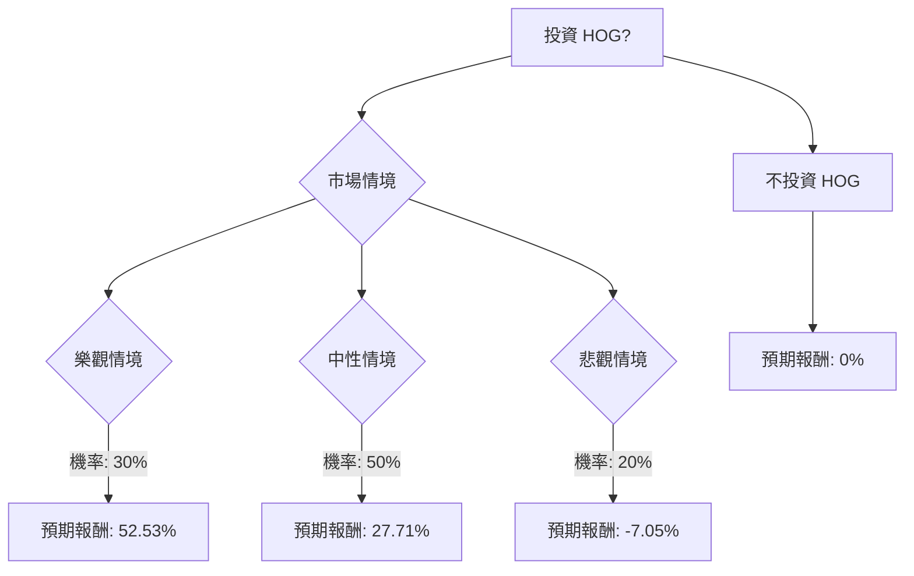

根據您提供的基本面數據以及對美股公司 HOG (Harley-Davidson, Inc.) 的最新市場資訊進行綜合評估，以下是決策樹分析與期望值分析：

### **HOG 投資評估：決策樹分析與期望值分析**

**公司概況與最新動態：**
Harley-Davidson (HOG) 是一家標誌性的美國摩托車製造商，目前正處於轉型期，以應對不斷變化的市場動態和消費者偏好。

**基本面數據摘要：**
*   **收盤價 (Close):** $20.14
*   **目標價 (Target Price):** $26.44
*   **本益比 (P/E):** 4.88
*   **股價淨值比 (P/B):** 0.66
*   **股息率 (Dividend %):** 3.58%
*   **未來一年預期 EPS 成長率 (EPS next Y_%):** -52.68% (顯著下降)
*   **過去一年股價表現 (Perf Year):** -24.76% (表現不佳)
*   **分析師建議 (Recom):** 2.39 (介於「買入」與「持有」之間)

**最新市場資訊補充：**
1.  **近期財報與展望：** HOG 預計於 2026 年 2 月 10 日（即今日）發布 2025 年第四季度及全年財報。分析師預計 2025 年第四季度每股收益 (EPS) 為 -$1.01，顯示盈利壓力。
2.  **2025 年表現：** 2025 年美國摩托車和 ATV 銷量整體下滑 5.3%，其中傳統的旅行摩托車銷量下降 13%，巡洋艦銷量下降 6%。Harley-Davidson 在美國市場的銷量下降了 12.9%，反映出其對非必需消費品支出壓力和不斷變化的消費者基礎的敏感性。
3.  **2024 年表現：** 2024 年全球摩托車出貨量同比下降 17%，全球零售銷量下降 7%。然而，在北美市場，旅行車、三輪車和 CVO 車型的零售銷量增長超過 8%，公司在美國旅行車市場的市佔率達到 74.5%。
4.  **HDFS 轉型：** Harley-Davidson Financial Services (HDFS) 與 KKR 和 PIMCO 建立了戰略合作夥伴關係，旨在轉型為輕資本、去風險化的業務模式，預計到 2026 年第一季度將釋放約 12 億至 12.5 億美元的自由現金。
5.  **產業趨勢與挑戰：** 摩托車市場正轉向小型化、運動型和電動車型。HOG 面臨吸引年輕買家、應對電動摩托車競爭以及關稅影響的挑戰。
6.  **分析師評級：** 分析師對 HOG 的評級存在分歧，從「持有」到「買入」不等，平均目標價介於 $23.00 到 $29.70 之間。

---

### **1. 決策樹分析 (Decision Tree Analysis)**

**核心假設：**
*   **市場環境：** 由於高利率和通膨，非必需消費品支出環境仍具挑戰性，但 2026 年可能有所改善。整體摩托車市場正從傳統大型巡洋艦轉向小型、運動型和電動車型。
*   **公司策略：** HOG 的「Hardwire」戰略，包括推出新型旅行車、入門級摩托車和 LiveWire 電動摩托車，將決定其適應不斷變化的消費者偏好的能力。HDFS 的轉型對財務靈活性是利好。
*   **競爭格局：** HOG 面臨來自其他摩托車製造商和電動車領域新進入者的競爭。

**決策點：投資 HOG**

**節點詳情與計算過程：**

*   **當前股價 (P_current):** $20.14
*   **年度股息 (Dividend):** $20.14 * 0.0358 = $0.72

**情境一：樂觀情境 (Optimistic Scenario)**
*   **預測情境名稱：** 市場復甦與戰略成功
*   **對應的機率 (Probability)：** 30%
*   **核心假設：** HOG 的 2025 年第四季度財報表現優於預期（或市場忽略負 EPS，因營收或指引強勁），2026 年展望非常樂觀，新車型（包括 LiveWire 和入門級車型）獲得顯著市場牽引力，HDFS 轉型完全實現，整體市場對非必需消費品的情緒改善。
*   **預期股價 (P_optimistic)：** $30.00 (參考分析師較高目標價)
*   **預期報酬 (Expected Return)：**
    *   股價增值 = $30.00 - $20.14 = $9.86
    *   總報酬 = ($9.86 + $0.72) / $20.14 = $10.58 / $20.14 = 0.5253 = **52.53%**
*   **期望值 (Expected Value)：** 0.30 * 52.53% = **15.76%**

**情境二：中性情境 (Neutral Scenario)**
*   **預測情境名稱：** 表現平穩但市場挑戰持續
*   **對應的機率 (Probability)：** 50%
*   **核心假設：** 2025 年第四季度 EPS 符合 -$1.01 的預期，但營收或 2026 年指引顯示出韌性或溫和改善。HDFS 的收益得以實現，但 HDMC 面臨持續挑戰。股價趨向分析師平均目標價。
*   **預期股價 (P_neutral)：** $25.00 (參考分析師平均目標價)
*   **預期報酬 (Expected Return)：**
    *   股價增值 = $25.00 - $20.14 = $4.86
    *   總報酬 = ($4.86 + $0.72) / $20.14 = $5.58 / $20.14 = 0.2771 = **27.71%**
*   **期望值 (Expected Value)：** 0.50 * 27.71% = **13.86%**

**情境三：悲觀情境 (Pessimistic Scenario)**
*   **預測情境名稱：** 持續疲軟與市場逆風
*   **對應的機率 (Probability)：** 20%
*   **核心假設：** 2025 年第四季度 EPS 差於預期，2026 年指引疲弱，整體摩托車市場持續下滑，HOG 未能適應不斷變化的消費者偏好，宏觀經濟逆風持續，關稅影響加劇。
*   **預期股價 (P_pessimistic)：** $18.00 (低於當前股價，反映顯著下跌)
*   **預期報酬 (Expected Return)：**
    *   股價變動 = $18.00 - $20.14 = -$2.14
    *   總報酬 = (-$2.14 + $0.72) / $20.14 = -$1.42 / $20.14 = -0.0705 = **-7.05%**
*   **期望值 (Expected Value)：** 0.20 * -7.05% = **-1.41%**

---

### **2. 期望值分析 (Expected Value Analysis)**

**整體期望值計算：**
整體期望值 = (樂觀情境期望值) + (中性情境期望值) + (悲觀情境期望值)
整體期望值 = 15.76% + 13.86% + (-1.41%)
整體期望值 = **28.21%**

---

### **3. 最終結論**

根據上述決策樹和期望值分析，投資 HOG 的**整體期望值為 28.21%**。

**判斷：適合投資**

**簡短理由：**
儘管 Harley-Davidson 面臨著傳統摩托車市場下滑、吸引年輕買家困難以及電動車轉型等挑戰，且 2025 年第四季度預期 EPS 為負值，但其 HDFS 業務的戰略轉型預計將釋放大量現金，並且在北美旅行車市場保持強勁的市佔率。 分析師的平均目標價也顯示出潛在的股價上漲空間。 綜合考慮各情境的機率與預期報酬，投資 HOG 的整體期望值為正，且相對較高，表明在承擔相應風險的前提下，該股票目前具有投資價值。然而，投資者應密切關注今日發布的 2025 年第四季度財報及其對 2026 年的展望，這將是影響股價的關鍵因素。