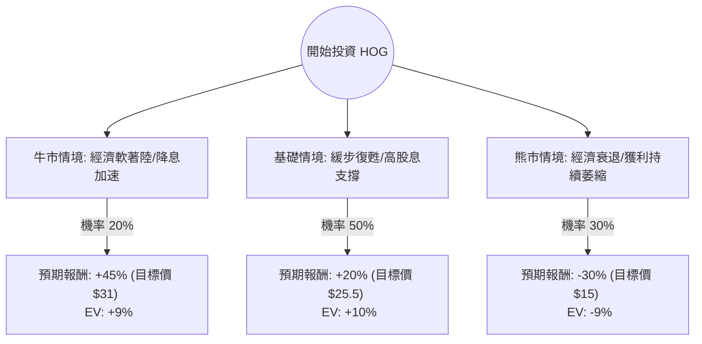

這份報告結合了你提供的 **Harley-Davidson (HOG)** 基本面數據，以及最新的市場動態（包含 2024 年 Q3 財報表現與產業趨勢），進行「決策樹」與「期望值」分析。

---

### 一、 現況分析與最新市場動態 (Context Update)

根據 2024 年 10 月底發布的最新資訊：
1.  **Q3 財報表現**：營收優於預期，但全球零售銷量下降了 13%。主要受到高利率環境影響，消費者對大額耐久財（如重型機車）的購買意願降低。
2.  **盈餘預測**：提供的數據顯示 `EPS next Y_%: -51.39%`，這是一個重大警訊，顯示市場預期明年獲利將減半，這解釋了為何目前 P/E 僅 5.15（市場在反映未來的衰退）。
3.  **電動車虧損 (LiveWire)**：電動車部門持續虧損，對集團利潤產生拖累。
4.  **庫存與利息**：經銷商庫存壓力仍大，且高利率增加了融資成本，影響了 HOG 的金融服務部門（HDFS）。

---

### 二、 決策樹分析 (Decision Tree)

我們將投資期限設定為 **12 個月**，根據市場變數設定三種情境：

#### 節點詳細資訊：

| 預測情境 | 機率 (P) | 預估股價 (12M) | 預期報酬率 (R) | 期望值 (P * R) |
| :--- | :--- | :--- | :--- | :--- |
| **牛市 (Optimistic)** | 20% | $31.00 | +45.8% | **+9.16%** |
| **基礎 (Base Case)** | 50% | $25.50 | +20.0% | **+10.00%** |
| **熊市 (Pessimistic)** | 30% | $15.00 | -29.4% | **-8.82%** |
| **總計期望報酬率** | **100%** | - | - | **+10.34%** |

---

### 三、 計算過程與核心假設

#### 1. 核心假設
*   **買入價格**：以當前股價 **$21.25** 計算。
*   **牛市情境 (20%)**：聯準會降息速度快於預期，消費者信貸成本下降，帶動重機需求回升。HOG 成功清理庫存，股價回升至 52 週高點附近（約 $31）。
*   **基礎情境 (50%)**：公司持續進行股票回購（Insider Trans/Inst Trans 雖然變動但公司現金流 P/FCF 6.41 仍穩健）。股價朝向分析師平均目標價 **$27.56** 靠攏，但考慮到明年 EPS 衰退，保守估計回升至 $25.5。
*   **熊市情境 (30%)**：全球經濟進入衰退，EPS 如數據預測般腰斬 (-51%)。股價跌破歷史低點，回測 $15 左右的支撐位。

#### 2. 期望值 (Expected Value, EV) 計算
$$EV = (P_{Bull} \times R_{Bull}) + (P_{Base} \times R_{Base}) + (P_{Bear} \times R_{Bear})$$
$$EV = (0.20 \times 45.8\%) + (0.50 \times 20.0\%) + (0.30 \times -29.4\%)$$
$$EV = 9.16\% + 10.00\% - 8.82\% = 10.34\%$$

此外，考慮到 **3.39% 的股息收益率**，總體預期期望報酬率約為 **13.73%**。

---

### 四、 最終結論

#### **判斷：適合投資 (中短線價值投資 / 高風險波動)**

#### **理由：**
1.  **估值極低 (Value Play)**：目前 P/E 5.15 且 P/B 0.7 顯示股價已大幅反映了未來的利空。即便明年盈餘減半，Forward P/E 10.5 仍屬於合理甚至偏低區間。
2.  **正向期望值**：儘管面臨 EPS 衰退的負面預期，但計算後的整體期望報酬率（含股息）仍有約 **13.7%**。這表示在當前價位下，上行空間大於下行風險。
3.  **現金流穩健**：P/FCF 僅 6.41，顯示公司產出現金的能力依然強勁，這能支撐其發放股息與執行股票回購。
4.  **安全邊際**：股價目前非常接近 52 週低點 ($20.45)，除非發生嚴重的經濟崩潰，否則進一步大幅破底的機率相較於反彈機率較低。

**投資建議注意：**
由於 `Short Float` (放空比例) 高達 **14.91%**，短期內波動會非常劇烈。若您是極度保守的投資者，建議等待聯準會明確的降息路徑出現，或等待 Q4 銷量數據止跌回穩後再進場。