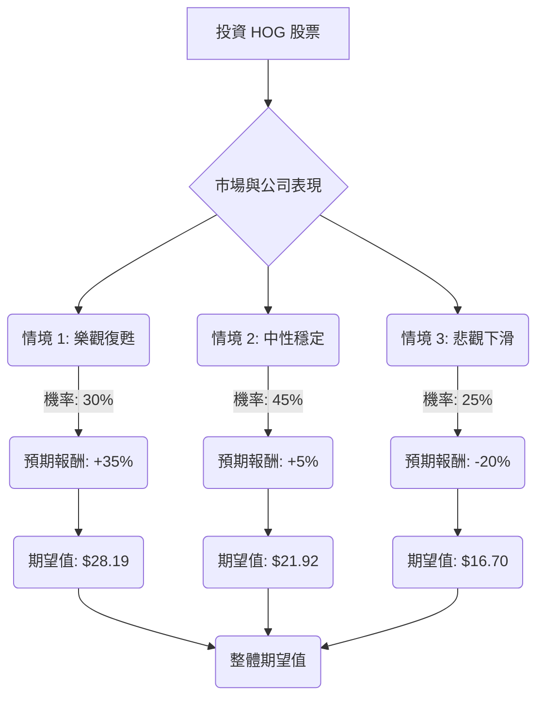

根據對美股公司 HOG (Harley-Davidson, Inc.) 的基本面數據和最新市場資訊的綜合分析，以下是使用決策樹分析和期望值分析的評估。

### 核心假設

在進行決策樹分析之前，我們基於收集到的資訊做出以下核心假設：

*   **市場趨勢：**
    *   全球摩托車市場面臨挑戰，特別是受高利率和消費者信心下降的影響，導致可支配產品需求疲軟。
    *   電動摩托車、智慧互聯功能和冒險旅行車款是行業的未來趨勢。
    *   Harley-Davidson 的傳統核心客戶群體正在老化，吸引年輕一代消費者是其關鍵挑戰。
*   **公司財務與營運：**
    *   HOG 近期銷售額和出貨量持續下滑，2024 年全球摩托車出貨量下降 17%，2025 年上半年全球註冊量下降 27.7%。
    *   公司正在實施 "Hardwire" 戰略，並推出新車型（如 LiveWire 電動車、Pan America 冒險車款以及 2026 年新產品線）以應對市場變化。
    *   與 KKR 和 PIMCO 的 HDFS 戰略合作預計在 2026 年第一季度前釋放約 12-12.5 億美元的自由現金流，有助於改善資產負債表。
    *   關稅問題對公司盈利能力構成顯著壓力，預計 2025 年淨影響為 1.3-1.75 億美元。
    *   公司面臨庫存過剩的挑戰（截至 2024 年底約 20,000 輛）。
    *   分析師對 HOG 的平均目標價約為 27.88 美元至 30.10 美元，暗示有顯著上漲空間，但共識評級多為「持有」。
    *   公司具有健康的股息收益率（約 3.38% - 3.4%）和可持續的派息比率。
    *   P/E 比率和 P/B 比率相對較低，PEG 比率也較低，可能暗示被低估。
*   **領導層變動：** 首席執行官 Jochen Zeitz 辭職以及其他董事會成員的變動，可能帶來不確定性。

### 決策樹分析

**決策點：投資 HOG 股票**

*   **當前股價 (P0)：** 20.88 美元

#### 節點說明與計算過程

**1. 決策點：投資 HOG 股票**
    *   這是我們需要做出決策的起點。

**2. 機會節點：市場與公司表現**
    *   基於對 HOG 及其所處行業的最新資訊分析，我們將未來一年的市場和公司表現分為三個情境。

    **情境 1: 樂觀復甦**
    *   **預測情境名稱：** 樂觀復甦
    *   **情境描述：** 宏觀經濟環境改善（利率下降，消費者信心回升），HOG 的 "Hardwire" 戰略和新產品（LiveWire、Pan America、2026 年新車型）成功吸引新客戶並提振銷售。HDFS 交易順利完成並釋放大量現金，關稅影響得到有效緩解。公司成功應對領導層變動。
    *   **對應機率 (Probability)：** 30%
        *   理由：儘管面臨挑戰，但公司有明確的戰略方向，分析師給出的平均目標價也顯示出潛在的上漲空間，HDFS 交易帶來利好。
    *   **預期報酬 (Expected Return)：** +35%
        *   理由：基於分析師平均目標價（約 27.88 美元 - 30.10 美元）相對於當前股價（20.88 美元）的潛在漲幅（33.5% - 44.2%），並考慮到股息收益率。
    *   **期望值 (Expected Value) 計算：**
        *   期望股價 = 當前股價 × (1 + 預期報酬率)
        *   期望股價 = $20.88 × (1 + 0.35) = $20.88 × 1.35 = $28.19
        *   加權期望值 = 0.30 × $28.19 = $8.457

    **情境 2: 中性穩定**
    *   **預測情境名稱：** 中性穩定
    *   **情境描述：** 宏觀經濟壓力持續存在，HOG 的銷售額保持相對穩定，但增長緩慢。新產品的市場接受度一般，關稅影響持續。HDFS 交易的利好被其他不利因素部分抵消。公司在轉型過程中進展緩慢。
    *   **對應機率 (Probability)：** 45%
        *   理由：這是最可能的情境，因為公司面臨的挑戰是結構性的，轉型需要時間，且宏觀經濟不確定性較高。
    *   **預期報酬 (Expected Return)：** +5%
        *   理由：考慮到當前股價相對較低，以及約 3.38% 的股息收益率，預計股價小幅上漲或持平。
    *   **期望值 (Expected Value) 計算：**
        *   期望股價 = $20.88 × (1 + 0.05) = $20.88 × 1.05 = $21.92
        *   加權期望值 = 0.45 × $21.92 = $9.864

    **情境 3: 悲觀下滑**
    *   **預測情境名稱：** 悲觀下滑
    *   **情境描述：** HOG 未能有效扭轉銷售下滑趨勢，新產品未能吸引足夠的市場份額。宏觀經濟惡化，關稅對盈利能力造成嚴重打擊。領導層變動導致公司戰略執行受阻，市場對其未來前景失去信心，導致股價進一步下跌。高空頭倉位加劇下跌壓力。
    *   **對應機率 (Probability)：** 25%
        *   理由：公司近期銷售數據持續疲軟，且面臨多重結構性挑戰，歷史銷售數據也顯示出持續下滑的趨勢。
    *   **預期報酬 (Expected Return)：** -20%
        *   理由：考慮到公司銷售額大幅下滑的歷史，以及市場對其未來前景的擔憂，股價可能跌至分析師最低目標價（21 美元）以下。
    *   **期望值 (Expected Value) 計算：**
        *   期望股價 = $20.88 × (1 - 0.20) = $20.88 × 0.80 = $16.70
        *   加權期望值 = 0.25 × $16.70 = $4.175

**3. 整體期望值 (Overall Expected Value)**
    *   整體期望值 = 情境 1 加權期望值 + 情境 2 加權期望值 + 情境 3 加權期望值
    *   整體期望值 = $8.457 + $9.864 + $4.175 = $22.496

### 最終結論

根據決策樹分析和期望值計算，投資 HOG 股票的整體期望值為 **22.496 美元**。

*   **判斷：** 適合投資。
*   **理由：**
    *   儘管 HOG 面臨銷售下滑、市場轉型和關稅等多重挑戰，但其當前股價 (20.88 美元) 低於計算出的整體期望值 (22.496 美元)。這表明該股票在當前價格下具有一定的上漲潛力。
    *   公司正在積極實施轉型戰略，包括發展電動摩托車和冒險旅行車款，並通過 HDFS 交易改善財務狀況。
    *   其較低的 P/E (5.17) 和 P/B (0.7) 比率，以及健康的股息收益率 (3.38%)，使其在估值上具有吸引力。
    *   分析師的平均目標價也顯著高於當前股價，提供了潛在的上漲空間。

然而，投資者應充分意識到 HOG 轉型過程中的風險，包括市場對新產品的接受度、宏觀經濟的不確定性以及關稅的持續影響。建議投資者在考慮投資時，將 HOG 視為一項具有潛在價值但伴隨較高風險的投資。