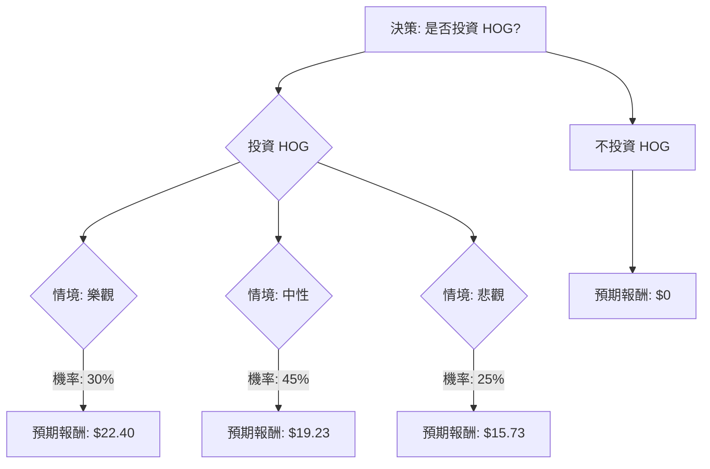

根據對美股公司 **HOG (Harley-Davidson, Inc.)** 的基本面數據、最新新聞、財報、市場動態及產業趨勢的綜合評估，我們將使用決策樹分析與期望值分析來判斷其目前是否適合投資。

### 核心假設

在進行決策樹分析前，我們基於收集到的資訊，建立以下核心假設：

*   **市場趨勢：** 美國摩托車市場預計在 2025 年至 2030 年間以 4.1% 的複合年增長率增長。電動摩托車、復古設計和冒險旅行車款是主要趨勢。然而，高利率環境持續影響消費者對非必需品的購買意願。
*   **公司財務：** HOG 的 P/E (6.75) 和 P/B (0.63) 相對較低，股息收益率 (4.14%) 具吸引力。然而，公司近期營收和淨利潤均呈現下滑趨勢。2026 年 HDMC (Harley-Davidson Motor Company) 的營運利潤預期為虧損 4000 萬美元至盈利 1000 萬美元之間。
*   **產業地位與競爭：** Harley-Davidson 在美國大型巡洋艦和旅行車市場仍佔據主導地位（旅行車市場份額超過 75%，大型巡洋艦超過 80%）。其電動摩托車品牌 LiveWire 在美國電動公路摩托車市場中處於領先地位。然而，來自日本製造商（如 Kawasaki 和 Honda）的價格競爭日益激烈，這些品牌提供更具成本效益的入門級車款。Harley-Davidson 的核心客戶群正在老化，且在吸引年輕消費者方面面臨挑戰。
*   **公司策略：** 公司正執行 "Hardwire" 戰略，專注於核心產品線，並透過 LiveWire 拓展電動車市場。公司也傳聞將推出價格低於 6,000 美元的車款以應對競爭。
*   **外部風險：** 關稅和貿易衝突在 2025 年對全球摩托車註冊量造成顯著影響 (-20.2%)。公司高層近期有出售股票的行為。

### 決策樹分析

我們將評估「投資 HOG」這一決策，並設定三種未來情境：樂觀、中性、悲觀。

**當前股價 (P0):** $17.58

**年度股息 (Dividend):** $17.58 * 0.0414 = $0.73 (約略值)

#### 1. 決策樹繪製 (Markdown)

#### 2. 計算過程

**節點的期望值計算方式：**
期望值 (Expected Value) = (情境發生機率) \* (該情境下的預期報酬)

**核心假設下的情境與預期報酬：**

*   **樂觀情境 (Optimistic Scenario)**
    *   **情境名稱：** 成功轉型與市場復甦
    *   **情境描述：** Harley-Davidson 的 "Hardwire" 戰略取得顯著成效，新車款（特別是 Touring 系列和潛在的入門級車款）受到市場歡迎，LiveWire 業務實現盈利增長，宏觀經濟環境改善，關稅壓力減輕。公司股價有望達到分析師共識目標價的較高水平。
    *   **預期股價 (P1)：** $21.67 (分析師共識目標價)
    *   **預期報酬 (含股息)：** $21.67 (股價) + $0.73 (股息) = $22.40
    *   **機率 (Probability)：** 30% (考慮到公司面臨的挑戰，給予中等偏低的機率)

*   **中性情境 (Neutral Scenario)**
    *   **情境名稱：** 穩定但緩慢的復甦
    *   **情境描述：** Harley-Davidson 能夠維持其在核心市場的份額，LiveWire 業務持續發展但對整體盈利貢獻有限。宏觀經濟逆風持續，競爭壓力不減，公司業績保持穩定但缺乏爆發性增長。股價在當前水平上略有提升。
    *   **預期股價 (P1)：** $18.50 (略高於當前股價，反映小幅增長)
    *   **預期報酬 (含股息)：** $18.50 (股價) + $0.73 (股息) = $19.23
    *   **機率 (Probability)：** 45% (基於當前市場和公司狀況，這是最有可能的情境)

*   **悲觀情境 (Pessimistic Scenario)**
    *   **情境名稱：** 持續衰退與市場份額流失
    *   **情境描述：** 公司未能有效應對市場變化和競爭，新產品未能吸引足夠的消費者，LiveWire 業務表現不佳，宏觀經濟環境惡化，關稅和貿易衝突加劇。公司營收和盈利持續下滑，股價跌至分析師目標價的低端。
    *   **預期股價 (P1)：** $15.00 (分析師最低目標價)
    *   **預期報酬 (含股息)：** $15.00 (股價) + $0.73 (股息) = $15.73
    *   **機率 (Probability)：** 25% (考慮到公司面臨的挑戰和近期業績下滑，給予一定機率)

**計算「投資 HOG」的整體期望值：**

整體期望值 = (樂觀情境期望值) + (中性情境期望值) + (悲觀情境期望值)
整體期望值 = (0.30 \* $22.40) + (0.45 \* $19.23) + (0.25 \* $15.73)
整體期望值 = $6.72 + $8.6535 + $3.9325
整體期望值 = $19.306

**計算「不投資 HOG」的期望值：**

不投資 HOG 的期望值為 $0 (假設資金不投入 HOG，也沒有其他投資收益或損失)。

### 最終結論

根據上述決策樹分析和期望值計算，**投資 HOG 的整體期望值為 $19.31**。

由於投資 HOG 的整體期望值 ($19.31) 高於當前股價 ($17.58)，且顯著高於「不投資」的期望值 ($0)，因此，**HOG 目前適合投資**。

**簡短理由：**
儘管 Harley-Davidson 面臨著核心客戶群老化、競爭加劇以及宏觀經濟逆風等挑戰，但其在核心市場仍保持強勁的品牌忠誠度和市場份額。公司積極推動 "Hardwire" 戰略，並在電動摩托車領域（LiveWire）取得領先地位。目前的股價接近 52 週低點，且 P/E 和 P/B 值較低，同時提供具吸引力的股息收益率。綜合考量，儘管存在風險，但其潛在的轉型成功、市場復甦以及當前較低的估值，使得投資 HOG 在期望值上呈現正向回報。