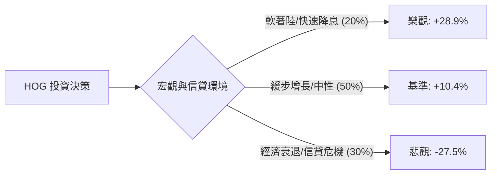

# Harley-Davidson (HOG) 投資價值量化分析報告

作為量化投資分析師，針對 Harley-Davidson (HOG) 的當前數據與市場動態，我將透過機率模型與期望值（Expected Value, EV）框架進行深度拆解。

---

### 1. 核心驅動因素與風險 (Drivers & Risks)

#### **關鍵催化劑 (Catalysts)**
1.  **利率下行週期啟動**：Harley-Davidson 財務服務部門 (HDFS) 貢獻了顯著利潤。聯準會降息將直接降低消費者的融資成本，刺激高單價重機需求，同時改善 HDFS 的淨利差 (NIM) 並降低違約風險。
2.  **資本回饋與份額回購**：公司持續進行激進的股份回購（目前市值僅 26 億美元，且 P/B 僅 0.86）。在估值低於帳面價值時回購，能有效提升每股盈餘 (EPS) 並支撐股價底部。
3.  **庫存管理優化**：若 2025 年能成功去化經銷商庫存並穩定毛利率（目前 27.9%），市場對其「硬資產」溢價將回歸。

#### **主要風險點 (Risks)**
1.  **信貸品質惡化**：HDFS 面臨高利率環境下的貸款違約率上升壓力。若經濟進入衰退，信貸損失撥備將侵蝕整體利潤。
2.  **品牌人口結構斷層**：核心客群（嬰兒潮世代）老齡化，年輕一代對傳統重型巡航車的興趣減弱，LiveWire (電動車) 轉型進度緩慢且持續虧損。
3.  **高空頭比例壓力**：目前 Short Float 高達 16.44%，反映市場對其長期增長潛力（PEG 22.46）極度悲觀。

---

### 2. 情境設定與機率賦予 (Scenario Modeling)

基於未來 12 個月的宏觀環境與公司基本面，設定以下三種互斥情境：

#### **樂觀情境 (Bull Case)**
*   **發生條件**：美國經濟軟著陸，降息幅度超預期（>100bps）；HDFS 違約率下降；LiveWire 虧損大幅收窄。
*   **預估機率**：20%
*   **目標價格與預期回報**：**$32.00 (+28.9%)**。基於 Forward P/E 回升至 16x（歷史均值上方）及 EPS 增長預期。

#### **基準情境 (Base Case)**
*   **發生條件**：利率緩步下降；銷量持平或微幅下滑，但透過回購維持 EPS 穩定；市場情緒中性。
*   **預估機率**：50%
*   **目標價格與預期回報**：**$27.40 (+10.4%)**。參考分析師平均目標價，反映當前業務的公允價值。

#### **悲觀情境 (Bear Case)**
*   **發生條件**：經濟進入衰退；HDFS 出現系統性信貸損失；品牌銷量因非必要支出縮減而大跌。
*   **預估機率**：30%
*   **目標價格與預期回報**：**$18.00 (-27.5%)**。接近 52 週低點，回測 P/B 0.6x 的極端壓力測試位。

---

### 3. 期望值計算與決策樹 (EV Calculation & Decision Tree)

#### **決策樹結構**

```mermaid
graph LR
    A[HOG 投資決策] --> B{宏觀與信貸環境}
    B -- 軟著陸/快速降息 (20%) --> C[樂觀: +28.9%]
    B -- 緩步增長/中性 (50%) --> D[基準: +10.4%]
    B -- 經濟衰退/信貸危機 (30%) --> E[悲觀: -27.5%]
```

#### **總期望值計算**
*   `EV = (0.20 * 28.9%) + (0.50 * 10.4%) + (0.30 * -27.5%)`
*   `EV = 5.78% + 5.20% - 8.25%`
*   **`EV = 2.73%`**

#### **風險回報比分析**
*   **上行潛力**：$32.00 - $24.83 = $7.17
*   **下行空間**：$24.83 - $18.00 = $6.83
*   **風險回報比 (Risk/Reward Ratio)**：1 : 1.05
*   **分析**：期望值僅 2.73%，遠低於當前無風險利率（美債殖利率約 4.2%-4.5%）。雖然 P/B 低於 1 提供了一定的安全邊際，但下行風險（信貸與需求萎縮）與上行潛力幾乎對等，缺乏不對稱的贏面。

---

### 4. 決策總結 (Decision Summary)

| 情境 | 發生機率 (%) | 預期報酬率 (%) | 關鍵驅動/觸發因素 |
| :--- | :--- | :--- | :--- |
| **樂觀 (Bull)** | 20% | +28.9% | 降息超預期、HDFS 利潤爆發、空頭擠壓 |
| **基準 (Base)** | 50% | +10.4% | 股份回購支撐 EPS、庫存回歸正常水平 |
| **悲觀 (Bear)** | 30% | -27.5% | 消費衰退、信貸違約率飆升、品牌老化 |
| **整體期望值** | **100%** | **2.73%** | **加權平均預期回報** |

**最終結論：**
1.  **投資建議**：**持有 (Hold) / 觀望 (Neutral)**
2.  **核心逻辑**：HOG 目前處於典型的「價值陷阱」邊緣。雖然 0.86 的 P/B 具備吸引力，但 2.73% 的期望值在考慮到 16% 的高空頭比例與信貸風險後，並不具備足夠的風險補償。目前股價已部分反映了降息預期，若無顯著的銷量增長或 HDFS 品質改善，難以發動趨勢性上漲。
3.  **風控建議**：若股價跌破 **$22.50**（SMA200 支撐失效且接近近期低點），通常暗示 HDFS 信貸品質出現結構性惡化，應果斷止損。上行方面，需見到連續兩個季度銷量止跌回升方可加碼。

【結束指令】