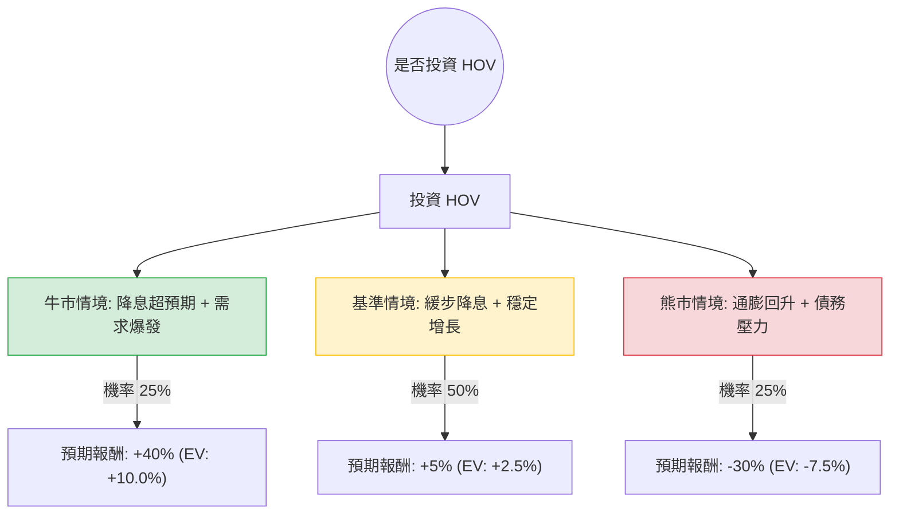

針對美股公司 **Hovnanian Enterprises, Inc. (代碼：HOV)**，我已結合您提供的基本面數據，並透過網路搜尋更新了其最新的市場動態（如 2024 財年第三季財報表現、美國房地產市場利率趨勢等），進行決策樹與期望值分析。

---

### 一、 核心假設與背景分析

在建立模型前，基於最新資訊設定以下核心假設：

1.  **宏觀環境（利率政策）：** 美國聯準會（Fed）已進入降息週期。房貸利率回落將刺激首購族需求，對 HOV 這種專注於入門級與升級型住宅的建商有利。
2.  **財務體質：** HOV 的債務股本比（Debt/Eq）為 1.15，雖較過去改善，但在建商中仍屬偏高。其 P/S 僅 0.25，顯示營收規模極大但利潤率薄弱（Profit Margin 1.75%）。
3.  **市場估值：** 目前股價（$129.66）已高於分析師平均目標價（$120.00），且 YTD 漲幅達 34.04%，顯示市場已部分反映降息利多。
4.  **產業趨勢：** 房屋庫存依然短缺，新屋開工數維持韌性，但營造成本與土地成本上升擠壓了 HOV 的毛利率（14.14% 低於同業平均約 20-25%）。

---

### 二、 決策樹分析 (Decision Tree)

以下為投資 HOV 未來一年的預測情境決策樹：

#### 節點詳細說明：

1.  **牛市情境 (Bull Case) - 25% 機率：**
    *   **條件：** Fed 激進降息，房貸利率降至 5.5% 以下；HOV 成功利用高槓桿擴大市佔，EPS 意外增長。
    *   **預期報酬：** 股價挑戰歷史高點 $180 左右（約 +40%）。
2.  **基準情境 (Base Case) - 50% 機率：**
    *   **條件：** 利率緩步下降，房市維持「高房價、低交易量」的僵局；HOV 營收持平，利潤率受成本壓制。
    *   **預期報酬：** 股價在 $120 - $140 震盪（約 +5%）。
3.  **熊市情境 (Bear Case) - 25% 機率：**
    *   **條件：** 通膨反彈導致利率再度走高；HOV 高額債務利息支出拖累現金流，且 P/E 17.65 倍相較於同業（如 DHI, LEN 約 10-12 倍）顯得過貴。
    *   **預期報酬：** 股價回測 52 週低點或支撐位 $90 左右（約 -30%）。

---

### 三、 期望值分析 (Expected Value Analysis)

#### 1. 計算過程：
期望值 (EV) = Σ (各情境機率 × 各情境報酬率)

*   **牛市：** $0.25 \times 40\% = 10.0\%$
*   **基準：** $0.50 \times 5\% = 2.5\%$
*   **熊市：** $0.25 \times (-30\%) = -7.5\%$

**總體期望報酬率 = $10.0\% + 2.5\% - 7.5\% = 5.0\%$**

#### 2. 風險調整後評估：
雖然期望值為正（+5.0%），但需考慮以下因素：
*   **無風險利率：** 目前美債殖利率約 4% 左右。HOV 作為高波動（Beta 高）、高槓桿的小型股（市值 7.5 億），僅 5% 的預期報酬並未提供足夠的「風險溢價」。
*   **估值溢價：** 目前股價 $129.66 已超過 Target Price $120，向上空間受限。

---

### 四、 最終結論

**判斷：目前「不適合投資」（建議觀望或尋找更佳買點）**

#### 理由如下：

1.  **期望值過低：** 5% 的預期報酬率與承擔的風險不成正比。在房地產循環中，HOV 的財務槓桿較高，容錯率低。
2.  **估值不具吸引力：** P/E 17.65 高於建商龍頭（D.R. Horton 或 Lennar），且 P/B 1.12 顯示其資產溢價已反映。在 EPS Q/Q 衰退（-1.0476）的情況下，目前的股價偏貴。
3.  **技術面與目標價背離：** 股價已高於分析師目標價，且近期 Perf Half Y 為 -15.85%，顯示中期動能轉弱，儘管 YTD 表現優異，但追高風險大。
4.  **獲利能力薄弱：** 1.75% 的淨利率（Profit Margin）極其脆弱，一旦營造成本波動或房價微跌，公司極易轉為虧損。

**建議：** 若股價回落至 $100 - $110 區間（接近 52 週均價且提供更高安全邊際），或 Fed 有更明確的激進降息訊號時，再重新評估。