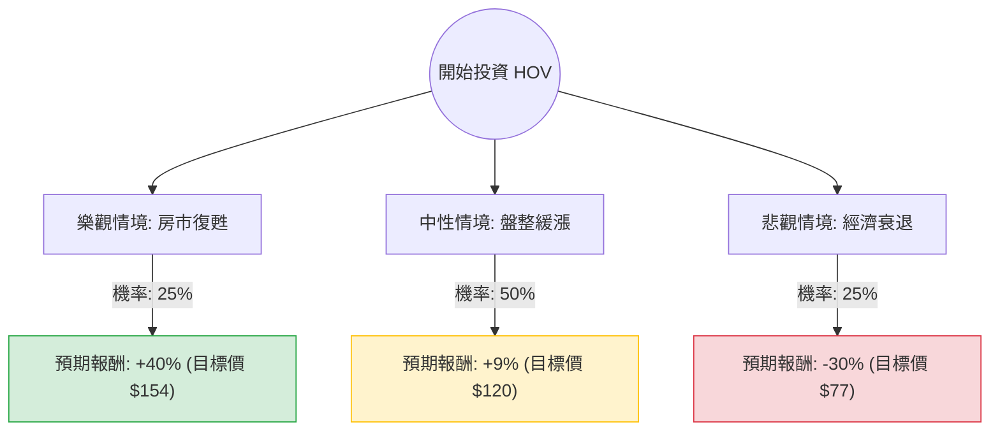

這份分析報告將結合您提供的財務數據與當前美股房地產市場的動態，利用**決策樹（Decision Tree）**與**期望值分析（Expected Value Analysis）**，評估 Hovnanian Enterprises, Inc. (HOV) 的投資價值。

---

### 一、 核心背景與市場動態分析

在進入模型前，我們先整合最新市場資訊：
1.  **產業趨勢**：美國房地產市場目前處於「高利率壓抑」與「供給短缺」的拉鋸戰。聯準會（Fed）雖有降息預期，但房貸利率仍維持在相對高位，影響首購族購買力。
2.  **HOV 公司特性**：HOV 是一家高槓桿（Debt/Eq 1.16）且利潤率較薄（Profit Margin 1.53%）的建商。這類公司對利率極度敏感，景氣好時獲利爆發力強，景氣差時財務壓力巨大。
3.  **技術面與估值**：目前股價低於 SMA20、50、200，顯示短期趨勢偏弱。P/B 0.93 顯示股價低於淨值，具有價值投資的潛力，但 ROE 6.76% 在同業中不算突出。

---

### 二、 決策樹分析 (Decision Tree)

我們將未來一年的情境分為三種：**樂觀（利率大幅下降/需求爆發）**、**中性（現狀維持）**、**悲觀（經濟衰退/高利率持續）**。

---

### 三、 期望值計算與假設

#### 1. 核心假設
*   **樂觀情境 (25%)**：聯準會降息速度快於預期，房貸利率降至 6% 以下，HOV 憑藉低 P/B 吸引資金回流，股價挑戰 52 週高點附近（約 $154）。
*   **中性情境 (50%)**：利率緩步下降，房市供需平衡。股價回歸分析師平均目標價 **$120**（較目前 $110 約有 9% 漲幅）。
*   **悲觀情境 (25%)**：通膨反彈導致利率維持高位，或美國陷入經濟衰退。HOV 因高債務比（Debt/Eq 1.16）與低流動性（Quick Ratio 0.68）面臨拋售，股價回測 52 週低點（約 $77）。

#### 2. 期望值 (EV) 計算過程
$$EV = (P_{Bull} \times R_{Bull}) + (P_{Base} \times R_{Base}) + (P_{Bear} \times R_{Bear})$$

*   **樂觀部分**：$0.25 \times 40\% = 10\%$
*   **中性部分**：$0.50 \times 9\% = 4.5\%$
*   **悲觀部分**：$0.25 \times (-30\%) = -7.5\%$

**總期望報酬率**：$10\% + 4.5\% - 7.5\% = \mathbf{7\%}$

---

### 四、 綜合評估與數據解讀

1.  **財務風險指標**：
    *   **債務壓力**：Debt/Eq 1.16 且 Quick Ratio 僅 0.68，顯示短期償債能力有隱憂。在利率高企環境下，利息支出會嚴重侵蝕僅 1.53% 的淨利率。
    *   **成長動能**：Sales Q/Q (-6.18%) 與 EPS Q/Q (-26.89%) 均呈現衰退，顯示目前基本面正在惡化。
2.  **估值優勢**：
    *   P/B 0.93 與 P/S 0.23 確實非常便宜，這提供了下行保護，也是期望值仍為正數的主因。
3.  **技術面**：
    *   股價處於所有均線（SMA20, 50, 200）之下，且過去半年跌幅達 23.58%，目前尚未看到止跌訊號。

---

### 五、 最終結論

**判斷：目前「不適合投資」（建議觀望）**

#### 理由：
1.  **期望值吸引力不足**：計算出的期望報酬率僅為 **7%**。考慮到 HOV 的高波動性（52週高低價差巨大）與高槓桿風險，7% 的預期回報不足以補償其潛在的下行風險。
2.  **基本面惡化**：營收與 EPS 同比大幅下滑，且利潤率極低（1.53%），容錯率極小。一旦房市需求進一步萎縮，公司可能面臨虧損。
3.  **技術面逆勢**：目前股價處於明顯的下降通道，且機構交易（Inst Trans -0.79%）略微流出，此時進場屬於「接掉下來的刀子」。
4.  **資金效率**：市場上有其他資產負債表更穩健、ROE 更高（HOV 僅 6.76%）的建商（如 DHI 或 LEN），在相同產業趨勢下，HOV 並非首選。

**建議操作**：若您仍看好該公司，建議等待 **SMA20 轉平且股價站回 SMA50**，或等待聯準會明確的連續降息信號出現後，再行考慮。目前資金留在現金或配置於更具成長動能的標的較為明智。