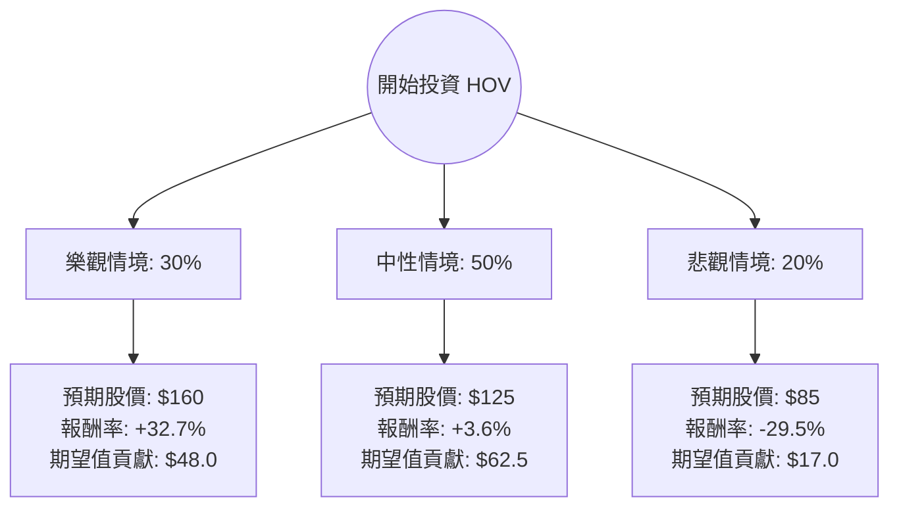

針對美股公司 **Hovnanian Enterprises, Inc. (HOV)**，我結合了您提供的基本面數據以及最新的市場動態（包含 2024 年第二季財報表現與美國房地產市場趨勢）進行分析。

以下是基於**決策樹分析**與**期望值分析**的投資評估報告。

---

### 一、 核心背景與市場動態分析

在進入計算前，我們先釐清 HOV 的現狀：
1.  **財務表現**：HOV 最近一季（Q2 2024）表現強勁，營收與利潤均優於預期。雖然數據顯示 `EPS Q/Q` 下跌，但年度同比（Y/Y）呈現增長。
2.  **產業趨勢**：美國房市目前處於「高利率、低庫存」狀態。現有房屋賣方惜售，導致買方轉向新成屋，這對像 HOV 這樣的建商有利。
3.  **債務壓力**：HOV 的 `Debt/Eq` 為 1.15，雖在改善中，但相較於大型建商（如 DHI 或 LEN），其財務槓桿仍較高，對利率敏感度極大。
4.  **估值**：P/E 16.3 倍，P/B 1.03 倍。股價目前在 $120 左右，非常接近分析師目標價 ($120.0)，顯示市場認為其目前估值合理，上行空間需依賴進一步利多。

---

### 二、 決策樹分析 (Decision Tree)

我們將未來 6-12 個月的投資情境分為三種：**樂觀（軟著陸+降息）**、**中性（維持現狀）**、**悲觀（衰退+高利率持續）**。

---

### 三、 期望值分析 (Expected Value Analysis)

#### 1. 核心假設與參數設定
*   **當前股價 ($P_0$)**：$120.60
*   **情境 A：樂觀 (Bull Case) - 機率 30%**
    *   **假設**：聯準會於下半年啟動降息，房貸利率回落至 6% 以下，刺激首購族需求。HOV 憑藉低 P/B 優勢獲得估值修復。
    *   **目標價**：$160 (接近 52 週高點)。
*   **情境 B：中性 (Base Case) - 機率 50%**
    *   **假設**：利率維持高位（Higher for longer），但因成屋庫存極低，HOV 訂單量維持穩定。獲利符合預期，股價隨大盤小幅波動。
    *   **目標價**：$125 (略高於分析師目標價)。
*   **情境 C：悲觀 (Bear Case) - 機率 20%**
    *   **假設**：美國經濟陷入衰退，失業率上升導致購屋需求崩潰。HOV 的高槓桿（Debt/Eq 1.15）成為負擔，引發拋售。
    *   **目標價**：$85 (接近 52 週低點)。

#### 2. 計算過程
期望值 ($EV$) = $\sum (機率 \times 預期股價)$

*   **$EV = (0.30 \times 160) + (0.50 \times 125) + (0.20 \times 85)$**
*   **$EV = 48.0 + 62.5 + 17.0 = 127.5$**

#### 3. 預期報酬率計算
*   **預期報酬率** = $(EV - P_0) / P_0$
*   **預期報酬率** = $(127.5 - 120.6) / 120.6 \approx \mathbf{5.72\%}$

---

### 四、 最終結論

#### **判斷：不適合投資 (觀望 / Hold)**

#### **理由：**
1.  **期望報酬率過低**：計算出的預期報酬率僅約 **5.72%**。考慮到 HOV 屬於高波動（High Beta）的小型股（市值僅 7 億美金），且不支付股利（Dividend %: "-"），這樣的風險回報比（Risk-Reward Ratio）並不具吸引力。
2.  **估值已達瓶頸**：目前股價 ($120.6) 已超越分析師平均目標價 ($120.0)。除非公司有超預期的盈餘增長，否則短期內缺乏上行動能。
3.  **財務體質風險**：雖然 P/B 1.03 看似便宜，但其 `Debt/Eq` (1.15) 與 `Quick Ratio` (0.71) 顯示其流動性與抗風險能力弱於同業。在利率環境不確定的當下，容錯率較低。
4.  **技術面背離**：雖然 SMA20/50/200 呈現多頭排列，但 `Perf Year` 為 -14.09%，顯示長期趨勢仍處於修復期，且近期 `Perf Week` (-2.19%) 顯示動能有所減弱。

**建議：**
如果您已經持有，建議繼續持有（Hold）以觀察降息預期；若尚未進場，建議等待股價回落至 **$100 - $105** 區間（提供更高的安全邊際），或轉向財務結構更穩健的大型建商。