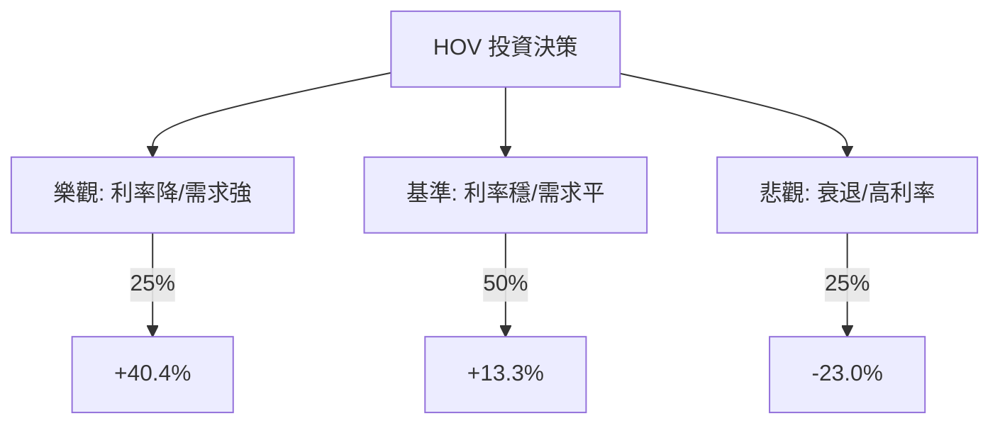

# HOV (Hovnanian Enterprises, Inc.) 量化投資分析報告

作為量化投資分析師，針對 HOV 的評估將聚焦於其高槓桿特性對利率環境的敏感度，以及目前低於帳面價值（P/B 0.94）所隱含的價值重估潛力。

---

### 1. 核心驅動因素與風險 (Drivers & Risks)

#### **關鍵催化劑 (Catalysts)**
1.  **聯準會降息週期啟動**：HOV 的財務槓桿較高（Debt/Eq 1.13），且購屋者對抵押貸款利率極度敏感。若 2024 下半年至 2025 年利率進入下降通道，將顯著降低其利息支出並刺激新屋訂單。
2.  **成屋庫存持續短缺**：全美成屋供應量仍處於歷史低位，迫使買方轉向新屋市場。HOV 專注於首購與換屋族群，將受益於此結構性需求。
3.  **資產負債表優化**：公司近年致力於去槓桿化，若未來兩季財報顯示債務比例進一步下降且毛利率（目前 13.57%）回升，將引發估值倍數（Multiple Re-rating）修復。

#### **主要風險點 (Risks)**
1.  **高利率環境持續 (Higher for Longer)**：若通膨反彈導致利率維持高位，HOV 的高債務負擔將侵蝕利潤，且購屋負擔能力惡化將導致銷量下滑。
2.  **經濟衰退風險**：房地產是週期性行業，若美國失業率超預期上升，將直接衝擊 HOV 的合約簽署量與交屋進度。
3.  **利潤率承壓**：相較於產業龍頭，HOV 的淨利率（0.86%）極低，任何建材成本或人工成本的波動都可能導致虧損。

---

### 2. 情境設定與機率賦予 (Scenario Modeling)

#### **樂觀情境 (Bull Case)**
*   **發生條件**：聯準會降息節奏快於預期，抵押貸款利率降至 6% 以下；HOV 毛利率回升至 18% 以上，且債務進一步削減。
*   **預估機率**：25%
*   **目標價格與預期回報**：**$155.00 (+40.4%)**。基於 P/B 回升至 1.3 倍（歷史高位區間）或 P/E 修復至行業平均水平。

#### **基準情境 (Base Case)**
*   **發生條件**：利率緩步下降，房市維持「低供應、穩需求」格局；公司營運表現符合預期，EPS 逐步轉正。
*   **預估機率**：50%
*   **目標價格與預期回報**：**$125.00 (+13.3%)**。接近分析師平均目標價，反映帳面價值的穩定增長。

#### **悲觀情境 (Bear Case)**
*   **發生條件**：美國進入硬著陸衰退，房價大幅下跌；HOV 因高槓桿面臨流動性壓力，EPS 嚴重虧損。
*   **預估機率**：25%
*   **目標價格與預期回報**：**$85.00 (-23.0%)**。回測 52 週低點，反映市場對其償債能力的擔憂。

---

### 3. 期望值計算與決策樹 (EV Calculation & Decision Tree)

#### **決策樹結構**

#### **總期望值計算**
*   `EV = (0.25 * 40.4%) + (0.50 * 13.3%) + (0.25 * -23.0%)`
*   `EV = 10.1% + 6.65% - 5.75% = 11.0%`

#### **風險回報比分析**
*   **上行潛力**：40.4% (Bull)
*   **下行空間**：23.0% (Bear)
*   **風險回報比 (Risk/Reward Ratio)**：1 : 1.76。這顯示每承擔 1 單位的風險，預期可獲得 1.76 單位的回報，具備正向不對稱性。

---

### 4. 決策總結 (Decision Summary)

| 情境 | 發生機率 (%) | 預期報酬率 (%) | 關鍵驅動/觸發因素 |
| :--- | :--- | :--- | :--- |
| **樂觀 (Bull)** | 25% | +40.4% | 利率快速下降、毛利率大幅擴張、去槓桿超預期 |
| **基準 (Base)** | 50% | +13.3% | 房市供需平衡、營運穩健、符合分析師預期 |
| **悲觀 (Bear)** | 25% | -23.0% | 經濟衰退、高利率持續、債務違約風險溢價上升 |
| **整體期望值** | **100%** | **+11.0%** | **加權平均預期回報** |

**最終結論：**
1. **投資建議**：**買入 (Buy)**
2. **核心邏輯**：HOV 目前 P/B 僅 0.94，估值具備極高安全邊際。雖然其高槓桿帶來波動，但在降息預期下，期望值為正（+11.0%），且風險回報比優於 1:1.5，對於追求高 Beta 回報的投資者具備吸引力。
3. **風控建議**：若股價跌破 **$95**（跌破 SMA200 且接近 52W 低點），或聯準會意外重啟升息，應視為悲觀情境觸發訊號，執行止損以保護資本。