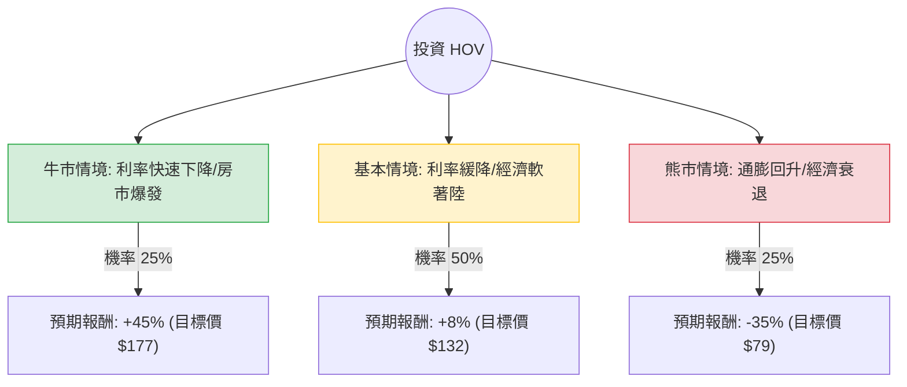

這份分析報告將針對 **Hovnanian Enterprises, Inc. (代號: HOV)** 進行深入評估。HOV 是一家美國大型住宅建築商，其業務高度受利率環境、房地產市場供需及公司財務槓桿影響。

以下結合您提供的數據與當前市場動態（聯準會降息預期、美國房市庫存狀況）進行的決策樹與期望值分析。

---

### 一、 核心假設與市場背景分析

在建立模型前，我們基於最新資訊設定以下假設：

1.  **宏觀環境（利多）**：聯準會（Fed）已進入降息週期。房貸利率下降將刺激潛在買家回流，對 HOV 這種提供入門級與升級型住宅的建商有利。
2.  **產業趨勢（中性偏利多）**：全美二手房庫存依然偏低，買家被迫轉向新成屋，這為建商提供了定價權。
3.  **財務狀況（風險點）**：HOV 的 **Debt/Eq (1.16)** 較高，且 **Profit Margin (1.53%)** 顯著低於同業龍頭（如 DHI 或 LEN 的 10% 以上）。這意味著 HOV 對成本波動非常敏感。
4.  **估值（利多）**：**P/B 1.03** 與 **P/S 0.24** 顯示股價接近帳面價值，估值極低，具備轉機股（Turnaround）的特質。

---

### 二、 決策樹分析圖 (Decision Tree)

我們預測未來一年的三種主要情境：

---

### 三、 期望值分析與計算過程

#### 1. 情境參數設定
*   **牛市情境 (Bull Case) - 25% 機率**：
    *   **條件**：Fed 降息超預期，房貸利率跌破 6%，HOV 營收增長轉正（目前 Sales Q/Q 為 -6.18%）。
    *   **估值修復**：P/B 回升至 1.5 倍（產業平均水準）。
    *   **預期報酬**：+45%。
*   **基本情境 (Base Case) - 50% 機率**：
    *   **條件**：利率緩慢下降，房市維持現狀。HOV 繼續去槓桿，利潤率微幅改善。
    *   **估值修復**：股價隨 EPS 緩步回升，接近分析師平均目標價。
    *   **預期報酬**：+8%。
*   **熊市情境 (Bear Case) - 25% 機率**：
    *   **條件**：通膨反彈導致利率重新走高，或失業率上升導致購屋需求崩潰。HOV 高債務壓力浮現。
    *   **估值修復**：股價回測 52 週低點（約 $85 附近）。
    *   **預期報酬**：-35%。

#### 2. 期望值 (Expected Value, EV) 計算
$$EV = (P_{Bull} \times R_{Bull}) + (P_{Base} \times R_{Base}) + (P_{Bear} \times R_{Bear})$$

*   $EV = (0.25 \times 0.45) + (0.50 \times 0.08) + (0.25 \times -0.35)$
*   $EV = 0.1125 + 0.04 - 0.0875$
*   $EV = 0.065$

**最終期望報酬率：+6.5%**

---

### 四、 綜合評估與最終結論

#### 1. 數據亮點與隱憂
*   **利多**：P/B 僅 1.03，下行空間受帳面價值支撐；近期股價表現（Perf Week +15%）顯示短期動能強勁，且站上 SMA20/50。
*   **利空**：EPS 增長率為負（-1.13），且明年預期依然疲弱（-2.75%）。現金流與獲利能力（ROE 6.76%）遠遜於同業。

#### 2. 最終判斷：**不適合投資 (或僅建議極小倉位投機)**

**理由如下：**
1.  **期望值過低**：計算出的期望報酬僅 **6.5%**，在美股市場中，這不足以補償 HOV 高波動（52週高低差極大）與高債務的風險。
2.  **風險報酬比不對稱**：熊市情境下的潛在跌幅（-35%）與牛市漲幅相比，容錯率較低。
3.  **基本面疲軟**：HOV 的獲利能力（Profit Margin 1.5%）極其脆弱。在房貸利率仍處於相對高位時，建商通常需要提供「利率補貼（Rate Buydowns）」來促銷，這會進一步侵蝕 HOV 本就微薄的利潤。
4.  **技術面背離**：目前股價 $122 已高於數據中的 Target Price ($120)，顯示市場已部分反映降息利多，追高風險增加。

**建議：**
如果您看好美國房市復甦，建議選擇財務結構更穩健、利潤率更高且具備規模經濟的龍頭股（如 **DHI** 或 **LEN**）。HOV 僅適合風險承受度極高、且專注於「低 P/B 轉機股」策略的投資者。